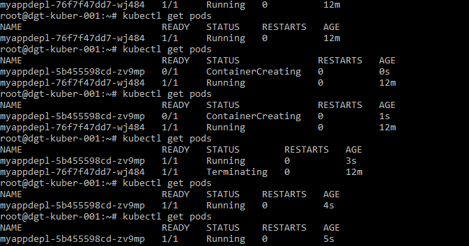

# [Дипломный практикум в Yandex.Cloudloud](https://github.com/netology-code/devops-diplom-yandexcloud)

## Олег Дьяченко DEVOPS-22

---

## 1. Создание облачной инфраструктуры

Подготовил предварительную облачную инфраструктуру в Яндекс Облаке при помощи Terraform манифеста.

Настроил backend для Terraform используюя Terraform Cloud (заблокирован для русских айпи, надо искользовать VPN либо прокси). Связал сразу ресурс [diplom-terraform](https://gitlab.com/OlegDy/diplom-terraform) c [Terraform Cloud](https://app.terraform.io/app/OlegDy), и инфраструктуру развернул уже через него, чтоб все ресурсы были управляемы с одного места и файл состояния располагался в Terraform Cloud.

Манифест рассчитан на использования двух workspace, создается два независимых контура:
- stage
- prod

Создал только один workspace - stage, из-за ограниченного бюджета. Все успешно развернулось в Яндекс облаке через Terraform Cloud.


---

## 2. Создание Kubernetes кластера

Создал кластер Kubernetes на базе предварительно созданной инфраструктуры.
Установил кластер используя Kuberspay ansible. На основании вывода Terraform создал конфигурационный файл [hosts.yaml](02-kubespray/mycluster/hosts.yaml)

```
root@dgt-kuber-001:~/.kube# kubectl get nodes
NAME      STATUS   ROLES           AGE   VERSION
master1   Ready    control-plane   24m   v1.27.4
worker1   Ready    <none>          23m   v1.27.4
worker2   Ready    <none>          23m   v1.27.4
worker3   Ready    <none>          23m   v1.27.4
```

```
root@dgt-kuber-001:~/.kube# kubectl config view
apiVersion: v1
clusters:
- cluster:
    certificate-authority-data: DATA+OMITTED
    server: https://84.201.149.223:6443
  name: cluster.local
contexts:
- context:
    cluster: cluster.local
    user: kubernetes-admin
  name: kubernetes-admin@cluster.local
current-context: kubernetes-admin@cluster.local
kind: Config
preferences: {}
users:
- name: kubernetes-admin
  user:
    client-certificate-data: DATA+OMITTED
    client-key-data: DATA+OMITTED
``` 

``` 
root@dgt-kuber-001:~/.kube# kubectl get pods --all-namespaces
NAMESPACE     NAME                                       READY   STATUS    RESTARTS      AGE
kube-system   calico-kube-controllers-5c5b57ffb5-hcn6j   1/1     Running   0             22m
kube-system   calico-node-c98f4                          1/1     Running   0             23m
kube-system   calico-node-lpztm                          1/1     Running   0             23m
kube-system   calico-node-r86r4                          1/1     Running   0             23m
kube-system   calico-node-z7wn6                          1/1     Running   1 (23m ago)   23m
kube-system   coredns-5c469774b8-dkmqp                   1/1     Running   0             21m
kube-system   coredns-5c469774b8-kcf6j                   1/1     Running   0             21m
kube-system   dns-autoscaler-f455cf558-r6z6g             1/1     Running   0             21m
kube-system   kube-apiserver-master1                     1/1     Running   2             26m
kube-system   kube-controller-manager-master1            1/1     Running   2             26m
kube-system   kube-proxy-6gmpl                           1/1     Running   0             25m
kube-system   kube-proxy-chcmr                           1/1     Running   0             25m
kube-system   kube-proxy-ntgfs                           1/1     Running   0             25m
kube-system   kube-proxy-vjbw4                           1/1     Running   0             25m
kube-system   kube-scheduler-master1                     1/1     Running   2 (20m ago)   26m
kube-system   nginx-proxy-worker1                        1/1     Running   0             25m
kube-system   nginx-proxy-worker2                        1/1     Running   0             25m
kube-system   nginx-proxy-worker3                        1/1     Running   0             25m
kube-system   nodelocaldns-hv5l5                         1/1     Running   0             21m
kube-system   nodelocaldns-r7xzs                         1/1     Running   0             21m
kube-system   nodelocaldns-xkl2m                         1/1     Running   0             21m
kube-system   nodelocaldns-zwspr                         1/1     Running   0             21m
```

---

## 3. Создание тестового приложения

Подготовил тестовое приложение [myapp](https://gitlab.com/OlegDy/my-test-app), простенький [dockerfile](https://gitlab.com/OlegDy/my-test-app/-/blob/main/Dockerfile).

Для хранения docker образа создал Yandex Container Registry с помощью терраформ.

```
root@dgt-kuber-001:~/diplom-app/my-test-app# docker build -t myapp .
Sending build context to Docker daemon  71.17kB
Step 1/5 : FROM nginx
latest: Pulling from library/nginx
a378f10b3218: Pull complete
4dfff0708538: Pull complete
2135e49ace4b: Pull complete
c843f6b280ce: Pull complete
6f35ab6f1400: Pull complete
6c538b49fa4a: Pull complete
d57731fb9008: Pull complete
Digest: sha256:b4af4f8b6470febf45dc10f564551af682a802eda1743055a7dfc8332dffa595
Status: Downloaded newer image for nginx:latest
 ---> bc649bab30d1
Step 2/5 : COPY html /usr/share/nginx/html
 ---> 9b2392256c02
Step 3/5 : COPY nginx.conf /etc/nginx/conf.d/default.conf
 ---> ae0035ccbe74
Step 4/5 : EXPOSE 80
 ---> Running in 4c7408521bab
Removing intermediate container 4c7408521bab
 ---> 368661eb4b63
Step 5/5 : CMD ["nginx", "-g", "daemon off;"]
 ---> Running in ec58c8d0c3c3
Removing intermediate container ec58c8d0c3c3
 ---> 1af030d26958
Successfully built 1af030d26958
Successfully tagged myapp:latest
```
```
root@dgt-kuber-001:~/diplom-app/my-test-app# docker tag myapp cr.yandex/crp9hpbe7fd8piicfnb6/myapp:0.1.0

root@dgt-kuber-001:~/diplom-app/my-test-app# docker push cr.yandex/crp9hpbe7fd8piicfnb6/myapp:0.1.0
The push refers to repository [cr.yandex/crp9hpbe7fd8piicfnb6/myapp]
d92471de8ca8: Pushed
f252cb52c809: Pushed
3c7f79e64c24: Pushed
ff24e13e73c7: Pushed
b0b61abb5846: Pushed
2187753852c0: Pushed
ad5d551c7fa1: Pushed
e53d016bbab1: Pushed
cb4596cc1454: Pushed
0.1.0: digest: sha256:888b79fe407fe2ad1b2b0e6fd7669ff40ccdb255df7c7d312ef8764ffd0b0331 size: 2192
```


---

## 4. Подготовка системы мониторинга и деплой приложения

### 4.1 Мониторинг

Установил kube-prometheus-stack [value.yaml](04-monitoring/prometheus/values.yaml) 
```
root@dgt-kuber-001:~# helm repo add prometheus-community https://prometheus-community.github.io/helm-charts
"prometheus-community" has been added to your repositories
root@dgt-kuber-001:~# helm repo update
Hang tight while we grab the latest from your chart repositories...
...Successfully got an update from the "prometheus-community" chart repository
Update Complete. ?Happy Helming!?
root@dgt-kuber-001:~# kubectl create namespace monitoring
namespace/monitoring created
root@dgt-kuber-001:/home/kuber/chart# kubectl config set-context --current --namespace=monitoring
root@dgt-kuber-001:/home/kuber/chart# helm install kube-prom-stack prometheus-community/kube-prometheus-stack -n monitoring -f values.yaml
NAME: kube-prom-stack
LAST DEPLOYED: Fri Oct 20 07:11:49 2023
NAMESPACE: monitoring
STATUS: deployed
REVISION: 1
NOTES:
kube-prometheus-stack has been installed. Check its status by running:
  kubectl --namespace monitoring get pods -l "release=kube-prom-stack"

Visit https://github.com/prometheus-operator/kube-prometheus for instructions on how to create & configure Alertmanager and Prometheus instances using the Operator.
```
```
root@dgt-kuber-001:/home/kuber/chart# kubectl get all
NAME                                                         READY   STATUS    RESTARTS   AGE
pod/alertmanager-kube-prom-stack-kube-prome-alertmanager-0   2/2     Running   0          3m35s
pod/kube-prom-stack-grafana-7657b94784-7s92f                 3/3     Running   0          3m44s
pod/kube-prom-stack-kube-prome-operator-7989cd7bb-f85zh      1/1     Running   0          3m44s
pod/kube-prom-stack-kube-state-metrics-844885f47b-r9gzp      1/1     Running   0          3m44s
pod/kube-prom-stack-prometheus-node-exporter-27lvh           1/1     Running   0          3m44s
pod/kube-prom-stack-prometheus-node-exporter-jvklc           1/1     Running   0          3m44s
pod/kube-prom-stack-prometheus-node-exporter-k2z6z           1/1     Running   0          3m44s
pod/kube-prom-stack-prometheus-node-exporter-w5n74           1/1     Running   0          3m44s
pod/prometheus-kube-prom-stack-kube-prome-prometheus-0       2/2     Running   0          3m34s

NAME                                               TYPE        CLUSTER-IP      EXTERNAL-IP   PORT(S)                         AGE
service/alertmanager-operated                      ClusterIP   None            <none>        9093/TCP,9094/TCP,9094/UDP      3m35s
service/kube-prom-stack-grafana                    NodePort    10.233.23.183   <none>        80:30680/TCP                    3m45s
service/kube-prom-stack-kube-prome-alertmanager    NodePort    10.233.62.16    <none>        9093:30903/TCP,8080:32405/TCP   3m45s
service/kube-prom-stack-kube-prome-operator        ClusterIP   10.233.38.44    <none>        443/TCP                         3m45s
service/kube-prom-stack-kube-prome-prometheus      NodePort    10.233.31.158   <none>        9090:30090/TCP,8080:31789/TCP   3m45s
service/kube-prom-stack-kube-state-metrics         ClusterIP   10.233.5.184    <none>        8080/TCP                        3m45s
service/kube-prom-stack-prometheus-node-exporter   ClusterIP   10.233.58.228   <none>        9100/TCP                        3m45s
service/prometheus-operated                        ClusterIP   None            <none>        9090/TCP                        3m35s

NAME                                                      DESIRED   CURRENT   READY   UP-TO-DATE   AVAILABLE   NODE SELECTOR            AGE
daemonset.apps/kube-prom-stack-prometheus-node-exporter   4         4         4       4            4           kubernetes.io/os=linux   3m44s

NAME                                                  READY   UP-TO-DATE   AVAILABLE   AGE
deployment.apps/kube-prom-stack-grafana               1/1     1            1           3m44s
deployment.apps/kube-prom-stack-kube-prome-operator   1/1     1            1           3m44s
deployment.apps/kube-prom-stack-kube-state-metrics    1/1     1            1           3m44s

NAME                                                            DESIRED   CURRENT   READY   AGE
replicaset.apps/kube-prom-stack-grafana-7657b94784              1         1         1       3m44s
replicaset.apps/kube-prom-stack-kube-prome-operator-7989cd7bb   1         1         1       3m44s
replicaset.apps/kube-prom-stack-kube-state-metrics-844885f47b   1         1         1       3m44s

NAME                                                                    READY   AGE
statefulset.apps/alertmanager-kube-prom-stack-kube-prome-alertmanager   1/1     3m35s
statefulset.apps/prometheus-kube-prom-stack-kube-prome-prometheus       1/1     3m34s
```

Добавил [яндекс балансировщик](https://gitlab.com/OlegDy/diplom-terraform/-/blob/main/balancers.tf) и через терраформ добавил его в яндекс облако.


[Grafana интерфейс http://62.84.120.169:8080/](http://62.84.120.169:8080/)  
логин: admin  
пароль: admin12oleg  


### 4.2 Деплоймент приложения

Создал новый namespace myapp, и в нем создал secret cr-key-json для идентификации к регистру яндекса, для идентификации взял файл, который создавал ранее для доступа к регистру в 3 пункте.
```
root@server1:/vagrant/diplom-app-depl# kubectl create namespace myapp
namespace/myapp created

root@server1:/vagrant/diplom-app-depl# kubectl config set-context --current --namespace=myapp
Context "kubernetes-admin@cluster.local" modified.

root@server1:/vagrant/diplom-app-depl# kubectl create secret generic cr-key-json   --namespace=myapp   --from-file=.dockerconfigjson=$HOME/.docker/config.json   --type=kubernetes.io/dockerconfigjson
secret/cr-key-json created
```

Деплоим тестовое приложение

```
root@server1:/vagrant/diplom-app-depl# kubectl apply -f myappdepl.yaml
```

Добавил новый [яндекс балансировщик](https://gitlab.com/OlegDy/diplom-terraform/-/blob/main/balancers.tf) и через терраформ добавил его в яндекс облако.


Проверяем доступ к моему приложению [myapp http://51.250.108.187/](http://51.250.108.187/)  
Добавил пару виджетов для нагрузки.


___

## 5. Установка и настройка CI/CD

Настроим ci/cd систему для автоматической сборки docker image и деплоя приложения при изменении кода.
Использовал gitlab.com и тестовое приложение [my-test-app](https://gitlab.com/OlegDy/my-test-app)

Настроил переменные


Установил GitlabRunner в Kubernetes при помощи helm, файл настроек [values.yaml](05-cicd/values.yaml). Использовал [инструкцию](https://docs.gitlab.com/runner/install/kubernetes.html).

```
root@server1:/vagrant/diplom-cicd# kubectl create namespace gitlab-runner
namespace/gitlab-runner created

root@server1:/vagrant/diplom-cicd# kubectl config set-context --current --namespace=gitlab-runner
Context "kubernetes-admin@cluster.local" modified.

root@server1:/vagrant/diplom-cicd# kubectl create secret generic gitlab-runner \
>   --from-literal=runner-registration-token="GR1348941YpCEH96dzc7szJs7x-P1" \
>   --from-literal=runner-token=""
secret/gitlab-runner created

root@server1:/vagrant/diplom-cicd# helm install gitlab-runner gitlab/gitlab-runner -n gitlab-runner -f values.yaml
NAME: gitlab-runner
LAST DEPLOYED: Sat Oct 21 10:22:25 2023
NAMESPACE: gitlab-runner
STATUS: deployed
REVISION: 1
TEST SUITE: None
NOTES:
Your GitLab Runner should now be registered against the GitLab instance reachable at: "https://gitlab.com"
```
Проверил доступность раннера


Написал `Pipeline` в файл [.gitlab-ci.yml](05-cicd/.gitlab-ci.yml). Алгоритм работы:
 
 - При коммите в репозиторий с тестовым приложением происходит build и отправка в регистр Docker образа.
 - При создании тега (например, v6.0.0) происходит build и отправка с соответствующим tag в Container Registry, затем deploy соответствующего Docker образа в кластер Kubernetes.


Поймал deploy


Обновленное приложение


**[Ссылка на тестовое приложение](http://51.250.108.187/)**

---
# Общий итог:

- Подготовил предварительную облачную инфраструктуру в Яндекс Облаке при помощи Terraform манифеста. Настроил backend для Terraform используюя Terraform Cloud
  
- Создал кластер Kubernetes на базе предварительно созданной инфраструктуры. На основании вывода Terraform установил кластер используя Kuberspay ansible. 

- Установил систему мониторинга kube-prometheus-stack (Prometheus,NodeExporter, Grafana, Alertmanager).
  
- Подготовил тестовое приложение и для хранения docker образа создал Yandex Container Registry с помощью Terraform. Задеплоил тестовое приложение.

- Настроим ci/cd систему для автоматической сборки docker image и деплоя приложения при изменении кода.


