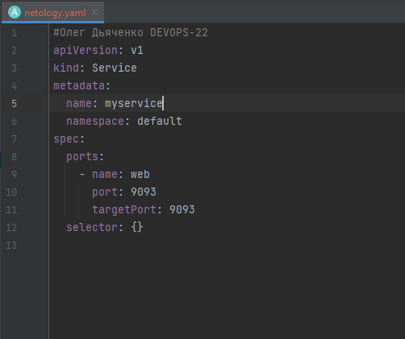
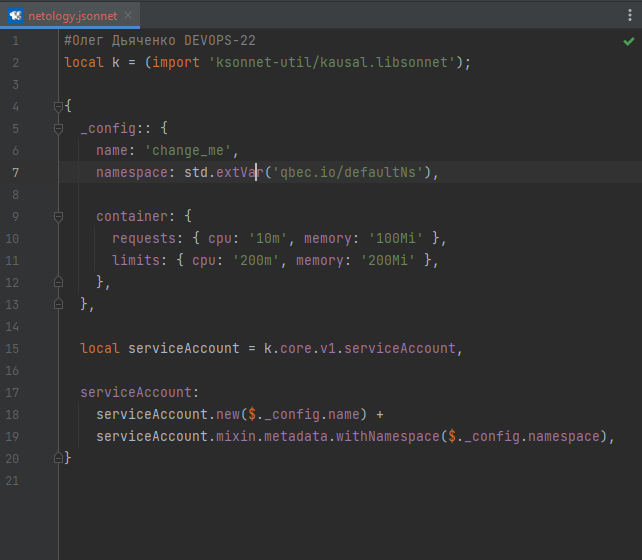

# Дамашнее задание 1

## Олег Дьяченко DEVOPS-22

## Задание №1 - Подготовка рабочей среды

### Terraform: 

### Bash: 

### Markdown: 

### Yaml: 

### Jsonnet: 

## Задание №2 - Описание жизненного цикла задачи (разработки нового функционала)

Чтобы лучше понимать предназначение дальнейших инструментов, с которыми нам предстоит работать, давайте 
составим схему жизненного цикла задачи в идеальном для вас случае.

### Описание истории

отделПредставьте, что вы работаете в стартапе, который запустил интернет-магазин. Ваш интернет-магазин достаточно успешно развивался, и вот пришло время налаживать процессы: у вас стало больше конечных клиентов, менеджеров и разработчиков.Сейчас от клиентов вам приходят задачи, связанные с разработкой нового функционала. Задач много, и все они требуют выкладки на тестовые среды, одобрения тестировщика, проверки менеджером перед показом клиенту. В случае необходимости, вам будет необходим откат изменений. 

### Решение задачи

Вам необходимо описать процесс решения задачи в соответствии с жизненным циклом разработки программного обеспечения. Использование какого-либо конкретного метода разработки не обязательно. Для решения главное - прописать по пунктам шаги решения задачи (релизации в конечный результат) с участием менеджера, разработчика (или команды разработчиков), тестировщика (или команды тестировщиков) и себя как DevOps-инженера.

### Мое виденье
(не совсем пока в теме, но как я вижу)

По сути надо собрать с программеров и тестировщиков ТЗ ("хотелки"), оценить их объем.
Если не хватает текущего железа то придется подумать как расширить.
Подумать сколько времени понадобится на это. Сказать тимлиду и подумать как решить задачи.
Запланировать процессы и начать выполнять по приоритетам.

