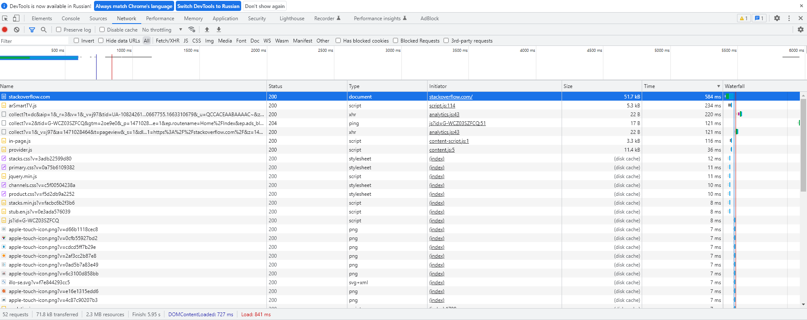
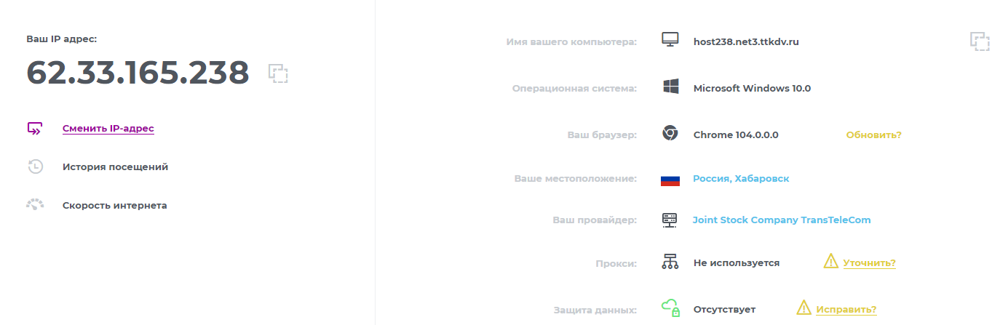
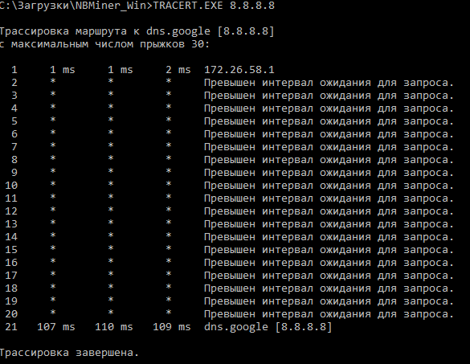
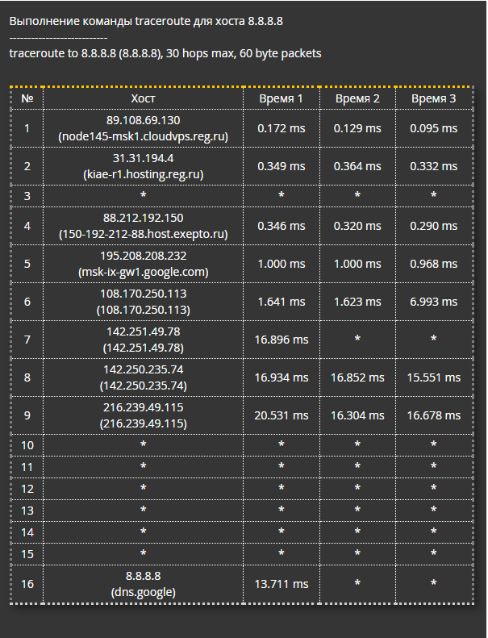
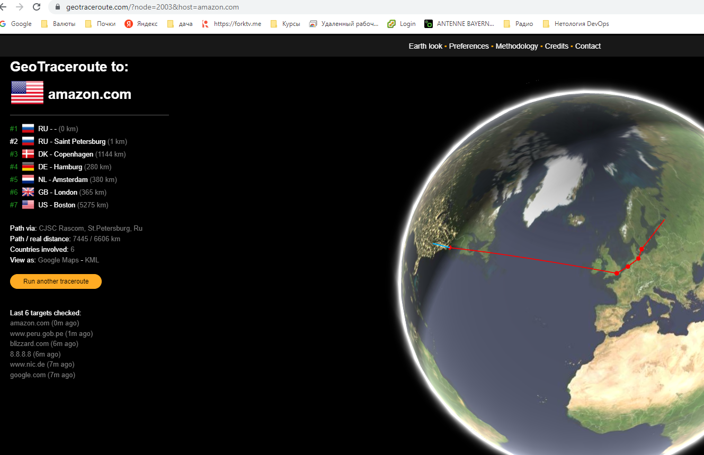

# Дамашнее задание 11, "3.6. Компьютерные сети, лекция 1"

## Олег Дьяченко DEVOPS-22

#### 1. Работа c HTTP через телнет.
- Подключитесь утилитой телнет к сайту stackoverflow.com
`telnet stackoverflow.com 80`
- отправьте HTTP запрос
```bash
GET /questions HTTP/1.0
HOST: stackoverflow.com
[press enter]
[press enter]
```
- В ответе укажите полученный HTTP код, что он означает?


    vagrant@vagrant:~$ telnet stackoverflow.com 80
    Trying 151.101.129.69...
    Connected to stackoverflow.com.
    Escape character is '^]'.
    GET /questions HTTP/1.0
    HOST: stackoverflow.com
    
    HTTP/1.1 301 Moved Permanently
    Server: Varnish
    Retry-After: 0
    Location: https://stackoverflow.com/questions
    Content-Length: 0
    Accept-Ranges: bytes
    Date: Fri, 16 Sep 2022 06:43:03 GMT
    Via: 1.1 varnish
    Connection: close
    X-Served-By: cache-nrt-rjtf7700077-NRT
    X-Cache: HIT
    X-Cache-Hits: 0
    X-Timer: S1663310583.010764,VS0,VE0
    Strict-Transport-Security: max-age=300
    X-DNS-Prefetch-Control: off
    
    Connection closed by foreign host.

Сделали запрос HOST, в ответ получили информацию о сервере.

#### 2. Повторите задание 1 в браузере, используя консоль разработчика F12.
- откройте вкладку `Network`
- отправьте запрос http://stackoverflow.com
- найдите первый ответ HTTP сервера, откройте вкладку `Headers`
- укажите в ответе полученный HTTP код.
- проверьте время загрузки страницы, какой запрос обрабатывался дольше всего?
- приложите скриншот консоли браузера в ответ.

`Status Code: 307 Internal Redirect` - сразу переадресовал нас на https

Время загрузки страницы - 841ms, самая долгая https://stackoverflow.com/ - 584ms.



#### 3. Какой IP адрес у вас в интернете?

vagrant@vagrant:~$ curl ifconfig.me/ip
62.33.165.238

#### 4. Какому провайдеру принадлежит ваш IP адрес? Какой автономной системе AS? Воспользуйтесь утилитой `whois`

Сеть ТТК `netname:        TTKDV-NET3`, автономная система `origin:         AS20485`

    vagrant@vagrant:~$ whois -h whois.ripe.net 62.33.165.238
    % This is the RIPE Database query service.
    % The objects are in RPSL format.
    %
    % The RIPE Database is subject to Terms and Conditions.
    % See http://www.ripe.net/db/support/db-terms-conditions.pdf
    
    % Note: this output has been filtered.
    %       To receive output for a database update, use the "-B" flag.
    
    % Information related to '62.33.165.0 - 62.33.165.255'
    
    % Abuse contact for '62.33.165.0 - 62.33.165.255' is 'abuse@ttk.ru'
    
    inetnum:        62.33.165.0 - 62.33.165.255
    netname:        TTKDV-NET3
    descr:          (MS002204) CJSC Transtelecom-DV,
    descr:          Khabarovsk, Russia
    country:        RU
    admin-c:        AMIK1-RIPE
    tech-c:         LIF1-RIPE
    status:         ASSIGNED PA
    mnt-by:         TRANSTELECOM-MNT
    created:        2003-09-29T08:39:08Z
    last-modified:  2008-05-06T11:08:51Z
    source:         RIPE # Filtered
    
    person:         Andrey V. Mikhalyov
    address:        23, Istomina street, 680000, Khabarovsk, Russia
    address:        54a, Leningradskaya street, 680021, Khabarovsk, Russia
    phone:          + 7 4212 384621
    fax-no:         + 7 4212 394724
    nic-hdl:        AMIK1-RIPE
    created:        2008-05-06T11:08:31Z
    last-modified:  2020-06-04T10:08:33Z
    source:         RIPE # Filtered
    mnt-by:         TRANSTELECOM-MNT
    
    person:         Ivan F Linnik
    address:        CJSC Transtelecom-DV Istomina,23 680000 Khabarovsk Russia
    phone:          + 7 4212 384820
    fax-no:         + 7 4212 384601
    nic-hdl:        LIF1-RIPE
    created:        2002-02-18T11:58:12Z
    last-modified:  2020-06-04T10:08:21Z
    source:         RIPE # Filtered
    mnt-by:         TRANSTELECOM-MNT
    
    % Information related to '62.33.160.0/20AS20485'
    
    route:          62.33.160.0/20
    descr:          RU-TRANS-TELECOM
    descr:          Khabarovsk
    origin:         AS20485
    mnt-by:         TRANSTELECOM-MNT
    created:        2002-09-03T08:28:42Z
    last-modified:  2002-09-03T08:28:42Z
    source:         RIPE
    
    % This query was served by the RIPE Database Query Service version 1.103 (ANGUS)

    vagrant@vagrant:~$ whois -h whois.radb.net 62.33.165.238
    route:          62.33.160.0/20
    descr:          RU-TRANS-TELECOM
    descr:          Khabarovsk
    origin:         AS20485
    mnt-by:         TRANSTELECOM-MNT
    created:        2002-09-03T08:28:42Z
    last-modified:  2002-09-03T08:28:42Z
    source:         RIPE
    
#### 5. Через какие сети проходит пакет, отправленный с вашего компьютера на адрес 8.8.8.8? Через какие AS? Воспользуйтесь утилитой `traceroute`

С vagrant traceroute не проходит. Пробовал из под винды 21 прыжок и все звездочки.

Попробовал онлайн https://ivit.pro/services/traceroute/

Нашел визуальную реализацию AS https://geotraceroute.com/ , но восьмерки и из нее плохо бьются.

Похоже где-то фаерволы не пускают. Не получается так красиво как у вас в презентации.

#### 6. Повторите задание 5 в утилите `mtr`. На каком участке наибольшая задержка - delay?
    
Промежуточные пробегают звездочками и все. Находит только последний. Похоже через нат не работает трейс.

    vagrant@vagrant:~$ mtr -zn yandex.ru
    Host                                                                                                                                                                                             Loss%   Snt   Last   Avg  Best  Wrst StDev
    1. AS???    10.0.2.2                                                                                                                                                                              0.0%     4    0.2   0.4   0.2   0.6   0.2
    2. AS???    172.26.58.1                                                                                                                                                                           0.0%     4    2.5   3.0   2.5   3.4   0.4
    3. AS13238 20872 277.88.55.88                                                                                                                                                                     33.3%     3    1.8   1.5   1.1   1.8   0.5

#### 7. Какие DNS сервера отвечают за доменное имя dns.google? Какие A записи? воспользуйтесь утилитой `dig`

    vagrant@vagrant:~$ dig ns  dns.google
    
    ; <<>> DiG 9.16.1-Ubuntu <<>> ns dns.google
    ;; global options: +cmd
    ;; Got answer:
    ;; ->>HEADER<<- opcode: QUERY, status: NOERROR, id: 55749
    ;; flags: qr rd ra; QUERY: 1, ANSWER: 4, AUTHORITY: 0, ADDITIONAL: 1
    
    ;; OPT PSEUDOSECTION:
    ; EDNS: version: 0, flags:; udp: 65494
    ;; QUESTION SECTION:
    ;dns.google.                    IN      NS
    
    ;; ANSWER SECTION:
    dns.google.             4920    IN      NS      ns2.zdns.google.
    dns.google.             4920    IN      NS      ns1.zdns.google.
    dns.google.             4920    IN      NS      ns4.zdns.google.
    dns.google.             4920    IN      NS      ns3.zdns.google.
    
    ;; Query time: 267 msec
    ;; SERVER: 127.0.0.53#53(127.0.0.53)
    ;; WHEN: Fri Sep 16 11:10:56 UTC 2022
    ;; MSG SIZE  rcvd: 116


    vagrant@vagrant:~$ dig a  dns.google
    
    ; <<>> DiG 9.16.1-Ubuntu <<>> a dns.google
    ;; global options: +cmd
    ;; Got answer:
    ;; ->>HEADER<<- opcode: QUERY, status: NOERROR, id: 61408
    ;; flags: qr rd ra; QUERY: 1, ANSWER: 2, AUTHORITY: 0, ADDITIONAL: 1
    
    ;; OPT PSEUDOSECTION:
    ; EDNS: version: 0, flags:; udp: 65494
    ;; QUESTION SECTION:
    ;dns.google.                    IN      A
    
    ;; ANSWER SECTION:
    dns.google.             660     IN      A       8.8.4.4
    dns.google.             660     IN      A       8.8.8.8
    
    ;; Query time: 0 msec
    ;; SERVER: 127.0.0.53#53(127.0.0.53)
    ;; WHEN: Fri Sep 16 11:11:39 UTC 2022
    ;; MSG SIZE  rcvd: 71

#### 8. Проверьте PTR записи для IP адресов из задания 7. Какое доменное имя привязано к IP? воспользуйтесь утилитой `dig`


    vagrant@vagrant:~$ dig -x 8.8.8.8
    
    ; <<>> DiG 9.16.1-Ubuntu <<>> -x 8.8.8.8
    ;; global options: +cmd
    ;; Got answer:
    ;; ->>HEADER<<- opcode: QUERY, status: NOERROR, id: 45539
    ;; flags: qr rd ra; QUERY: 1, ANSWER: 1, AUTHORITY: 0, ADDITIONAL: 1
    
    ;; OPT PSEUDOSECTION:
    ; EDNS: version: 0, flags:; udp: 65494
    ;; QUESTION SECTION:
    ;8.8.8.8.in-addr.arpa.          IN      PTR
    
    ;; ANSWER SECTION:
    8.8.8.8.in-addr.arpa.   2356    IN      PTR     dns.google.
    
    ;; Query time: 0 msec
    ;; SERVER: 127.0.0.53#53(127.0.0.53)
    ;; WHEN: Fri Sep 16 11:17:54 UTC 2022
    ;; MSG SIZE  rcvd: 73
    
    vagrant@vagrant:~$ dig -x 8.8.4.4
    
    ; <<>> DiG 9.16.1-Ubuntu <<>> -x 8.8.4.4
    ;; global options: +cmd
    ;; Got answer:
    ;; ->>HEADER<<- opcode: QUERY, status: NOERROR, id: 4459
    ;; flags: qr rd ra; QUERY: 1, ANSWER: 1, AUTHORITY: 0, ADDITIONAL: 1
    
    ;; OPT PSEUDOSECTION:
    ; EDNS: version: 0, flags:; udp: 65494
    ;; QUESTION SECTION:
    ;4.4.8.8.in-addr.arpa.          IN      PTR
    
    ;; ANSWER SECTION:
    4.4.8.8.in-addr.arpa.   5056    IN      PTR     dns.google.
    
    ;; Query time: 3 msec
    ;; SERVER: 127.0.0.53#53(127.0.0.53)
    ;; WHEN: Fri Sep 16 11:17:59 UTC 2022
    ;; MSG SIZE  rcvd: 73