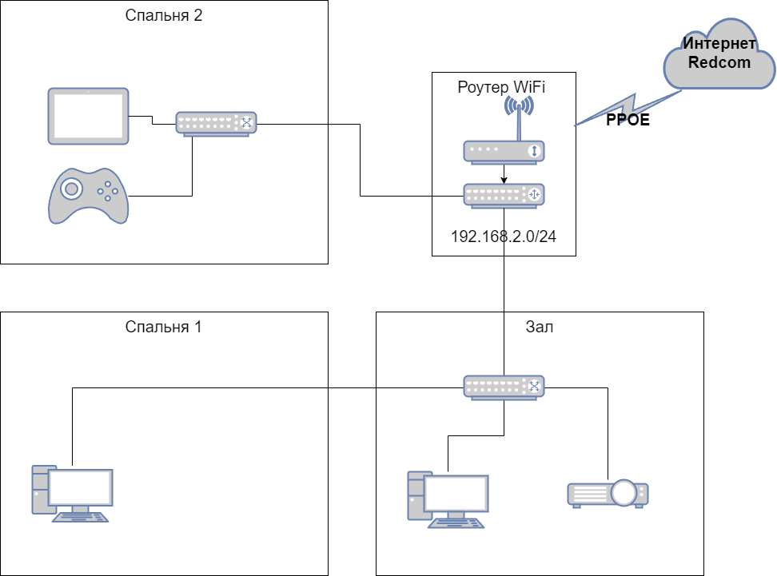
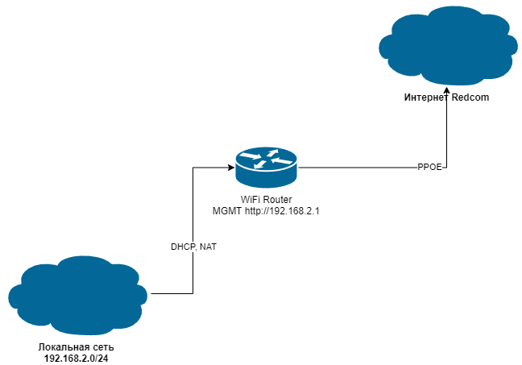

# Дамашнее задание 12, "3.8. Компьютерные сети, лекция 3"

## Олег Дьяченко DEVOPS-22


#### 1. Подключитесь к публичному маршрутизатору в интернет. Найдите маршрут к вашему публичному IP
```
telnet route-views.routeviews.org
Username: rviews
show ip route x.x.x.x/32
show bgp x.x.x.x/32
```

Подключился нормально, по второй команде выдал очень большую портянку.
```
route-views>show ip route 62.33.165.238
Routing entry for 62.33.0.0/16
  Known via "bgp 6447", distance 20, metric 0
  Tag 2497, type external
  Last update from 202.232.0.2 6d01h ago
  Routing Descriptor Blocks:
  * 202.232.0.2, from 202.232.0.2, 6d01h ago
      Route metric is 0, traffic share count is 1
      AS Hops 2
      Route tag 2497
      MPLS label: none


route-views>show bgp 62.33.165.238
BGP routing table entry for 62.33.0.0/16, version 2433715088
Paths: (23 available, best #22, table default)
  Not advertised to any peer
  Refresh Epoch 1
  3267 20485, (aggregated by 20485 10.99.0.18)
    194.85.40.15 from 194.85.40.15 (185.141.126.1)
      Origin IGP, metric 0, localpref 100, valid, external, atomic-aggregate
      path 7FE126FDEBF8 RPKI State valid
      rx pathid: 0, tx pathid: 0
  Refresh Epoch 1
  57866 3356 20485, (aggregated by 20485 10.39.0.6)
    37.139.139.17 from 37.139.139.17 (37.139.139.17)
      Origin IGP, metric 0, localpref 100, valid, external, atomic-aggregate
      Community: 3356:2 3356:22 3356:100 3356:123 3356:501 3356:901 3356:2065 20485:10039 57866:100 65100:3356 65103:1 65104:31
      unknown transitive attribute: flag 0xE0 type 0x20 length 0x30
        value 0000 E20A 0000 0064 0000 0D1C 0000 E20A
              0000 0065 0000 0064 0000 E20A 0000 0067
              0000 0001 0000 E20A 0000 0068 0000 001F
```

#### 2. Создайте dummy0 интерфейс в Ubuntu. Добавьте несколько статических маршрутов. Проверьте таблицу маршрутизации.
```
vagrant@vagrant:~$ ip -br add
lo               UNKNOWN        127.0.0.1/8 ::1/128
eth0             UP             10.0.2.15/24 fe80::a00:27ff:fea2:6bfd/64

vagrant@vagrant:~$ ip route
default via 10.0.2.2 dev eth0 proto dhcp src 10.0.2.15 metric 100
10.0.2.0/24 dev eth0 proto kernel scope link src 10.0.2.15
10.0.2.2 dev eth0 proto dhcp scope link src 10.0.2.15 metric 100
```
В Ubuntu 20.04, чутка по другому поднимается dummy через systemd, нашел инструкцию и сделал. 
```
root@vagrant:~# ip -br a
lo               UNKNOWN        127.0.0.1/8 ::1/128
eth0             UP             10.0.2.15/24 fe80::a00:27ff:fea2:6bfd/64
dummy0           UNKNOWN        192.168.0.100/24 fe80::7cf5:36ff:fe7a:8907/64

root@vagrant:~# ip route add 192.168.5.0/24 via 192.168.0.200
root@vagrant:~# ip ro
default via 10.0.2.2 dev eth0 proto dhcp src 10.0.2.15 metric 100
10.0.2.0/24 dev eth0 proto kernel scope link src 10.0.2.15
10.0.2.2 dev eth0 proto dhcp scope link src 10.0.2.15 metric 100
192.168.0.0/24 dev dummy0 proto kernel scope link src 192.168.0.100
192.168.1.0/24 via 192.168.0.200 dev dummy0 proto static onlink
192.168.5.0/24 via 192.168.0.200 dev dummy0

root@vagrant:/etc/systemd/network# cat /etc/systemd/network/vr-br.network
[Match]
Name=dummy0
[Network]
Address=192.168.0.100
Mask=255.255.255.0
[Route]
Gateway=192.168.0.200
Destination=192.168.1.0/24
```
делал статический маршрут через netplan, но он настройки systemd перебивает, но тоже работает. 
Получается несколько вариантов как обычно. Еще можно макрос-службу сделать и запускать просто командой `ip route add`

#### 3. Проверьте открытые TCP порты в Ubuntu, какие протоколы и приложения используют эти порты? Приведите несколько примеров.
```
root@vagrant:/# netstat -plnt
Active Internet connections (only servers)
Proto Recv-Q Send-Q Local Address           Foreign Address         State       PID/Program name
tcp        0      0 127.0.0.53:53           0.0.0.0:*               LISTEN      813/systemd-resolve
tcp        0      0 0.0.0.0:22              0.0.0.0:*               LISTEN      890/sshd: /usr/sbin
tcp6       0      0 :::22                   :::*                    LISTEN      890/sshd: /usr/sbin

root@vagrant:/# ss -plnt
State    Recv-Q   Send-Q     Local Address:Port     Peer Address:Port   Process
LISTEN   0        4096       127.0.0.53%lo:53            0.0.0.0:*       users:(("systemd-resolve",pid=813,fd=13))
LISTEN   0        128              0.0.0.0:22            0.0.0.0:*       users:(("sshd",pid=890,fd=3))
LISTEN   0        128                 [::]:22               [::]:*       users:(("sshd",pid=890,fd=4))

root@vagrant:/# sudo lsof -nP -iTCP -sTCP:LISTEN
COMMAND   PID            USER   FD   TYPE DEVICE SIZE/OFF NODE NAME
systemd-r 813 systemd-resolve   13u  IPv4  22403      0t0  TCP 127.0.0.53:53 (LISTEN)
sshd      890            root    3u  IPv4  24994      0t0  TCP *:22 (LISTEN)
sshd      890            root    4u  IPv6  24996      0t0  TCP *:22 (LISTEN)
```

Прослушивается два протокола DNS, SSH. DNS прослушивается на локальном интерфейсе кеширующим DNS-резолвером.
SSH прослушивается на всех сетевых картах и на протоколах ipv4 и ipv6.

#### 4. Проверьте используемые UDP сокеты в Ubuntu, какие протоколы и приложения используют эти порты?
```
root@vagrant:/# netstat -plnu
Active Internet connections (only servers)
Proto Recv-Q Send-Q Local Address           Foreign Address         State       PID/Program name
udp        0      0 127.0.0.53:53           0.0.0.0:*                           813/systemd-resolve
udp        0      0 10.0.2.15:68            0.0.0.0:*                           807/systemd-network

root@vagrant:/# ss -plnu
State    Recv-Q   Send-Q      Local Address:Port     Peer Address:Port  Process
UNCONN   0        0           127.0.0.53%lo:53            0.0.0.0:*      users:(("systemd-resolve",pid=813,fd=12))
UNCONN   0        0          10.0.2.15%eth0:68            0.0.0.0:*      users:(("systemd-network",pid=807,fd=21))

root@vagrant:/# sudo lsof -nP -iUDP
COMMAND   PID            USER   FD   TYPE DEVICE SIZE/OFF NODE NAME
systemd-n 807 systemd-network   21u  IPv4  22986      0t0  UDP 10.0.vt2.15:68
systemd-r 813 systemd-resolve   12u  IPv4  22402      0t0  UDP 127.0.0.53:53
```

UDP порты открыты: 53 для DNS резолвера и 68 для bootpc DHCP.

68UDP Bootstrap Protocol (BOOTP) Client; also used by Dynamic Host Configuration Protocol (DHCP) (official)

#### 5. Используя diagrams.net, создайте L3 диаграмму вашей домашней сети или любой другой сети, с которой вы работали. 



