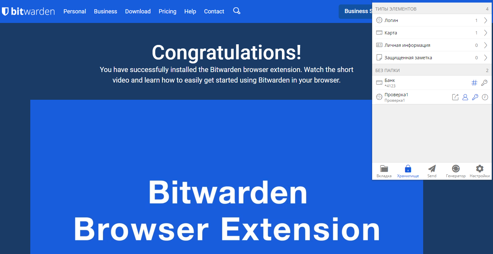
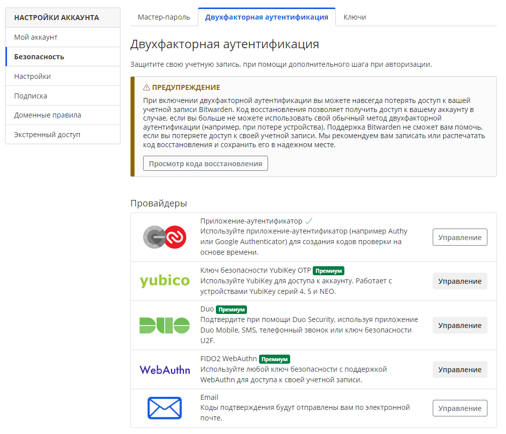
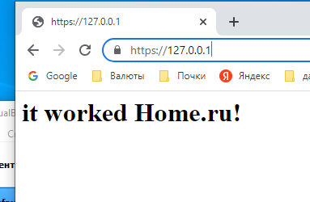
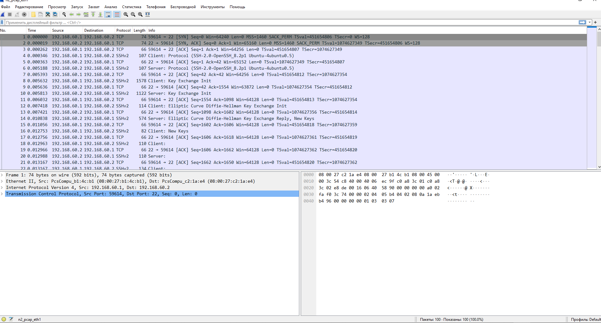

# Дамашнее задание 14, "3.9. Элементы безопасности информационных систем"

## Олег Дьяченко DEVOPS-22


#### 1. Установите Bitwarden плагин для браузера. Зарегестрируйтесь и сохраните несколько паролей.



#### 2. Установите Google authenticator на мобильный телефон. Настройте вход в Bitwarden акаунт через Google authenticator OTP.



#### 3. Установите apache2, сгенерируйте самоподписанный сертификат, настройте тестовый сайт для работы по HTTPS.

Сделал по инструкции из презентации [Apache](https://www.digitalocean.com/community/tutorials/how-to-create-a-self-signed-ssl-certificate-for-apache-in-ubuntu-20-04)

```
root@vagrant:/# sudo ufw allow "Apache Full"
Rules updated
Rules updated (v6)
root@vagrant:/# sudo a2enmod ssl
Considering dependency setenvif for ssl:
Module setenvif already enabled
Considering dependency mime for ssl:
Module mime already enabled
Considering dependency socache_shmcb for ssl:
Enabling module socache_shmcb.
Enabling module ssl.
See /usr/share/doc/apache2/README.Debian.gz on how to configure SSL and create self-signed certificates.
To activate the new configuration, you need to run:
  systemctl restart apache2
root@vagrant:/# sudo systemctl restart apache2
root@vagrant:/#
root@vagrant:/#
root@vagrant:/# sudo openssl req -x509 -nodes -days 365 -newkey rsa:2048 -keyout /etc/ssl/private/apache-selfsigned.key -out /etc/ssl/certs/apache-selfsigned.crt
Generating a RSA private key
........................+++++
..........................................................+++++
writing new private key to '/etc/ssl/private/apache-selfsigned.key'
-----
You are about to be asked to enter information that will be incorporated
into your certificate request.
What you are about to enter is what is called a Distinguished Name or a DN.
There are quite a few fields but you can leave some blank
For some fields there will be a default value,
If you enter '.', the field will be left blank.
-----
Country Name (2 letter code) [AU]:RU
State or Province Name (full name) [Some-State]:KHV
Locality Name (eg, city) []:KHV
Organization Name (eg, company) [Internet Widgits Pty Ltd]:HOME
Organizational Unit Name (eg, section) []:HOME
Common Name (e.g. server FQDN or YOUR name) []:home.ru
Email Address []:admin@home.ru
root@vagrant:/#
```
Затем сделал проброс порта с виртуальной машины и открыл в браузере.


#### 4. Проверьте на TLS уязвимости произвольный сайт в интернете (кроме сайтов МВД, ФСБ, МинОбр, НацБанк, РосКосмос, РосАтом, РосНАНО и любых госкомпаний, объектов КИИ, ВПК ... и тому подобное).

```
./testssl.sh -e --fast --parallel https://www.google.com/

------------------------------------------------------------------------------
Done testing now all IP addresses (on port 443): 108.177.14.99 108.177.14.147 108.177.14.105 108.177.14.106 108.177.14.103 108.177.14.104

root@vagrant:/home/vagrant/2/testssl.sh# ./testssl.sh -e --fast --parallel https://www.mail.ru/

------------------------------------------------------------------------------
Done testing now all IP addresses (on port 443): 94.100.180.70 217.69.139.70


root@vagrant:/home/vagrant/2/testssl.sh# ./testssl.sh -U --sneaky https://redcom.ru/

###########################################################
    testssl.sh       3.2rc2 from https://testssl.sh/dev/
    (b03d8ca 2022-09-29 19:16:25)

      This program is free software. Distribution and
             modification under GPLv2 permitted.
      USAGE w/o ANY WARRANTY. USE IT AT YOUR OWN RISK!

       Please file bugs @ https://testssl.sh/bugs/

###########################################################

 Using "OpenSSL 1.0.2-bad (1.0.2k-dev)" [~183 ciphers]
 on vagrant:./bin/openssl.Linux.x86_64
 (built: "Sep  1 14:03:44 2022", platform: "linux-x86_64")


 Start 2022-10-05 06:37:18        -->> 212.19.3.135:443 (redcom.ru) <<--

 rDNS (212.19.3.135):    bitrix.redcom.ru.
 Service detected:       HTTP


 Testing vulnerabilities

 Heartbleed (CVE-2014-0160)                not vulnerable (OK), no heartbeat extension
 CCS (CVE-2014-0224)                       not vulnerable (OK)
 Ticketbleed (CVE-2016-9244), experiment.  not vulnerable (OK)
 ROBOT                                     Server does not support any cipher suites that use RSA key transport
 Secure Renegotiation (RFC 5746)           supported (OK)
 Secure Client-Initiated Renegotiation     not vulnerable (OK)
 CRIME, TLS (CVE-2012-4929)                not vulnerable (OK)
 BREACH (CVE-2013-3587)                    potentially NOT ok, "gzip" HTTP compression detected. - only supplied "/" tested
                                           Can be ignored for static pages or if no secrets in the page
 POODLE, SSL (CVE-2014-3566)               not vulnerable (OK)
 TLS_FALLBACK_SCSV (RFC 7507)              No fallback possible (OK), no protocol below TLS 1.2 offered
 SWEET32 (CVE-2016-2183, CVE-2016-6329)    not vulnerable (OK)
 FREAK (CVE-2015-0204)                     not vulnerable (OK)
 DROWN (CVE-2016-0800, CVE-2016-0703)      not vulnerable on this host and port (OK)
                                           make sure you don't use this certificate elsewhere with SSLv2 enabled services, see
                                           https://search.censys.io/search?resource=hosts&virtual_hosts=INCLUDE&q=160ABA7F8F6B4142BB5FCE1C75F75AEC6B4967DB5906136212BB0426C5544A4F
 LOGJAM (CVE-2015-4000), experimental      not vulnerable (OK): no DH EXPORT ciphers, no common prime detected
 BEAST (CVE-2011-3389)                     not vulnerable (OK), no SSL3 or TLS1
 LUCKY13 (CVE-2013-0169), experimental     not vulnerable (OK)
 Winshock (CVE-2014-6321), experimental    not vulnerable (OK)
 RC4 (CVE-2013-2566, CVE-2015-2808)        no RC4 ciphers detected (OK)


 Done 2022-10-05 06:37:36 [  20s] -->> 212.19.3.135:443 (redcom.ru) <<--

```

нашел какуют бреш ```BREACH (CVE-2013-3587)                    potentially NOT ok, "gzip" HTTP compression detected. - only supplied "/" tested
                                           Can be ignored for static pages or if no secrets in the page```

#### 5. Установите на Ubuntu ssh сервер, сгенерируйте новый приватный ключ. Скопируйте свой публичный ключ на другой сервер. Подключитесь к серверу по SSH-ключу.
 
Через vagrant поднял две ubuntu. Настроил связь между ними.

```
config.vm.define "n1" do |n1|
    n1.vm.hostname = "node1"
    n1.vm.network "private_network", ip: "192.168.60.1"	, :adapter => 2
    #n1.vm.network("192.168.60.1", {:adapter=>2})
  end
 
  config.vm.define "n2" do |n2|
    n2.vm.hostname = "node2"
    n2.vm.network "private_network", ip: "192.168.60.2"	, :adapter => 2
  end
```

Сгенировал на N1 ключи, перенес публичный ключ, и подключился без пароля к N2.

```
vagrant@node1:~$ ssh-keygen
Generating public/private rsa key pair.
Enter file in which to save the key (/home/vagrant/.ssh/id_rsa):
Enter passphrase (empty for no passphrase):
Enter same passphrase again:
Your identification has been saved in /home/vagrant/.ssh/id_rsa
Your public key has been saved in /home/vagrant/.ssh/id_rsa.pub
The key fingerprint is:
SHA256:lljZCNtHkHUcRoa9xBSh8hppwuvO9YcVStO+RyLlS+Q vagrant@node1
The key's randomart image is:
+---[RSA 3072]----+
|      . .+oBX+   |
|       +.=.==    |
|      . * +o .   |
|     . o *o *    |
|      + S..O .   |
|       = oo E .  |
|      . o  = =   |
|     o . .. + .  |
|     .+   .. .   |
+----[SHA256]-----+
vagrant@node1:~$

vagrant@node1:~$ ssh-copy-id vagrant@192.168.60.2
/usr/bin/ssh-copy-id: INFO: Source of key(s) to be installed: "/home/vagrant/.ssh/id_rsa.pub"
The authenticity of host '192.168.60.2 (192.168.60.2)' can't be established.
ECDSA key fingerprint is SHA256:8Lb/tKqeyNQllMhaDRbn8d8aX/ef6T2IkQ5EWnKa01s.
Are you sure you want to continue connecting (yes/no/[fingerprint])? yes
/usr/bin/ssh-copy-id: INFO: attempting to log in with the new key(s), to filter out any that are already installed
/usr/bin/ssh-copy-id: INFO: 1 key(s) remain to be installed -- if you are prompted now it is to install the new keys
vagrant@192.168.60.2's password:

Number of key(s) added: 1

Now try logging into the machine, with:   "ssh 'vagrant@192.168.60.2'"
and check to make sure that only the key(s) you wanted were added.

vagrant@node1:~$ ssh 'vagrant@192.168.60.2'
Welcome to Ubuntu 20.04.4 LTS (GNU/Linux 5.4.0-110-generic x86_64)

 * Documentation:  https://help.ubuntu.com
 * Management:     https://landscape.canonical.com
 * Support:        https://ubuntu.com/advantage

  System information as of Sun 09 Oct 2022 01:15:39 AM UTC

  System load:  0.0                Processes:             118
  Usage of /:   12.0% of 30.63GB   Users logged in:       1
  Memory usage: 22%                IPv4 address for eth0: 10.0.2.15
  Swap usage:   0%                 IPv4 address for eth1: 192.168.60.2


This system is built by the Bento project by Chef Software
More information can be found at https://github.com/chef/bento
Last login: Sun Oct  9 01:09:34 2022 from 10.0.2.2

```

#### 6. Переименуйте файлы ключей из задания 5. Настройте файл конфигурации SSH клиента, так чтобы вход на удаленный сервер осуществлялся по имени сервера.

Переименовал файл, настроил ssh_config

```
vagrant@node1:~$ cat /etc/ssh/ssh_config
...

Host my_n2
 HostName 192.168.60.2
 IdentityFile ~/.ssh/n2_id_rsa
 User vagrant


vagrant@node1:~$ ssh my_n2
Welcome to Ubuntu 20.04.4 LTS (GNU/Linux 5.4.0-110-generic x86_64)

 * Documentation:  https://help.ubuntu.com
 * Management:     https://landscape.canonical.com
 * Support:        https://ubuntu.com/advantage

  System information as of Sun 09 Oct 2022 02:01:03 AM UTC

  System load:  0.0                Processes:             123
  Usage of /:   12.0% of 30.63GB   Users logged in:       1
  Memory usage: 23%                IPv4 address for eth0: 10.0.2.15
  Swap usage:   0%                 IPv4 address for eth1: 192.168.60.2


This system is built by the Bento project by Chef Software
More information can be found at https://github.com/chef/bento
Last login: Sun Oct  9 01:54:00 2022 from 192.168.60.1

```

#### 7. Соберите дамп трафика утилитой tcpdump в формате pcap, 100 пакетов. Откройте файл pcap в Wireshark.

На N2 запустил tcpdump на сетевушке которая локальная с прошлого задания. И подключился по ssh с машины N1

```
vagrant@node2:~$ sudo tcpdump -i eth1 -c 100 -s 65535 -w n2_pcap_eth1
tcpdump: listening on eth1, link-type EN10MB (Ethernet), capture size 65535 bytes
100 packets captured
113 packets received by filter
0 packets dropped by kernel

```

