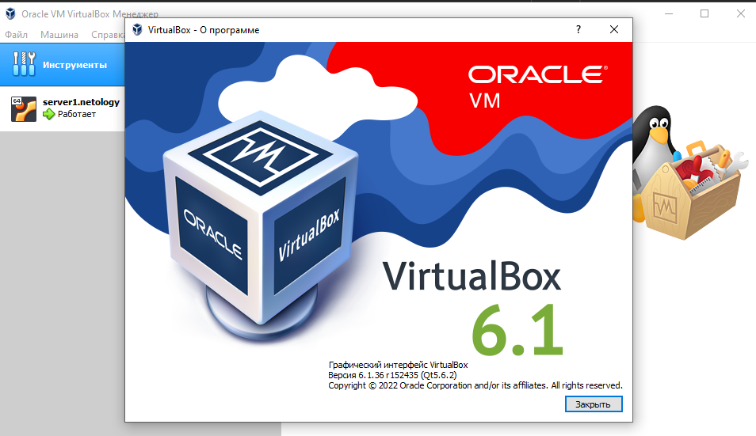

# Дамашнее задание 19 "2. Применение принципов IaaC в работе с виртуальными машинами"

## Олег Дьяченко DEVOPS-22

## Задача 1

- Опишите своими словами основные преимущества применения на практике IaaC паттернов.

Больше всего понравилось объяснение на википедии, коротко понятно и по делу.
Ценность IaC стоит на 3 китах: цена, скорость и уменьшение рисков. 

Уменьшение расходов относится не только к финансовой составляющей, но и к количеству времени, затрачиваемого на рутинные операции. Принципы IaC позволяют не фокусироваться на рутине, а заниматься более важными задачами. Автоматизация инфраструктуры позволяет эффективнее использовать существующие ресурсы. Также автоматизация позволяет минимизировать риск возникновения человеческой ошибки.

- Какой из принципов IaaC является основополагающим?

Идемпотентность. Идемпотентность помогает проектировать более надежные системы


## Задача 2

- Чем Ansible выгодно отличается от других систем управление конфигурациями?

Ansible и Terraform от всех остальных отличает безагентная модель работы. 
Ansible подключается к серверам и работает на них по SSH.

- Какой, на ваш взгляд, метод работы систем конфигурации более надёжный push или pull?

Нашел статейку [ссылка](https://temofeev.ru/info/articles/gitops-sravnenie-metodov-pull-i-push/)

Там, как обычно написано, что разница в сфере применения. И я думаю надо тестировать разные подходы. 

## Задача 3

Установить на личный компьютер:

- VirtualBox
- Vagrant
- Ansible



```

C:\HashiCorp\Home>vagrant version
Installed Version: 2.3.0
Latest Version: 2.3.2


vagrant@server1:~$ ansible --version
ansible [core 2.12.10]
  config file = /etc/ansible/ansible.cfg
  configured module search path = ['/home/vagrant/.ansible/plugins/modules', '/usr/share/ansible/plugins/modules']
  ansible python module location = /usr/lib/python3/dist-packages/ansible
  ansible collection location = /home/vagrant/.ansible/collections:/usr/share/ansible/collections
  executable location = /usr/bin/ansible
  python version = 3.8.10 (default, Mar 15 2022, 12:22:08) [GCC 9.4.0]
  jinja version = 2.10.1
  libyaml = True
```

## Задача 4 (*)

Воспроизвести практическую часть лекции самостоятельно.

- Создать виртуальную машину.
- Зайти внутрь ВМ, убедиться, что Docker установлен с помощью команды
```
docker ps
```

```
vagrant@server1:~$ sudo docker ps
CONTAINER ID   IMAGE     COMMAND   CREATED   STATUS    PORTS     NAMES

vagrant@server1:~$ docker --version
Docker version 20.10.21, build baeda1f
```

Все еще пытаюсь все делать из под винды.

Получилось установить docker через локальный ansible, через настройку `config.vm.provision "ansible_local" do |ansible|`. 
Где vagrant сам ставит ansible, а затем запускает playbook.

Как раз вопрос: интересно вообще такое применяется в DevOps? Думаю применяется, но на сколько часто например в вашей практике. 


