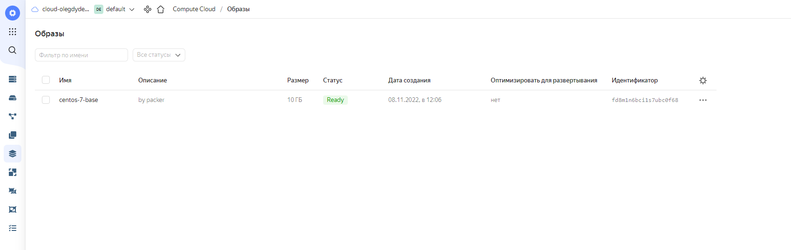
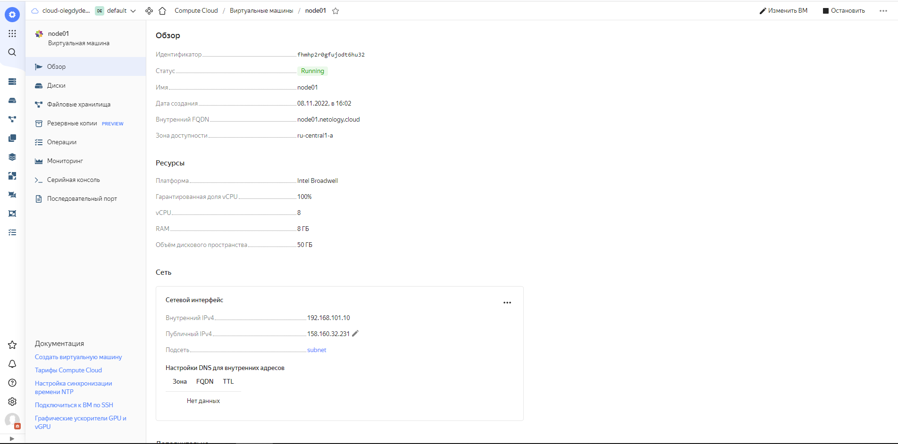
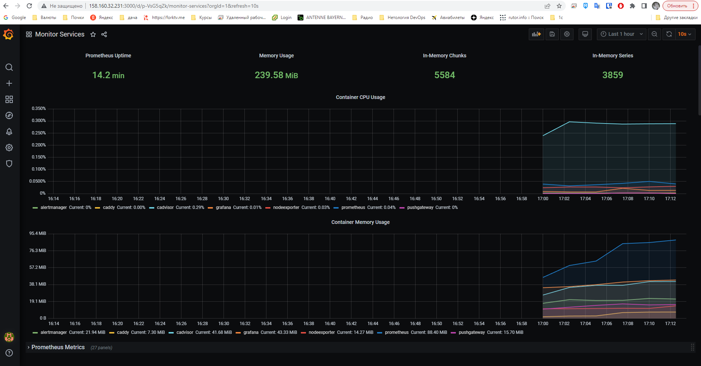

# Домашнее задание 21 "5.4. Оркестрация группой Docker контейнеров на примере Docker Compose"

## Олег Дьяченко DEVOPS-22

## Задача 1

Создать собственный образ операционной системы с помощью Packer.

```
root@server1:/home/vagrant/src/packer#packer build centos8.json
yandex: output will be in this color.

==> yandex: Creating temporary RSA SSH key for instance...
==> yandex: Using as source image: fd88d14a6790do254kj7 (name: "centos-7-v20220620", family: "centos-7")
==> yandex: Use provided subnet id e9br7aljfd0g05hmuk96
==> yandex: Creating disk...
==> yandex: Creating instance...
==> yandex: Waiting for instance with id fhmfhrch35r8bkkd99rm to become active...
    yandex: Detected instance IP: 158.160.38.72
==> yandex: Using SSH communicator to connect: 158.160.38.72
==> yandex: Waiting for SSH to become available...
==> yandex: Connected to SSH!
==> yandex: Stopping instance...
==> yandex: Deleting instance...
    yandex: Instance has been deleted!
==> yandex: Creating image: centos-7-base
==> yandex: Waiting for image to complete...
==> yandex: Success image create...
==> yandex: Destroying boot disk...
    yandex: Disk has been deleted!
Build 'yandex' finished after 1 minute 46 seconds.

==> Wait completed after 1 minute 46 seconds

==> Builds finished. The artifacts of successful builds are:
--> yandex: A disk image was created: centos-7-base (id: fd8m1n6bci1s7ubc0f68) with family name centos
```




## Задача 2

Создать вашу первую виртуальную машину в Яндекс.Облаке.

```
yandex_vpc_network.default: Creating...
yandex_vpc_network.default: Creation complete after 2s [id=enp8slmge9l5seiddhgo]
yandex_vpc_subnet.default: Creating...
yandex_vpc_subnet.default: Creation complete after 1s [id=e9b5554p57lcdtpmukfq]
yandex_compute_instance.node01: Creating...
yandex_compute_instance.node01: Still creating... [10s elapsed]
yandex_compute_instance.node01: Still creating... [20s elapsed]
yandex_compute_instance.node01: Still creating... [30s elapsed]
yandex_compute_instance.node01: Still creating... [40s elapsed]
yandex_compute_instance.node01: Still creating... [50s elapsed]
yandex_compute_instance.node01: Creation complete after 55s [id=fhmhp2r0gfujodt6hu32]

Apply complete! Resources: 3 added, 0 changed, 0 destroyed.

Outputs:

external_ip_address_node01_yandex_cloud = "158.160.32.231"
internal_ip_address_node01_yandex_cloud = "192.168.101.10"
```



## Задача 3

Создать ваш первый готовый к боевой эксплуатации компонент мониторинга, состоящий из стека микросервисов.



