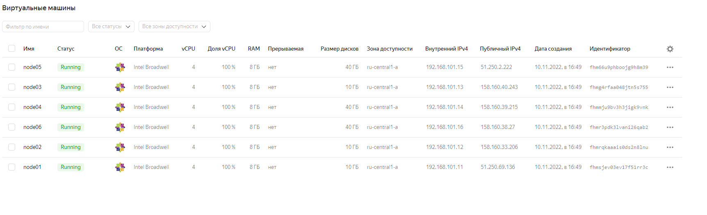

# Домашнее задание 21 "5.5. Оркестрация кластером Docker контейнеров на примере Docker Swarm"

## Олег Дьяченко DEVOPS-22

## Задача 1

Дайте письменные ответы на следующие вопросы:

- В чём отличие режимов работы сервисов в Docker Swarm кластере: replication и global?
  - replication это конкретное количество реплик, а global - сколько нод столько и реплик.
  
- Какой алгоритм выбора лидера используется в Docker Swarm кластере?
  - В кластере могут одновременно работать несколько управляющих нод, которые могут в любой момент заменить вышедшего 
из строя лидера. Используется алгоритм поддержания распределенного консенсуса — Raft. 
 
- Что такое Overlay Network?
  - Overlay Network создает подсеть, которую могут использовать контейнеры в разных хостах swarm-кластера. 
Контейнеры на разных физических хостах могут обмениваться данными по Overlay сети. 
  - Docker создает виртуальные сети поверх существующих связей между хостами, которые могут оказаться внутри одной подсети. 
Любые точки, которые являются частью этой виртуальной сети, выглядят друг для друга так, будто они связаны поверх свича 
и не заботятся об устройстве основной физической сети.

## Задача 2

Создать ваш первый Docker Swarm кластер в Яндекс.Облаке

Для получения зачета, вам необходимо предоставить скриншот из терминала (консоли), с выводом команды:
```
docker node ls
```

```
terraform apply
...
Apply complete! Resources: 11 added, 0 changed, 0 destroyed.

Outputs:

external_ip_address_node01 = "51.250.69.136"
external_ip_address_node02 = "158.160.33.206"
external_ip_address_node03 = "158.160.40.243"
external_ip_address_node04 = "158.160.39.215"
external_ip_address_node05 = "51.250.2.222"
external_ip_address_node06 = "158.160.38.27"
internal_ip_address_node01 = "192.168.101.11"
internal_ip_address_node02 = "192.168.101.12"
internal_ip_address_node03 = "192.168.101.13"
internal_ip_address_node04 = "192.168.101.14"
internal_ip_address_node05 = "192.168.101.15"
internal_ip_address_node06 = "192.168.101.16"

root@server1:/home/vagrant/src55/terraform# ssh centos@51.250.69.136
[centos@node01 ~]$ sudo docker node ls
ID                            HOSTNAME             STATUS    AVAILABILITY   MANAGER STATUS   ENGINE VERSION
6ettjy21bnm8jteeh29bndrrs *   node01.netology.yc   Ready     Active         Leader           20.10.21
80b61yq4o17cnrkbp4vrwit8k     node02.netology.yc   Ready     Active         Reachable        20.10.21
ika4c85f1bfl4rqoknd6zsnlp     node03.netology.yc   Ready     Active         Reachable        20.10.21
x0xnw9j0cjqd9cbcqfhhwxhwp     node04.netology.yc   Ready     Active                          20.10.21
pm4kajpqx57fjujxtmtar98lv     node05.netology.yc   Ready     Active                          20.10.21
r3ih00l55jiebn84sdup57qgh     node06.netology.yc   Ready     Active                          20.10.21
```

## Задача 3

Создать ваш первый, готовый к боевой эксплуатации кластер мониторинга, состоящий из стека микросервисов.

Для получения зачета, вам необходимо предоставить скриншот из терминала (консоли), с выводом команды:
```
docker service ls
```

```
[centos@node01 ~]$ sudo docker service ls
ID             NAME                                MODE         REPLICAS   IMAGE                                          PORTS
ty8whuf68xa9   swarm_monitoring_alertmanager       replicated   1/1        stefanprodan/swarmprom-alertmanager:v0.14.0
115vyevz10fx   swarm_monitoring_caddy              replicated   1/1        stefanprodan/caddy:latest                      *:3000->3000/tcp, *:9090->9090/tcp, *:9093-9094->9093-9094/tcp
mwhsgqjy71jx   swarm_monitoring_cadvisor           global       6/6        google/cadvisor:latest
0jc5d0ce4tgh   swarm_monitoring_dockerd-exporter   global       6/6        stefanprodan/caddy:latest
ll89qab3wh9l   swarm_monitoring_grafana            replicated   1/1        stefanprodan/swarmprom-grafana:5.3.4
whjisi7pj46a   swarm_monitoring_node-exporter      global       6/6        stefanprodan/swarmprom-node-exporter:v0.16.0
sayhl6e84g43   swarm_monitoring_prometheus         replicated   1/1        stefanprodan/swarmprom-prometheus:v2.5.0
im3od5qxngqq   swarm_monitoring_unsee              replicated   1/1        cloudflare/unsee:v0.8.0
```

## Задача 4 (*)

Выполнить на лидере Docker Swarm кластера команду (указанную ниже) и дать письменное описание её функционала, что она делает и зачем она нужна:
```
# см.документацию: https://docs.docker.com/engine/swarm/swarm_manager_locking/
docker swarm update --autolock=true
```

```
[centos@node01 ~]$ sudo docker swarm update --autolock=true
Swarm updated.
To unlock a swarm manager after it restarts, run the `docker swarm unlock`
command and provide the following key:

    SWMKEY-1-2btHwzW+tv1U+Yu6OSuUcRv01uFVBMIlVD+Opc8sq4A

Please remember to store this key in a password manager, since without it you
will not be able to restart the manager.
```

```--autolock   Enable manager autolocking (requiring an unlock key to start a stopped manager)```

Я так понял что, если включить эту блокировку, то не сможешь запустить кластер пока не введешь этот токен.
Если что расскажите на итоговом вебинаре подробнее.