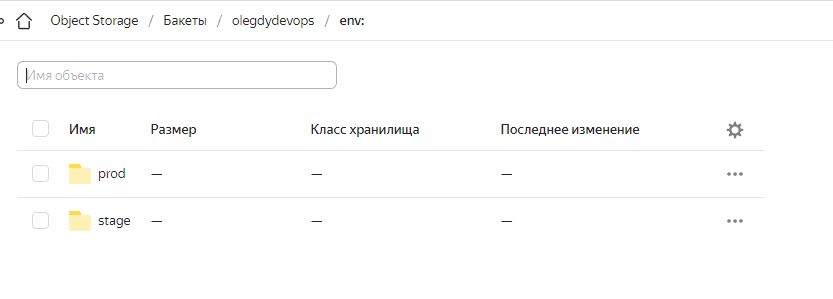

# Домашнее задание 31 [7.3. Основы и принцип работы Терраформ](https://github.com/netology-code/virt-homeworks/tree/virt-11/07-terraform-03-basic)

## Олег Дьяченко DEVOPS-22

## Задача 1. Создадим бэкэнд в S3 (необязательно, но крайне желательно).

Если в рамках предыдущего задания у вас уже есть аккаунт AWS, то давайте продолжим знакомство со взаимодействием
терраформа и aws. 

1. Создайте s3 бакет, iam роль и пользователя от которого будет работать терраформ. Можно создать отдельного пользователя,
а можно использовать созданного в рамках предыдущего задания, просто добавьте ему необходимы права, как описано 
[здесь](https://www.terraform.io/docs/backends/types/s3.html).
1. Зарегистрируйте бэкэнд в терраформ проекте как описано по ссылке выше. 

Создал через terraform отдельным файлом конфигурации [Папка с проектом](create_bucket)
Посмотрел как можно сделать вручную.  
Сделал workspace-ы, проверил что файлы состояния появились на облаке.
```
root@server1:/vagrant/demo/infrastructure-as-code-main/terraform/30-74# terraform workspace list
* default

root@server1:/vagrant/demo/infrastructure-as-code-main/terraform/30-74# terraform workspace new prod
Created and switched to workspace "prod"!

You're now on a new, empty workspace. Workspaces isolate their state,
so if you run "terraform plan" Terraform will not see any existing state
for this configuration.
root@server1:/vagrant/demo/infrastructure-as-code-main/terraform/30-74# terraform workspace new stage
Created and switched to workspace "stage"!

You're now on a new, empty workspace. Workspaces isolate their state,
so if you run "terraform plan" Terraform will not see any existing state
for this configuration.
root@server1:/vagrant/demo/infrastructure-as-code-main/terraform/30-74# terraform workspace select prod
Switched to workspace "prod".
root@server1:/vagrant/demo/infrastructure-as-code-main/terraform/30-74# terraform workspace list
  default
* prod
  stage
```


## Задача 2. Инициализируем проект и создаем воркспейсы. 

1. Выполните `terraform init`:
    * если был создан бэкэнд в S3, то терраформ создат файл стейтов в S3 и запись в таблице 
dynamodb.
    * иначе будет создан локальный файл со стейтами.  
1. Создайте два воркспейса `stage` и `prod`.
1. В уже созданный `aws_instance` добавьте зависимость типа инстанса от вокспейса, что бы в разных ворскспейсах 
использовались разные `instance_type`.
1. Добавим `count`. Для `stage` должен создаться один экземпляр `ec2`, а для `prod` два. 
1. Создайте рядом еще один `aws_instance`, но теперь определите их количество при помощи `for_each`, а не `count`.
1. Что бы при изменении типа инстанса не возникло ситуации, когда не будет ни одного инстанса добавьте параметр
жизненного цикла `create_before_destroy = true` в один из рессурсов `aws_instance`.
1. При желании поэкспериментируйте с другими параметрами и рессурсами.

В виде результата работы пришлите:
* Вывод команды `terraform workspace list`.
* Вывод команды `terraform plan` для воркспейса `prod`.  

```
terraform workspace list
  default
* prod
  stage
```

Count и for_each в одном инстансе не работает, пришлось сделать два блока. Можно конечно через модули как на лекционном примере, 
но не стал плагиатить, намучал свое :)

Сделал вывод plan для [prod](main/prodplan.txt) и [stage](main/stageplan.txt)

