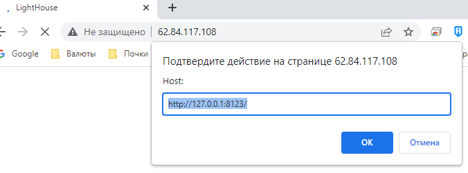

## Домашнее задание 37 [8.3 Использование Yandex Cloud](https://github.com/netology-code/mnt-homeworks/tree/MNT-video/08-ansible-03-yandex)

### Олег Дьяченко DEVOPS-22

## Подготовка к выполнению

1. Подготовьте в Yandex Cloud три хоста: для `clickhouse`, для `vector` и для `lighthouse`.

    Ссылка на репозиторий LightHouse: https://github.com/VKCOM/lighthouse  
    
    Собрал ресурсы яндекса через terraform

    ```
    Apply complete! Resources: 5 added, 0 changed, 0 destroyed.
    
    Outputs:
    
    public_ip = {
      "clickhouse" = [
        "62.84.119.229",
      ]
      "lighthouse" = [
        "62.84.116.110",
      ]
      "vector" = [
        "62.84.117.108",
      ]
    }
    ```


## Основная часть

1. Допишите playbook: нужно сделать ещё один play, который устанавливает и настраивает lighthouse.
2. При создании tasks рекомендую использовать модули: `get_url`, `template`, `yum`, `apt`.
3. Tasks должны: скачать статику lighthouse, установить nginx или любой другой webserver, настроить его конфиг для открытия lighthouse, запустить webserver.
4. Приготовьте свой собственный inventory файл [prod.yml](playbook/inventory/prod.yml). 
5. Запустите `ansible-lint site.yml` и исправьте ошибки, если они есть.  
    Без ошибок
6. Попробуйте запустить playbook на этом окружении с флагом `--check`.
    ```
    root@server1:/vagrant/playbook83# ansible-playbook site.yml -i inventory/prod.yml --check
    
    PLAY [Install Clickhouse] **************************************************************************************************
    
    TASK [Gathering Facts] *****************************************************************************************************
    ok: [clickhouse-01]
    
    TASK [Get clickhouse distrib] **********************************************************************************************
    changed: [clickhouse-01] => (item=clickhouse-client)
    changed: [clickhouse-01] => (item=clickhouse-server)
    failed: [clickhouse-01] (item=clickhouse-common-static) => {"ansible_loop_var": "item", "changed": false, "dest": "./clickhouse-common-static-22.3.3.44.rpm", "elapsed": 0, "item": "clickhouse-common-static", "msg": "Request failed", "response": "HTTP Error 404: Not Found", "status_code": 404, "url": "https://packages.clickhouse.com/rpm/stable/clickhouse-common-static-22.3.3.44.noarch.rpm"}
    
    TASK [Get clickhouse distrib] **********************************************************************************************
    changed: [clickhouse-01]
    
    TASK [Install clickhouse packages] *****************************************************************************************
    fatal: [clickhouse-01]: FAILED! => {"changed": false, "msg": "No RPM file matching 'clickhouse-common-static-22.3.3.44.rpm' found on system", "rc": 127, "results": ["No RPM file matching 'clickhouse-common-static-22.3.3.44.rpm' found on system"]}
    
    PLAY RECAP *****************************************************************************************************************
    clickhouse-01              : ok=2    changed=1    unreachable=0    failed=1    skipped=0    rescued=1    ignored=0
    ```

7. Запустите playbook на `prod.yml` окружении с флагом `--diff`. Убедитесь, что изменения на системе произведены.  
   [Ссылка на diff1](diff1.txt)
8. Повторно запустите playbook с флагом `--diff` и убедитесь, что playbook идемпотентен.  
   [Ссылка на diff2](diff2.txt)  
   После прогона проверил, открывается ли lighthouse  
   
9. Подготовьте README.md файл по своему playbook. В нём должно быть описано: что делает playbook, какие у него есть параметры и теги.
10. Готовый playbook выложите в свой репозиторий, поставьте тег `08-ansible-03-yandex` на фиксирующий коммит, в ответ предоставьте ссылку на него.  
   [Ссылка на readme](playbook/readme.md)


