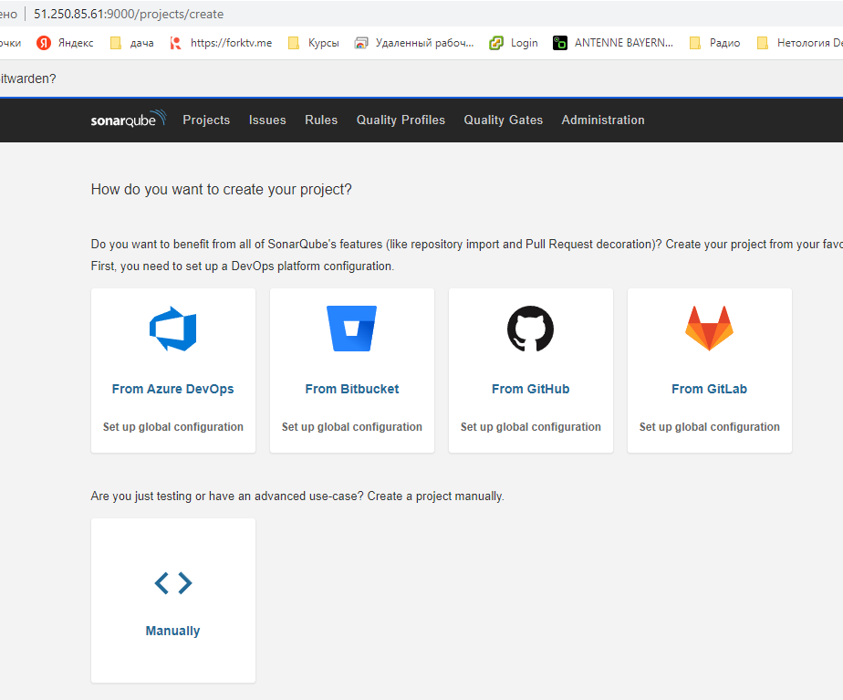
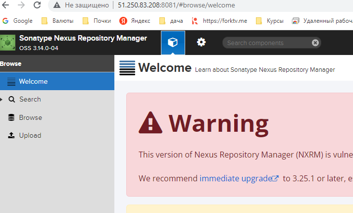
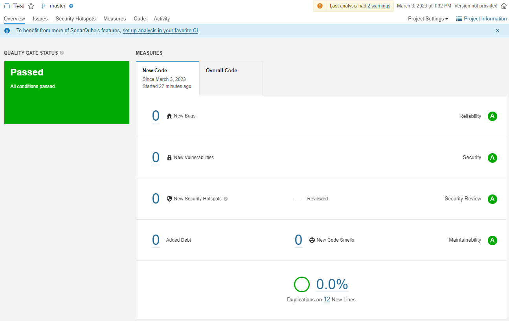
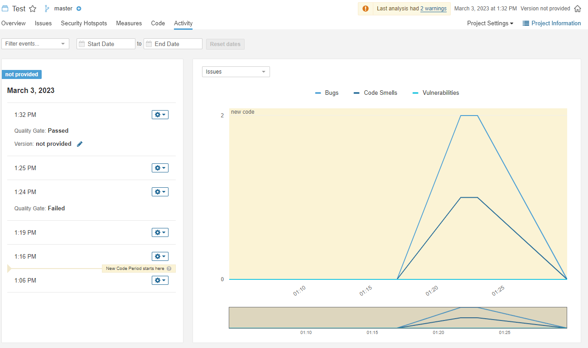

## Домашнее задание 43 [9.3 Процессы CI/CD](https://github.com/netology-code/mnt-homeworks/tree/MNT-video/09-ci-03-cicd)

### Олег Дьяченко DEVOPS-22


## Подготовка к выполнению

1. Создайте два VM в Yandex Cloud с параметрами: 2CPU 4RAM Centos7 (остальное по минимальным требованиям).
    ```
    Apply complete! Resources: 4 added, 0 changed, 0 destroyed.
    
    Outputs:
    
    public_ip = {
      "nexus" = [
        "51.250.83.208",
      ]
      "sonar" = [
        "51.250.85.61",
      ]
    }
    ```
2. Пропишите в [inventory](./infrastructure/inventory/cicd/hosts.yml) [playbook](./infrastructure/site.yml) созданные хосты.
3. Добавьте в [files](./infrastructure/files/) файл со своим публичным ключом (id_rsa.pub). Если ключ называется иначе — найдите таску в плейбуке, которая использует id_rsa.pub имя, и исправьте на своё.
4. Запустите playbook, ожидайте успешного завершения.
    ```
    ansible-playbook site.yml -i ./inventory/cicd/hosts.yml
    ...
    PLAY RECAP ************************************************************************************************************************************
    nexus-01                   : ok=17   changed=15   unreachable=0    failed=0    skipped=2    rescued=0    ignored=0
    sonar-01                   : ok=35   changed=27   unreachable=0    failed=0    skipped=0    rescued=0    ignored=0
    ```
5. Проверьте готовность SonarQube через [браузер](http://51.250.85.61:9000).

6. Зайдите под admin\admin, поменяйте пароль на свой.
7.  Проверьте готовность Nexus через [бразуер](http://51.250.83.208:8081).

8. Подключитесь под admin\admin123, поменяйте пароль, сохраните анонимный доступ.

## Знакомоство с SonarQube

### Основная часть

1. Создайте новый проект, название произвольное.
2. Скачайте пакет sonar-scanner, который вам предлагает скачать SonarQube.

sonar-scanner.bat -D"sonar.projectKey=Test" -D"sonar.sources=." -D"sonar.host.url=http://51.250.85.61:9000" -D"sonar.login=28ddf15d46601cea8908a847a02f3c2d5b1fb49c"

3. Сделайте так, чтобы binary был доступен через вызов в shell (или поменяйте переменную PATH, или любой другой, удобный вам способ).
4. Проверьте `sonar-scanner --version`.
   ```
   INFO: Scanner configuration file: C:\HashiCorp\Home\hw93\sonar-scanner-cli-4.8.0.2856-windows\sonar-scanner-4.8.0.2856-windows\bin\..\conf\sonar-scanner.properties
   INFO: Project root configuration file: NONE
   INFO: SonarScanner 4.8.0.2856
   INFO: Java 11.0.17 Eclipse Adoptium (64-bit)
   INFO: Windows 10 10.0 amd64
   ```
5. Запустите анализатор против кода из директории [example](./example) с дополнительным ключом `-Dsonar.coverage.exclusions=fail.py`.
6. Посмотрите результат в интерфейсе.
7. Исправьте ошибки, которые он выявил, включая warnings.
8. Запустите анализатор повторно — проверьте, что QG пройдены успешно.
9. Сделайте скриншот успешного прохождения анализа, приложите к решению ДЗ.



## Знакомство с Nexus

### Основная часть

1. В репозиторий `maven-public` загрузите артефакт с GAV-параметрами:

 *    groupId: netology;
 *    artifactId: java;
 *    version: 8_282;
 *    classifier: distrib;
 *    type: tar.gz.
   
2. В него же загрузите такой же артефакт, но с version: 8_102.
3. Проверьте, что все файлы загрузились успешно.
4. В ответе пришлите файл `maven-metadata.xml` для этого артефекта.
   ```XML
   <?xml version="1.0" encoding="UTF-8"?>
   <metadata modelVersion="1.1.0">
     <groupId>netology</groupId>
     <artifactId>java</artifactId>
     <versioning>
       <latest>8_282</latest>
       <release>8_282</release>
       <versions>
         <version>8_102</version>
         <version>8_282</version>
       </versions>
       <lastUpdated>20230303040157</lastUpdated>
     </versioning>
   </metadata>
   ```

### Знакомство с Maven

### Подготовка к выполнению

1. Скачайте дистрибутив с [maven](https://maven.apache.org/download.cgi).
2. Разархивируйте, сделайте так, чтобы binary был доступен через вызов в shell (или поменяйте переменную PATH, или любой другой, удобный вам способ).
3. Удалите из `apache-maven-<version>/conf/settings.xml` упоминание о правиле, отвергающем HTTP- соединение — раздел mirrors —> id: my-repository-http-unblocker.
4. Проверьте `mvn --version`.
5. Заберите директорию [mvn](./mvn) с pom.
   ```
   root@server1:/vagrant/hw93# root@server1:/vagrant/hw93# mvn -v
   Apache Maven 3.9.0 (9b58d2bad23a66be161c4664ef21ce219c2c8584)
   Maven home: /usr/share/apache-maven
   Java version: 11.0.18, vendor: Ubuntu, runtime: /usr/lib/jvm/java-11-openjdk-amd64
   Default locale: en_US, platform encoding: UTF-8
   OS name: "linux", version: "5.4.0-110-generic", arch: "amd64", family: "unix"
   ```
### Основная часть

1. Поменяйте в `pom.xml` блок с зависимостями под ваш артефакт из первого пункта задания для Nexus (java с версией 8_282).
2. Запустите команду `mvn package` в директории с `pom.xml`, ожидайте успешного окончания.
   ```
   [WARNING] JAR will be empty - no content was marked for inclusion!
   [INFO] Building jar: /vagrant/hw93/09-ci-03-cicd/mvn/target/java-1.0.0.jar
   [INFO] ------------------------------------------------------------------------
   [INFO] BUILD SUCCESS
   [INFO] ------------------------------------------------------------------------
   [INFO] Total time:  11.054 s
   [INFO] Finished at: 2023-03-03T04:23:23Z
   [INFO] ------------------------------------------------------------------------
   ```
3. Проверьте директорию `~/.m2/repository/`, найдите ваш артефакт.

   ```
   root@server1:~/.m2/repository/netology/java/8_282# ls -ll
   total 12
   -rw-r--r-- 1 root root   0 Mar  3 04:23 java-8_282-distrib.tar.gz
   -rw-r--r-- 1 root root  40 Mar  3 04:23 java-8_282-distrib.tar.gz.sha1
   -rw-r--r-- 1 root root 390 Mar  3 04:23 java-8_282.pom.lastUpdated
   -rw-r--r-- 1 root root 175 Mar  3 04:23 _remote.repositories
   ```

4. В ответе пришлите исправленный файл `pom.xml`.
   ```XML
   <project xmlns="http://maven.apache.org/POM/4.0.0" xmlns:xsi="http://www.w3.org/2001/XMLSchema-instance"
     xsi:schemaLocation="http://maven.apache.org/POM/4.0.0 http://maven.apache.org/xsd/maven-4.0.0.xsd">
     <modelVersion>4.0.0</modelVersion>
    
     <groupId>netology_new</groupId>
     <artifactId>java</artifactId>
     <version>1.0.0</version>
      <repositories>
       <repository>
         <id>my-repo</id>
         <name>maven-public</name>
         <url>http://51.250.83.208:8081/repository/maven-public/</url>
       </repository>
     </repositories>
     <dependencies>
        <dependency>
         <groupId>netology</groupId>
         <artifactId>java</artifactId>
         <version>8_282</version>
         <classifier>distrib</classifier>
         <type>tar.gz</type>
       </dependency>
     </dependencies>
   </project>
   ```
