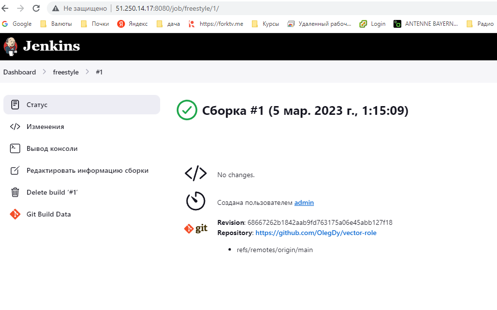
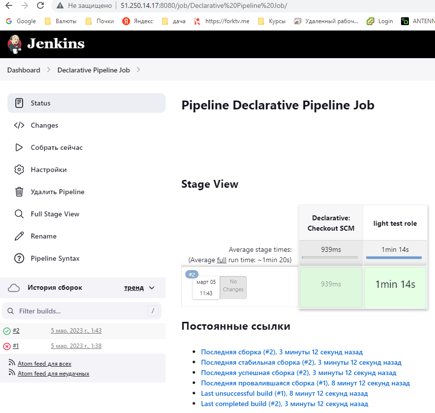
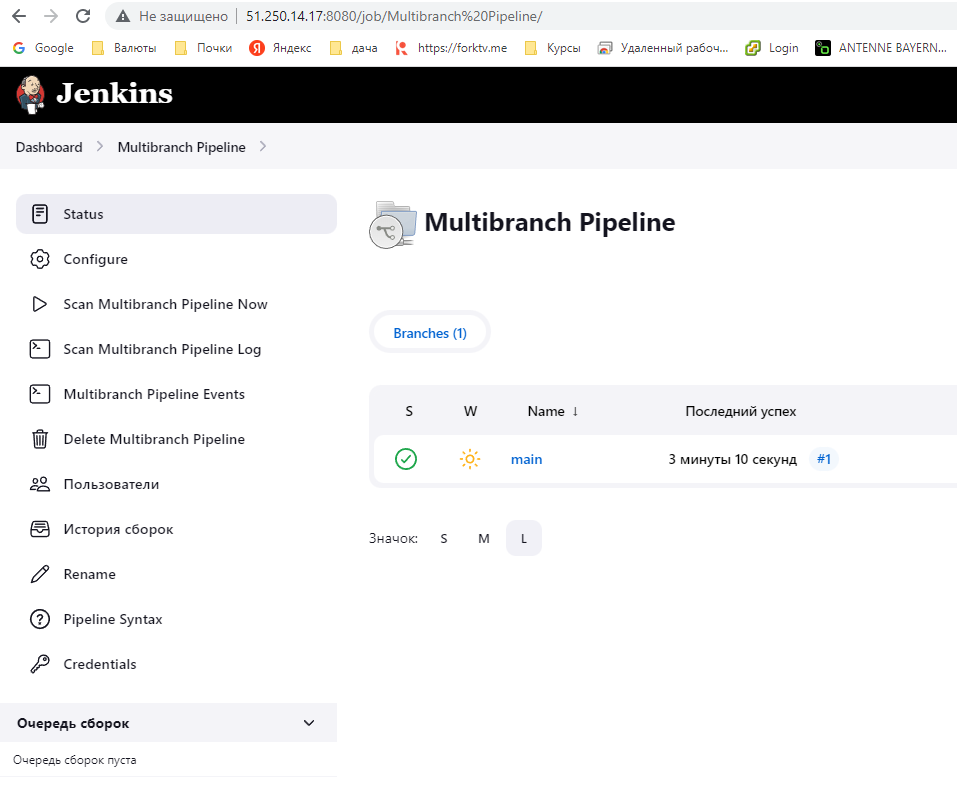
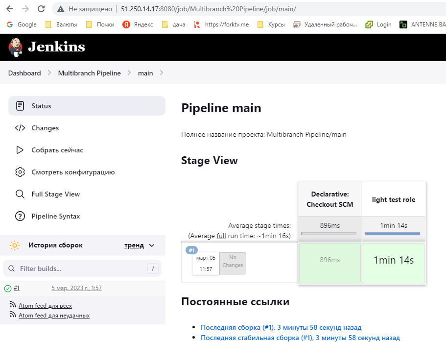
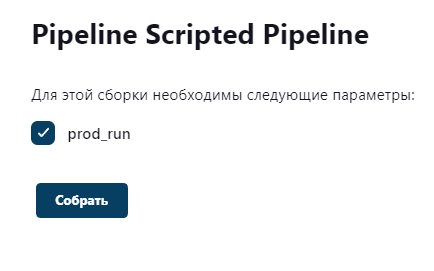
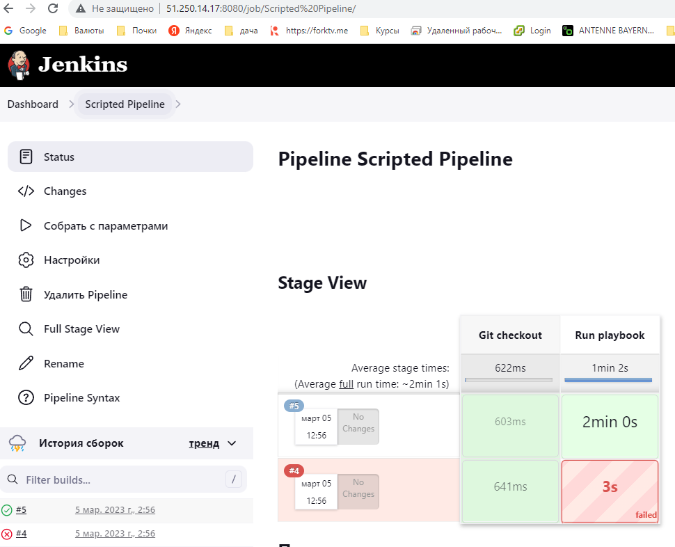

## Домашнее задание 44 [9.4 Jenkins](https://github.com/netology-code/mnt-homeworks/tree/MNT-video/09-ci-04-jenkins)

### Олег Дьяченко DEVOPS-22

## Подготовка к выполнению

1. Создать два VM: для jenkins-master и jenkins-agent.
    ```
    Apply complete! Resources: 4 added, 0 changed, 0 destroyed.
    
    Outputs:
    
    public_ip = {
      "jenkins" = [
        "51.250.14.17",
        "51.250.83.126",
      ]
    }
    ```
2. Установить Jenkins при помощи playbook.
    ```
    ansible-playbook site.yml -i ./inventory/cicd/hosts.yml
    PLAY RECAP ************************************************************************************************************************************
    jenkins-agent-01           : ok=17   changed=14   unreachable=0    failed=0    skipped=0    rescued=0    ignored=0
    jenkins-master-01          : ok=11   changed=9    unreachable=0    failed=0    skipped=0    rescued=0    ignored=0
    ```
3. Запустить и проверить работоспособность.
4. Сделать первоначальную настройку.

   


## Основная часть

1. Сделать Freestyle Job, который будет запускать `molecule test` из любого вашего репозитория с ролью.   

   Использовал CentOS8, но затем еще донастроил, чтоб работала molecule, сделал версии и плагины как на своей машине.
   Только после этого запустилась. Промучался целый день.
   Команду использовал облегченную `molecule test -s centos7`
   

2. Сделать Declarative Pipeline Job, который будет запускать `molecule test` из любого вашего репозитория с ролью.
3. Перенести Declarative Pipeline в репозиторий в файл `Jenkinsfile`.  

   [jenkinsfile](https://github.com/OlegDy/vector-role/blob/main/jenkinsfile)
   

4. Создать Multibranch Pipeline на запуск `Jenkinsfile` из репозитория.

   
   

5. Создать Scripted Pipeline, наполнить его скриптом из [pipeline](./pipeline).
6. Внести необходимые изменения, чтобы Pipeline запускал `ansible-playbook` без флагов `--check --diff`, если не установлен параметр при запуске джобы (prod_run = True). По умолчанию параметр имеет значение False и запускает прогон с флагами `--check --diff`.
7. Проверить работоспособность, исправить ошибки, исправленный Pipeline вложить в репозиторий в файл `ScriptedJenkinsfile`.  

    При запуске `prod_run=false` скрипт запускает check и выходит ошибка
    ```
    TASK [java : Ensure installation dir exists] ***********************************
    --- before
    +++ after
    @@ -1,4 +1,4 @@
     {
         "path": "/opt/jdk/openjdk-11",
    -    "state": "absent"
    +    "state": "directory"
     }
    
    changed: [localhost]
    
    TASK [java : Extract java in the installation directory] ***********************
    An exception occurred during task execution. To see the full traceback, use -vvv. The error was: NoneType: None
    fatal: [localhost]: FAILED! => {"changed": false, "msg": "dest '/opt/jdk/openjdk-11' must be an existing dir"}
    
    PLAY RECAP *********************************************************************
    localhost                  : ok=3    changed=2    unreachable=0    failed=1    skipped=1    rescued=0    ignored=0   
    
    [Pipeline] }
    [Pipeline] // stage
    [Pipeline] }
    [Pipeline] // node
    [Pipeline] End of Pipeline
    ERROR: script returned exit code 2
    Finished: FAILURE
    ```
    При `prod_run=true` все выходит нормально. 
    

8. Отправить ссылку на репозиторий с ролью и Declarative Pipeline и Scripted Pipeline.

    [vector-role](https://github.com/OlegDy/vector-role)  
    [jenkinsfile](https://github.com/OlegDy/vector-role/blob/main/jenkinsfile)  
    [ScriptedJenkinsfile](https://github.com/OlegDy/vector-role/blob/main/ScriptedJenkinsfile)  