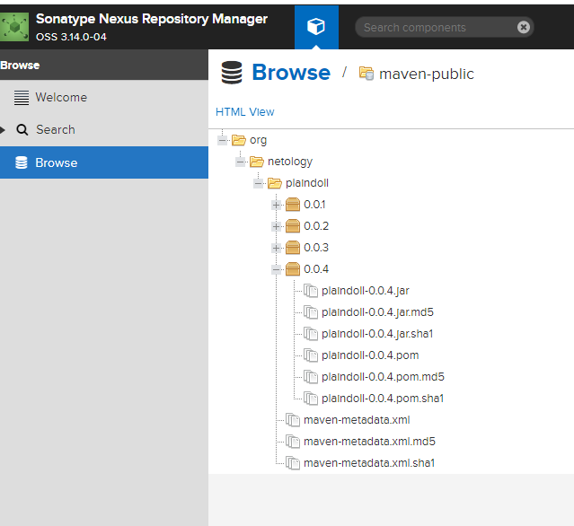

## Домашнее задание 45 [9.5 Teamcity](https://github.com/netology-code/mnt-homeworks/tree/MNT-video/09-ci-05-teamcity)

### Олег Дьяченко DEVOPS-22

# Домашнее задание к занятию 11 «Teamcity»

## Подготовка к выполнению

1. В Yandex Cloud создайте новый инстанс (4CPU4RAM) на основе образа `jetbrains/teamcity-server`.
2. Дождитесь запуска teamcity, выполните первоначальную настройку.
3. Создайте ещё один инстанс (2CPU4RAM) на основе образа `jetbrains/teamcity-agent`. Пропишите к нему переменную окружения `SERVER_URL: "http://<teamcity_url>:8111"`.
4. Авторизуйте агент.
5. Сделайте fork [репозитория](https://github.com/aragastmatb/example-teamcity).
6. Создайте VM (2CPU4RAM) и запустите [playbook](./infrastructure).
    ```
    PLAY RECAP **********************************************************************************************************************************************************************************************************************************
    nexus-01                   : ok=17   changed=15   unreachable=0    failed=0    skipped=2    rescued=0    ignored=0
    ```
    

## Основная часть

1. Создайте новый проект в teamcity на основе fork.
   
2. Сделайте autodetect конфигурации.
   
3. Сохраните необходимые шаги, запустите первую сборку master.
    
4. Поменяйте условия сборки: если сборка по ветке `master`, то должен происходит `mvn clean deploy`, иначе `mvn clean test`.
    
5. Для deploy будет необходимо загрузить [settings.xml](./teamcity/settings.xml) в набор конфигураций maven у teamcity, предварительно записав туда креды для подключения к nexus.
6. В pom.xml необходимо поменять ссылки на репозиторий и nexus.
7. Запустите сборку по master, убедитесь, что всё прошло успешно и артефакт появился в nexus.
    
8. Мигрируйте `build configuration` в репозиторий.
    
   [ссылка на .teamcity)](https://github.com/OlegDy/example-teamcity/tree/master/.teamcity)
9. Создайте отдельную ветку `feature/add_reply` в репозитории.
10. Напишите новый метод для класса Welcomer: метод должен возвращать произвольную реплику, содержащую слово `hunter`.
   ```java
   package plaindoll;
   
   public class Welcomer{
       public String sayWelcome() {
           return "Welcome home, good hunter. What is it your desire?";
       }
       public String sayFarewell() {
           return "Farewell, good hunter. May you find your worth in waking world.";
       }
       public String sayNeedGold(){
           return "Not enough gold";
       }
       public String saySome(){
           return "something in the way";
       }
       public String sayGLHunter(){
           return "Good luck, hunter.";
       }
   }
   ```
11. Дополните тест для нового метода на поиск слова `hunter` в новой реплике.

   ```
   ...
       @Test
       public void welcomerGoodLuck(){
           assertThat(welcomer.sayGLHunter(), containsString("hunter"));
       }
   ...
   ```
12. Сделайте push всех изменений в новую ветку репозитория.
13. Убедитесь, что сборка самостоятельно запустилась, тесты прошли успешно.

   

14. Внесите изменения из произвольной ветки `feature/add_reply` в `master` через `Merge`.
15. Убедитесь, что нет собранного артефакта в сборке по ветке `master`.
16. Настройте конфигурацию так, чтобы она собирала `.jar` в артефакты сборки.

   
17. Проведите повторную сборку мастера, убедитесь, что сбора прошла успешно и артефакты собраны.

   
18. Проверьте, что конфигурация в репозитории содержит все настройки конфигурации из teamcity.

   
19. В ответе пришлите ссылку на репозиторий.

   [Ссылка на репозиторий](https://github.com/OlegDy/example-teamcity)