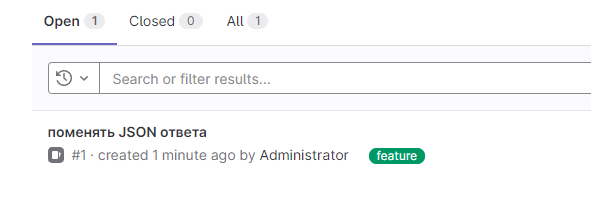
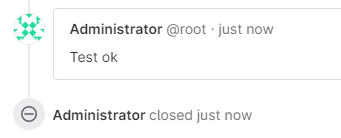

## Домашнее задание 46 [9.6 GitLab](https://github.com/netology-code/mnt-homeworks/tree/MNT-video/09-ci-06-gitlab)

### Олег Дьяченко DEVOPS-22


## Подготовка к выполнению

1. Подготовьте к работе GitLab [по инструкции](https://cloud.yandex.ru/docs/tutorials/infrastructure-management/gitlab-containers).

    

2. Создайте свой новый проект.
3. Создайте новый репозиторий в GitLab, наполните его [файлами](./repository).

   

4. Проект должен быть публичным, остальные настройки по желанию.

## Основная часть

### DevOps

В репозитории содержится код проекта на Python. Проект — RESTful API сервис. Ваша задача — автоматизировать сборку образа с выполнением python-скрипта:

1. Образ собирается на основе [centos:7](https://hub.docker.com/_/centos?tab=tags&page=1&ordering=last_updated).
2. Python версии не ниже 3.7.
3. Установлены зависимости: `flask` `flask-jsonpify` `flask-restful`.
4. Создана директория `/python_api`.
5. Скрипт из репозитория размещён в /python_api.
6. Точка вызова: запуск скрипта.
7. Если сборка происходит на ветке `master`: должен подняться pod kubernetes на основе образа `python-api`, иначе этот шаг нужно пропустить.

   
   

   [.gitlab-ci.yml](devops-main/.gitlab-ci.yml)  
   [Dockerfile](devops-main/Dockerfile)  
   [k8s.yaml](devops-main/k8s.yaml)  
   [python-api.py](devops-main/python-api.py)  
   [requirements.txt](devops-main/requirements.txt)  
   
   ```
   root@server1:/vagrant/hw96# kubectl logs deployment.apps/python-api-deployment -n netology
    * Serving Flask app 'python-api' (lazy loading)
    * Environment: production
      WARNING: This is a development server. Do not use it in a production deployment.
      Use a production WSGI server instead.
    * Debug mode: off
    * Running on all addresses.
      WARNING: This is a development server. Do not use it in a production deployment.
    * Running on http://10.112.128.17:5290/ (Press CTRL+C to quit)
   
   root@server1:/vagrant/hw96# ssh centos@51.250.14.38
   centos@cl1dqtjdr1bgee291jou-ivor:~$
   centos@cl1dqtjdr1bgee291jou-ivor:~$ curl http://10.112.128.17:5290/get_info
   {"version": 3, "method": "GET", "message": "Already started"}
   ```

### Product Owner

Вашему проекту нужна бизнесовая доработка: нужно поменять JSON ответа на вызов метода GET `/rest/api/get_info`, необходимо создать Issue в котором указать:

1. Какой метод необходимо исправить.
2. Текст с `{ "message": "Already started" }` на `{ "message": "Running"}`.
3. Issue поставить label: feature.

   

### Developer

Пришёл новый Issue на доработку, вам нужно:

1. Создать отдельную ветку, связанную с этим Issue.
2. Внести изменения по тексту из задания.
3. Подготовить Merge Request, влить необходимые изменения в `master`, проверить, что сборка прошла успешно.

   
   
   

### Tester

Разработчики выполнили новый Issue, необходимо проверить валидность изменений:

1. Поднять докер-контейнер с образом `python-api:latest` и проверить возврат метода на корректность.
2. Закрыть Issue с комментарием об успешности прохождения, указав желаемый результат и фактически достигнутый.

   
   

   Автоматически deploy почему-то не перезаписал pod, пришлось удалять вручную и перезапускать pipeline, моих знаний решить это по другому не хватило.
`kubectl delete deployment.apps/python-api-deployment -n netology --force`

   ```
   root@server1:/vagrant/hw96# kubectl logs deployment.apps/python-api-deployment -n netology
    * Serving Flask app 'python-api' (lazy loading)
    * Environment: production
    * Debug mode: off
    * Running on all addresses.
    * Running on http://10.112.128.26:5290/ (Press CTRL+C to quit)
   
   root@server1:/vagrant/hw96# ssh centos@51.250.14.38
   
   centos@cl1dqtjdr1bgee291jou-ivor:~$ curl http://10.112.128.26:5290/get_info
   {"version": 3, "method": "GET", "message": "Running"}
   
   ```


