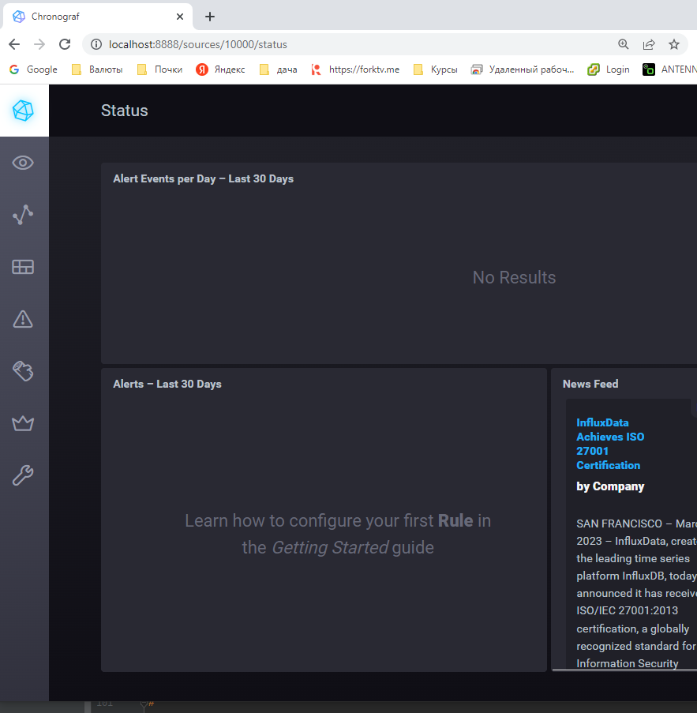
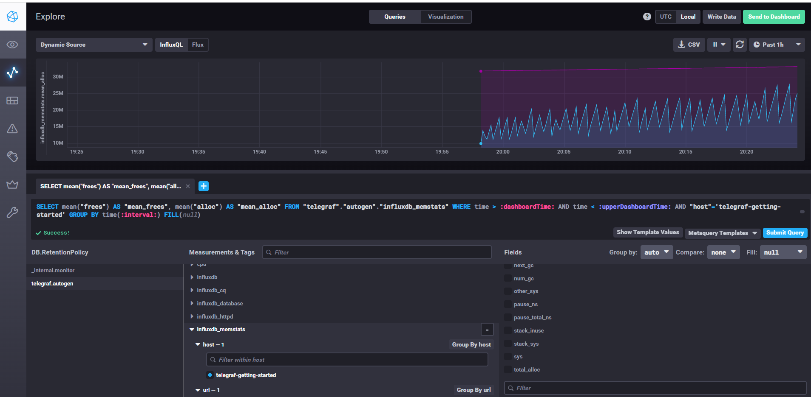
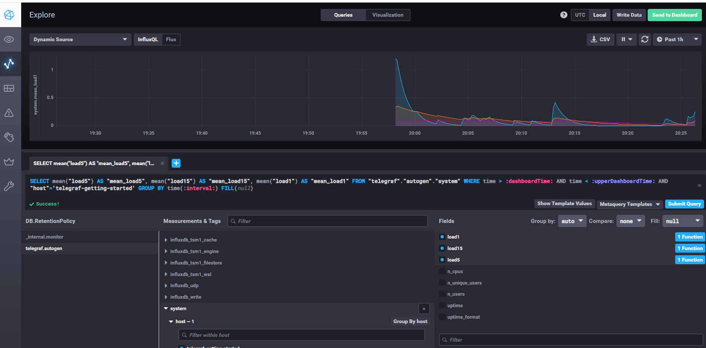
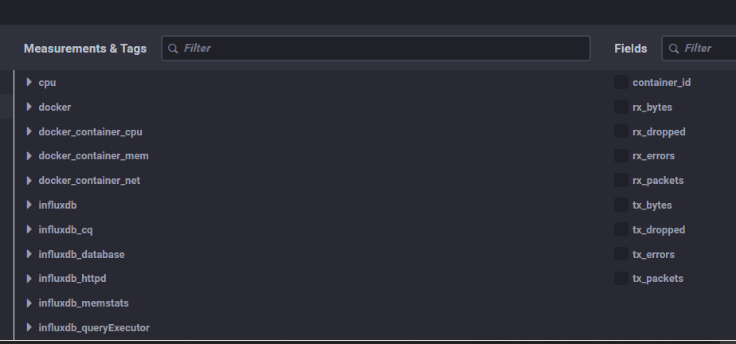

## Домашнее задание 47 [10.2 Введение в мониторинг](https://github.com/netology-code/mnt-homeworks/tree/MNT-video/10-monitoring-02-systems)

### Олег Дьяченко DEVOPS-22


## Обязательные задания

1. Вас пригласили настроить мониторинг на проект. На онбординге вам рассказали, что проект представляет из себя платформу для вычислений с выдачей текстовых отчётов, которые сохраняются на диск. 
Взаимодействие с платформой осуществляется по протоколу http. Также вам отметили, что вычисления загружают ЦПУ. Какой минимальный набор метрик вы выведите в мониторинг и почему?

Я предлагаю следующий минимальный набор метрик и алертов:

- CPU idle < 10% в течение 10 минут;
- CPU Load Average превышает количество доступных процессоров и не равно 0 в течение 5 минут
- заполнение SWAP > 90% (актуально для версий ядра Linux младше третей)
- активная запись в SWAP (swapin > 1 Мбайт/с) в течение 2-5 минут (актуально для новых версий ядра Linux)
- используемая оперативная память > 85%
- нагрузка на диск (iostat) > 95% в течение 1 часа
- Free inodes (по каждому разделу) <10%
- Свободное место на диске (по каждому разделу) <10% + дополнительный алерт < 5%
- входящая сетевая нагрузка >75% или >90% от лимита
- исходящая сетевая нагрузка >75% или >90% от лимита
- количество ошибок HTTP сервера (ошибки 4хх и 5хх) 

Ну это основной для меня список метрик + метрики уже по сервисам, в данном случае HTTP

2. Менеджер продукта, посмотрев на ваши метрики, сказал, что ему непонятно, что такое RAM/inodes/CPUla. Также он сказал, что хочет понимать, насколько мы выполняем свои обязанности перед клиентами и какое качество обслуживания. Что вы можете ему предложить?

Применить концепции SLI, SLA и SLO.

**SLI** 
- количество 500-х ошибок

**SLA** 
- 15 минут — за это время обязуемся отреагировать на запрос или инцидент клиента

**SLO**
- максимальное количество 500-х ошибок за 5 минут, например 10.

3. Вашей DevOps-команде в этом году не выделили финансирование на построение системы сбора логов. Разработчики, в свою очередь, хотят видеть все ошибки, которые выдают их приложения. Какое решение вы можете предпринять в этой ситуации, чтобы разработчики получали ошибки приложения?

Поставить Sentry. 

Sentry — это программа с открытым исходным кодом, предназначенная для отслеживания ошибок, которая показывает все сбои в стеке по мере их возникновения и предоставляет данные, необходимые для определения приоритета, выявления, воспроизведения и исправления каждой проблемы.

4. Вы, как опытный SRE, сделали мониторинг, куда вывели отображения выполнения SLA = 99% по http-кодам ответов. 
Этот параметр вычисляется по формуле: summ_2xx_requests/summ_all_requests. Он не поднимается выше 70%, но при этом в вашей системе нет кодов ответа 5xx и 4xx. Где у вас ошибка?  
   
Пропустили 100-е и 300-е коды, надо или:   
- (summ_1xx_requests + summ_2xx_requests + summ_3xx_requests)/summ_all_requests
- (summ_all_requests - summ_4xx_requests - summ_5xx_requests)/summ_all_requests

5. Опишите основные плюсы и минусы pull и push систем мониторинга.

Плюсы push-модели:
- упрощение репликации данных в разные системы мониторинга или их резервные копии
- более гибкая настройка отправки пакетов данных с метриками
- UDP — это менее затратный способ передачи данных, из-за чего может возрасти производительность сбора метрик

Плюсы pull-модели:
- легче контролировать подлинность данных
- можно настроить единый proxy server до всех агентов с TLS
- упрощённая отладка получения данных с агентов

Плюсы взял с лекции, а минусы можно придумывать разные, лучше применять какую любо технелогию от потребностей.
Для меня разница - если в push агента ip сервера можно один раз забить, а потом делай образы-клоны системы, и при 
загрузке сразу в системе мониторинга появилась, а если pull то его еще внести туда надо, либо макрос какой-либо прописать
чтобы сканил сетку и делал первичное заполнение.  
В push появляются сами, но могут и мусорить если тесты делаешь, а в pull только что тебе надо. 

6. Какие из ниже перечисленных систем относятся к push модели, а какие к pull? А может есть гибридные?

    - Prometheus - вообще pull, но можно использовать промежуточный pushgateway
    - TICK - push
    - Zabbix - push и pull
    - VictoriaMetrics - push и pull  
    - Nagios - push


7. Склонируйте себе [репозиторий](https://github.com/influxdata/sandbox/tree/master) и запустите TICK-стэк, 
используя технологии docker и docker-compose.

В виде решения на это упражнение приведите скриншот веб-интерфейса ПО chronograf (`http://localhost:8888`). 

```
root@server1:/vagrant/hw102# git clone https://github.com/influxdata/sandbox.git
Cloning into 'sandbox'...
remote: Enumerating objects: 1718, done.
remote: Counting objects: 100% (32/32), done.
remote: Compressing objects: 100% (22/22), done.
remote: Total 1718 (delta 13), reused 25 (delta 10), pack-reused 1686
Receiving objects: 100% (1718/1718), 7.17 MiB | 1.16 MiB/s, done.
Resolving deltas: 100% (946/946), done.
root@server1:/vagrant/hw102#
root@server1:/vagrant/hw102/sandbox# ./sandbox up
Using latest, stable releases
Spinning up Docker Images...
If this is your first time starting sandbox this might take a minute...
Creating network "sandbox_default" with the default driver
Building influxdb
Sending build context to Docker daemon  4.096kB
Step 1/2 : ARG INFLUXDB_TAG
Step 2/2 : FROM influxdb:$INFLUXDB_TAG
1.8: Pulling from library/influxdb
3e440a704568: Pull complete
68a71c865a2c: Pull complete
670730c27c2e: Pull complete
165bd3b11d28: Pull complete
c384206a7d98: Pull complete
c0735b9a1aa4: Pull complete
1c2414554d31: Pull complete
dfecd8038c8c: Pull complete
Digest: sha256:835589ca51ea393cad48b45bddd40085689684bf58a0ac0b2e9339879567e496
Status: Downloaded newer image for influxdb:1.8
 ---> 65bd4efc776d
Successfully built 65bd4efc776d
Successfully tagged influxdb:latest
Building telegraf
Sending build context to Docker daemon  4.096kB
Step 1/2 : ARG TELEGRAF_TAG
Step 2/2 : FROM telegraf:$TELEGRAF_TAG
latest: Pulling from library/telegraf
3e440a704568: Already exists
68a71c865a2c: Already exists
670730c27c2e: Already exists
dfdbe6f7aa64: Pull complete
bc430066e7cd: Pull complete
9f819617eabb: Pull complete
5c07076f5a46: Pull complete
Digest: sha256:53e099fc11a8f7886733cbdeec17c71b41d10343079d35d3412f50dcf66234c5
Status: Downloaded newer image for telegraf:latest
 ---> 06d13d31091e
Successfully built 06d13d31091e
Successfully tagged telegraf:latest
Building kapacitor
Sending build context to Docker daemon  4.096kB
Step 1/2 : ARG KAPACITOR_TAG
Step 2/2 : FROM kapacitor:$KAPACITOR_TAG
latest: Pulling from library/kapacitor
6e3729cf69e0: Pull complete
1c825b7c3eae: Pull complete
19a67ff2d29b: Pull complete
6f7efe91e59e: Pull complete
47588d010403: Pull complete
dd480ac8c32b: Pull complete
1cf53978fddf: Pull complete
Digest: sha256:9b5d97af6fbfd6c9d10c5b3e0e17015b87f510d5bb07d64bc31c369770bc25a9
Status: Downloaded newer image for kapacitor:latest
 ---> 71a6b621879d
Successfully built 71a6b621879d
Successfully tagged kapacitor:latest
Building chronograf
Sending build context to Docker daemon  6.144kB
Step 1/4 : ARG CHRONOGRAF_TAG
Step 2/4 : FROM chronograf:$CHRONOGRAF_TAG
latest: Pulling from library/chronograf
f1f26f570256: Pull complete
08b38a80a9c9: Pull complete
8e6b1b6422de: Pull complete
685b83b562e3: Pull complete
af80511b750f: Pull complete
144629686b91: Pull complete
Digest: sha256:a56a25d0eaab7051ae9080098c08191e74d49d3bf4bbe2c26f60efa8c275b6de
Status: Downloaded newer image for chronograf:latest
 ---> 054a06db258d
Step 3/4 : ADD ./sandbox.src ./usr/share/chronograf/resources/
 ---> 569aa2545495
Step 4/4 : ADD ./sandbox-kapa.kap ./usr/share/chronograf/resources/
 ---> 83535cd7c50f
Successfully built 83535cd7c50f
Successfully tagged chrono_config:latest
Building documentation
Sending build context to Docker daemon  12.95MB
Step 1/6 : FROM alpine:3.12
3.12: Pulling from library/alpine
1b7ca6aea1dd: Pull complete
Digest: sha256:c75ac27b49326926b803b9ed43bf088bc220d22556de1bc5f72d742c91398f69
Status: Downloaded newer image for alpine:3.12
 ---> 24c8ece58a1a
Step 2/6 : EXPOSE 3010:3000
 ---> Running in 8a4470f59fda
Removing intermediate container 8a4470f59fda
 ---> 328a7626dfc2
Step 3/6 : RUN mkdir -p /documentation
 ---> Running in baee2a975ab2
Removing intermediate container baee2a975ab2
 ---> 2fa895010eda
Step 4/6 : COPY builds/documentation /documentation/
 ---> c59f4f4c413f
Step 5/6 : COPY static/ /documentation/static
 ---> 700d0eb234a5
Step 6/6 : CMD ["/documentation/documentation", "-filePath", "/documentation/"]
 ---> Running in e783c9b24ea6
Removing intermediate container e783c9b24ea6
 ---> 47370c40df18
Successfully built 47370c40df18
Successfully tagged sandbox_documentation:latest
Creating sandbox_documentation_1 ... done
Creating sandbox_influxdb_1      ... done
Creating sandbox_kapacitor_1     ... done
Creating sandbox_telegraf_1      ... done
Creating sandbox_chronograf_1    ... done
Opening tabs in browser...
./sandbox: line 91: xdg-open: command not found
root@server1:/vagrant/hw102/sandbox# docker ps -a
CONTAINER ID   IMAGE                     COMMAND                  CREATED         STATUS                     PORTS                                                                                                                             NAMES
5653a193c670   chrono_config             "/entrypoint.sh chro…"   2 minutes ago   Up 2 minutes               0.0.0.0:8888->8888/tcp, :::8888->8888/tcp                                                                                         sandbox_chronograf_1
3461f3e1b861   telegraf                  "/entrypoint.sh tele…"   2 minutes ago   Up 2 minutes               8092/udp, 8125/udp, 8094/tcp                                                                                                      sandbox_telegraf_1
5504458f5ec6   kapacitor                 "/entrypoint.sh kapa…"   2 minutes ago   Up 2 minutes               0.0.0.0:9092->9092/tcp, :::9092->9092/tcp                                                                                         sandbox_kapacitor_1
ac1586ce3bb5   influxdb                  "/entrypoint.sh infl…"   2 minutes ago   Up 2 minutes               0.0.0.0:8082->8082/tcp, :::8082->8082/tcp, 0.0.0.0:8086->8086/tcp, :::8086->8086/tcp, 0.0.0.0:8089->8089/udp, :::8089->8089/udp   sandbox_influxdb_1
0bc58ae0d2fc   sandbox_documentation     "/documentation/docu…"   2 minutes ago   Up 2 minutes               0.0.0.0:3010->3000/tcp, :::3010->3000/tcp                                                                                         sandbox_documentation_1
```


P.S.: если при запуске некоторые контейнеры будут падать с ошибкой - проставьте им режим `Z`, например
`./data:/var/lib:Z`

8. Перейдите в веб-интерфейс Chronograf (`http://localhost:8888`) и откройте вкладку `Data explorer`.

    - Нажмите на кнопку `Add a query`
    - Изучите вывод интерфейса и выберите БД `telegraf.autogen`
    - В `measurments` выберите mem->host->telegraf_container_id , а в `fields` выберите used_percent. 
    Внизу появится график утилизации оперативной памяти в контейнере telegraf.
    - Вверху вы можете увидеть запрос, аналогичный SQL-синтаксису. 
    Поэкспериментируйте с запросом, попробуйте изменить группировку и интервал наблюдений.

Для выполнения задания приведите скриншот с отображением метрик утилизации места на диске 
(disk->host->telegraf_container_id) из веб-интерфейса.

Не нашел ваших параметров, сделал скрины памяти и нагрузки на процессор 1,5,15




9. Изучите список [telegraf inputs](https://github.com/influxdata/telegraf/tree/master/plugins/inputs). 
Добавьте в конфигурацию telegraf следующий плагин - [docker](https://github.com/influxdata/telegraf/tree/master/plugins/inputs/docker):
```
[[inputs.docker]]
  endpoint = "unix:///var/run/docker.sock"
```

Дополнительно вам может потребоваться донастройка контейнера telegraf в `docker-compose.yml` дополнительного volume и 
режима privileged:
```
  telegraf:
    image: telegraf:1.4.0
    privileged: true
    volumes:
      - ./etc/telegraf.conf:/etc/telegraf/telegraf.conf:Z
      - /var/run/docker.sock:/var/run/docker.sock:Z
    links:
      - influxdb
    ports:
      - "8092:8092/udp"
      - "8094:8094"
      - "8125:8125/udp"
```

После настройке перезапустите telegraf, обновите веб интерфейс и приведите скриншотом список `measurments` в 
веб-интерфейсе базы telegraf.autogen . Там должны появиться метрики, связанные с docker.

Факультативно можете изучить какие метрики собирает telegraf после выполнения данного задания.


Пришлось помучаться. Но внеся ваши конфиги. И закоментировав блок `[[inputs.syslog]]` в `telegraf.conf`. Все получилось.
