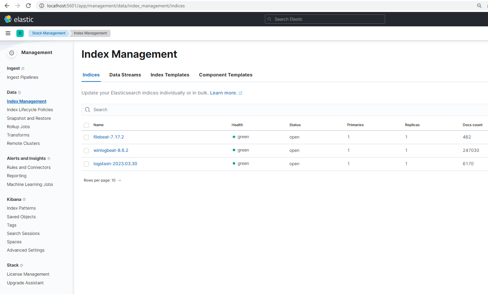
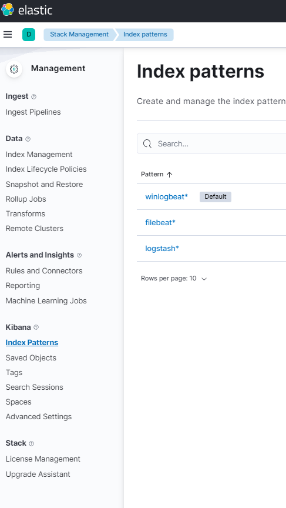
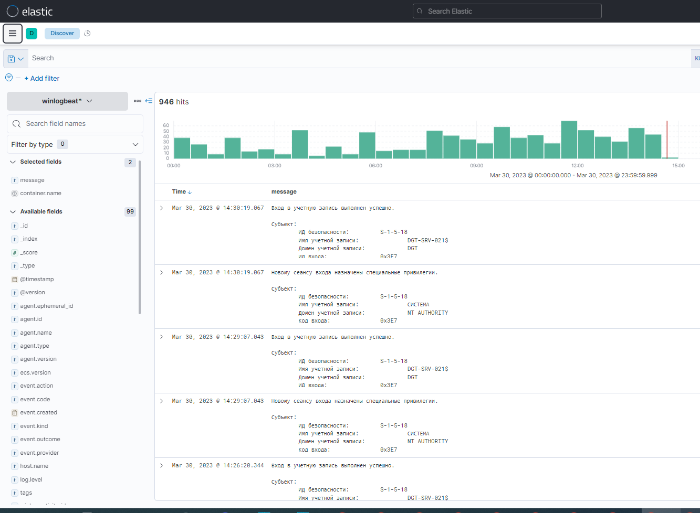
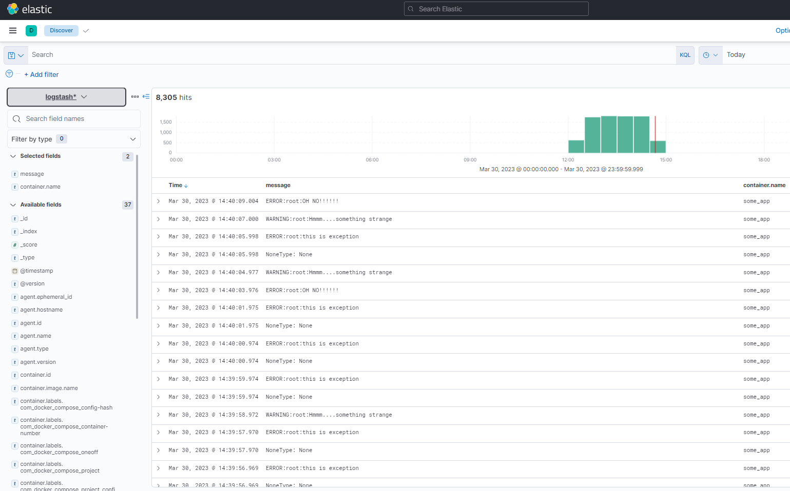

## Домашнее задание 49 [10.4 Система сбора логов Elastic Stack](https://github.com/netology-code/mnt-homeworks/tree/MNT-video/10-monitoring-04-elk)

### Олег Дьяченко DEVOPS-22

# Домашнее задание к занятию 15 «Система сбора логов Elastic Stack»

## Задание 1

Вам необходимо поднять в докере и связать между собой:

- elasticsearch (hot и warm ноды);
- logstash;
- kibana;
- filebeat.

Logstash следует сконфигурировать для приёма по tcp json-сообщений.

Filebeat следует сконфигурировать для отправки логов docker вашей системы в logstash.

В директории [help](./help) находится манифест docker-compose и конфигурации filebeat/logstash для быстрого 
выполнения этого задания.

Результатом выполнения задания должны быть:

- скриншот `docker ps` через 5 минут после старта всех контейнеров (их должно быть 5);
  ```
  root@server1:/opt/hw104/help2# docker ps -a
  CONTAINER ID   IMAGE                     COMMAND                  CREATED       STATUS       PORTS                                                                                  NAMES
  e0a1e903f597   elasticsearch:7.17.2      "/bin/tini -- /usr/l…"   2 hours ago   Up 2 hours   0.0.0.0:9201->9200/tcp, :::9201->9200/tcp, 0.0.0.0:9301->9300/tcp, :::9301->9300/tcp   es-warm
  f7a5ac6e64f6   elastic/filebeat:7.17.2   "/usr/bin/tini -- /u…"   2 hours ago   Up 2 hours                                                                                          filebeat
  4cbc7e6a8175   python:3.9-alpine         "python3 /opt/run.py"    2 hours ago   Up 2 hours                                                                                          some_app
  0bc26966f0af   elasticsearch:7.17.2      "/bin/tini -- /usr/l…"   2 hours ago   Up 2 hours   0.0.0.0:9200->9200/tcp, :::9200->9200/tcp, 0.0.0.0:9300->9300/tcp, :::9300->9300/tcp   es-hot
  38e0091926d9   logstash:7.17.2           "/usr/local/bin/dock…"   2 hours ago   Up 2 hours   0.0.0.0:5044->5044/tcp, :::5044->5044/tcp, 0.0.0.0:9600->9600/tcp, :::9600->9600/tcp   logstash
  cd20b179e504   kibana:7.17.2             "/bin/tini -- /usr/l…"   2 hours ago   Up 2 hours   0.0.0.0:5601->5601/tcp, :::5601->5601/tcp                                              kibana  
  ```
- скриншот интерфейса kibana;
  
- docker-compose манифест (если вы не использовали директорию help);
- ваши yml-конфигурации для стека (если вы не использовали директорию help).

  Использовал из папки help, правда почему-то не сильно работало, logstash забивал свободное место за 10 минут,
ничего не получалось сделать, так и не понял почему. Нашел другой посвежее примерный dockerfile, и совместил из вашего и него.  
Добавил еще `winbeatlog` под windows. Но ковыряться в этом ELK можно долго.

  [моя версия help](help2)


## Задание 2

Перейдите в меню [создания index-patterns  в kibana](http://localhost:5601/app/management/kibana/indexPatterns/create) и создайте несколько index-patterns из имеющихся.

Перейдите в меню просмотра логов в kibana (Discover) и самостоятельно изучите, как отображаются логи и как производить поиск по логам.

В манифесте директории help также приведенно dummy-приложение, которое генерирует рандомные события в stdout-контейнера.
Эти логи должны порождать индекс logstash-* в elasticsearch. Если этого индекса нет — воспользуйтесь советами и источниками из раздела «Дополнительные ссылки» этого задания.


Логи винды

Логи dummy-приложения.
 
---
 
## Дополнительные ссылки

При выполнении задания используйте дополнительные ресурсы:

- [поднимаем elk в docker](https://www.elastic.co/guide/en/elastic-stack-get-started/current/get-started-docker.html);
- [поднимаем elk в docker с filebeat и docker-логами](https://www.sarulabs.com/post/5/2019-08-12/sending-docker-logs-to-elasticsearch-and-kibana-with-filebeat.html);
- [конфигурируем logstash](https://www.elastic.co/guide/en/logstash/current/configuration.html);
- [плагины filter для logstash](https://www.elastic.co/guide/en/logstash/current/filter-plugins.html);
- [конфигурируем filebeat](https://www.elastic.co/guide/en/beats/libbeat/5.3/config-file-format.html);
- [привязываем индексы из elastic в kibana](https://www.elastic.co/guide/en/kibana/current/index-patterns.html);
- [как просматривать логи в kibana](https://www.elastic.co/guide/en/kibana/current/discover.html);
- [решение ошибки increase vm.max_map_count elasticsearch](https://stackoverflow.com/questions/42889241/how-to-increase-vm-max-map-count).

В процессе выполнения в зависимости от системы могут также возникнуть не указанные здесь проблемы.

Используйте output stdout filebeat/kibana и api elasticsearch для изучения корня проблемы и её устранения.
