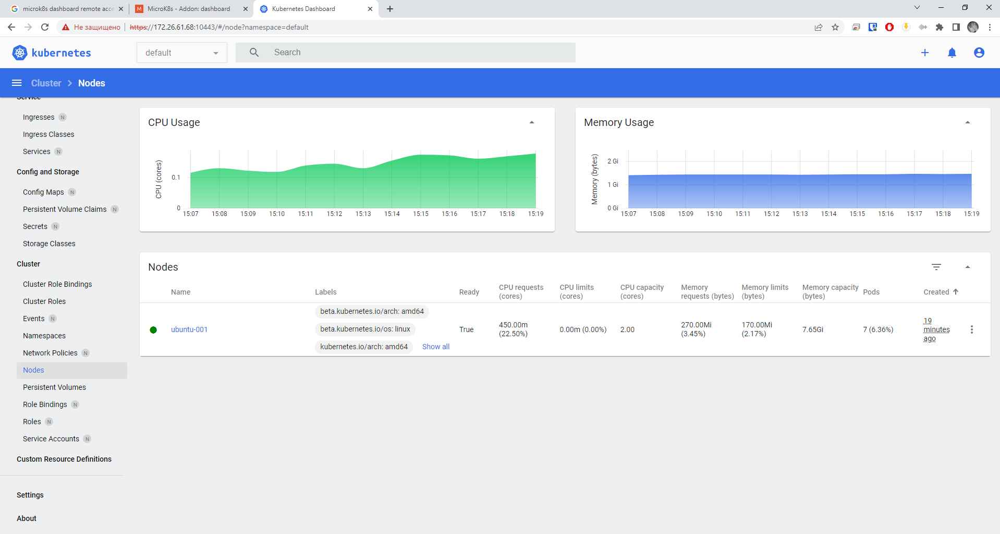

## Домашнее задание 56 [1.1 Kubernetes. Причины появления. Команда kubectl](https://github.com/netology-code/kuber-homeworks/blob/main/1.1/1.1.md)

### Олег Дьяченко DEVOPS-22

# Домашнее задание к занятию «Kubernetes. Причины появления. Команда kubectl»

### Цель задания

Для экспериментов и валидации ваших решений вам нужно подготовить тестовую среду для работы с Kubernetes. Оптимальное решение — развернуть на рабочей машине или на отдельной виртуальной машине MicroK8S.

------

### Чеклист готовности к домашнему заданию

1. Личный компьютер с ОС Linux или MacOS 

или

2. ВМ c ОС Linux в облаке либо ВМ на локальной машине для установки MicroK8S  

------

### Инструкция к заданию

1. Установка MicroK8S:
    - sudo apt update,
    - sudo apt install snapd,
    - sudo snap install microk8s --classic,
    - добавить локального пользователя в группу `sudo usermod -a -G microk8s $USER`,
    - изменить права на папку с конфигурацией `sudo chown -f -R $USER ~/.kube`.

2. Полезные команды:
    - проверить статус `microk8s status --wait-ready`;
    - подключиться к microK8s и получить информацию можно через команду `microk8s command`, например, `microk8s kubectl get nodes`;
    - включить addon можно через команду `microk8s enable`; 
    - список addon `microk8s status`;
    - вывод конфигурации `microk8s config`;
    - проброс порта для подключения локально `microk8s kubectl port-forward -n kube-system service/kubernetes-dashboard 10443:443`.

3. Настройка внешнего подключения:
    - отредактировать файл /var/snap/microk8s/current/certs/csr.conf.template
    ```shell
    # [ alt_names ]
    # Add
    # IP.4 = 123.45.67.89
    ```
    - обновить сертификаты `sudo microk8s refresh-certs --cert front-proxy-client.crt`.

4. Установка kubectl:
    - curl -LO https://storage.googleapis.com/kubernetes-release/release/`curl -s https://storage.googleapis.com/kubernetes-release/release/stable.txt`/bin/linux/amd64/kubectl;
    - chmod +x ./kubectl;
    - sudo mv ./kubectl /usr/local/bin/kubectl;
    - настройка автодополнения в текущую сессию `bash source <(kubectl completion bash)`;
    - добавление автодополнения в командную оболочку bash `echo "source <(kubectl completion bash)" >> ~/.bashrc`.

------

### Инструменты и дополнительные материалы, которые пригодятся для выполнения задания

1. [Инструкция](https://microk8s.io/docs/getting-started) по установке MicroK8S.
2. [Инструкция](https://kubernetes.io/ru/docs/reference/kubectl/cheatsheet/#bash) по установке автодополнения **kubectl**.
3. [Шпаргалка](https://kubernetes.io/ru/docs/reference/kubectl/cheatsheet/) по **kubectl**.

------

### Задание 1. Установка MicroK8S

1. Установить MicroK8S на локальную машину или на удалённую виртуальную машину.

   Установил виртуальную машину c Ubuntu 22.04.2 LTS
   ```
   lega@ubuntu-001:~$ microk8s kubectl get nodes
   NAME         STATUS   ROLES    AGE   VERSION
   ubuntu-001   Ready    <none>   10m   v1.27.2
   
   lega@ubuntu-001:~$ microk8s kubectl get services
   NAME         TYPE        CLUSTER-IP     EXTERNAL-IP   PORT(S)   AGE
   kubernetes   ClusterIP   10.152.183.1   <none>        443/TCP   11m
   
   lega@ubuntu-001:~$ microk8s kubectl get services --all-namespaces
   NAMESPACE     NAME                        TYPE        CLUSTER-IP       EXTERNAL-IP   PORT(S)                  AGE
   default       kubernetes                  ClusterIP   10.152.183.1     <none>        443/TCP                  11m
   kube-system   kube-dns                    ClusterIP   10.152.183.10    <none>        53/UDP,53/TCP,9153/TCP   11m
   kube-system   metrics-server              ClusterIP   10.152.183.65    <none>        443/TCP                  8m41s
   kube-system   kubernetes-dashboard        ClusterIP   10.152.183.221   <none>        443/TCP                  8m40s
   kube-system   dashboard-metrics-scraper   ClusterIP   10.152.183.227   <none>        8000/TCP                 8m39s
   ```

2. Установить dashboard.

   ```
   lega@ubuntu-001:~$ microk8s kubectl describe secret -n kube-system microk8s-dashboard-token
   Name:         microk8s-dashboard-token
   Namespace:    kube-system
   Labels:       <none>
   Annotations:  kubernetes.io/service-account.name: default
                 kubernetes.io/service-account.uid: 577ac3ce-fe66-43ed-98c7-f10b15952dde
   
   Type:  kubernetes.io/service-account-token
   
   Data
   ====
   namespace:  11 bytes
   token:      
   ca.crt:     1123 bytes
   ```

3. Сгенерировать сертификат для подключения к внешнему ip-адресу.

   ```
   lega@ubuntu-001:~$ sudo microk8s refresh-certs --cert front-proxy-client.crt
   [sudo] password for lega:
   Taking a backup of the current certificates under /var/snap/microk8s/5372/certs-backup/
   Creating new certificates
   Signature ok
   subject=CN = front-proxy-client
   Getting CA Private Key
   Restarting service kubelite.
   ```

------

### Задание 2. Установка и настройка локального kubectl
1. Установить на локальную машину kubectl.

   Установил на свою машину под Windows
   ```
   PS C:\Users\ДьяченкоОА> kubectl version --client --output=yaml
   clientVersion:
     buildDate: "2023-05-17T14:20:07Z"
     compiler: gc
     gitCommit: 7f6f68fdabc4df88cfea2dcf9a19b2b830f1e647
     gitTreeState: clean
     gitVersion: v1.27.2
     goVersion: go1.20.4
     major: "1"
     minor: "27"
     platform: windows/amd64
   kustomizeVersion: v5.0.1
   ```

2. Настроить локально подключение к кластеру.

   ```
   PS C:\Users\ДьяченкоОА> kubectl.exe get nodes
   NAME         STATUS   ROLES    AGE   VERSION
   ubuntu-001   Ready    <none>   42m   v1.27.2
   ```

3. Подключиться к дашборду с помощью port-forward.

   ```
   lega@ubuntu-001:~$ microk8s kubectl port-forward -n kube-system service/kubernetes-dashboard 10443:443 --address 0.0.0.0
   Forwarding from 0.0.0.0:10443 -> 8443
   ```
   
   


------

