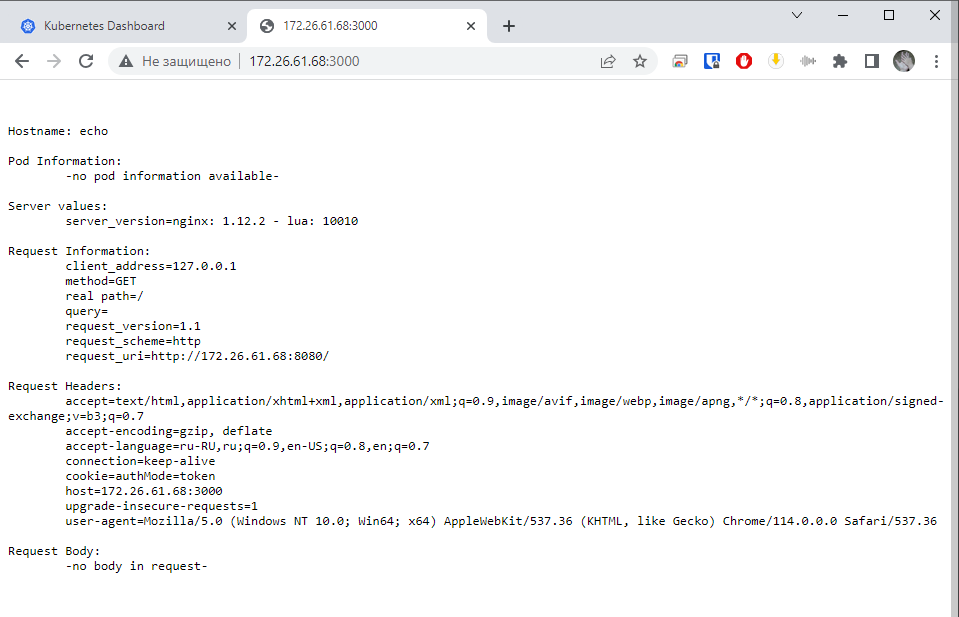
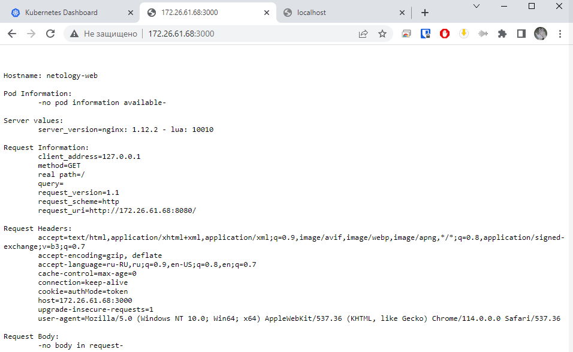

## Домашнее задание 57 [1.2 Базовые объекты K8S](https://github.com/netology-code/kuber-homeworks/blob/main/1.2/1.2.md)

### Олег Дьяченко DEVOPS-22

### Цель задания

В тестовой среде для работы с Kubernetes, установленной в предыдущем ДЗ, необходимо развернуть Pod с приложением и подключиться к нему со своего локального компьютера. 

------

### Чеклист готовности к домашнему заданию

1. Установленное k8s-решение (например, MicroK8S). +
2. Установленный локальный kubectl. +
3. Редактор YAML-файлов с подключенным Git-репозиторием. +

------

### Инструменты и дополнительные материалы, которые пригодятся для выполнения задания

1. Описание [Pod](https://kubernetes.io/docs/concepts/workloads/pods/) и примеры манифестов.
2. Описание [Service](https://kubernetes.io/docs/concepts/services-networking/service/).

------

### Задание 1. Создать Pod с именем hello-world

1. Создать манифест (yaml-конфигурацию) Pod.

```
PS C:\PycharmProjects\DevOps\HW57\manifest> kubectl.exe apply -f .\pod.yaml
pod/echo created

PS C:\PycharmProjects\DevOps\HW57\manifest> kubectl get pods
NAME   READY   STATUS    RESTARTS   AGE
echo   1/1     Running   0          66s
```

2. Использовать image - gcr.io/kubernetes-e2e-test-images/echoserver:2.2.

    ```yaml
    apiVersion: v1
    kind: Pod
    metadata:
      labels:
        app: my-pod-echo
      name: echo
    spec:
      containers:
      - name: echoserver
        image: gcr.io/kubernetes-e2e-test-images/echoserver:2.2
        ports:
        - containerPort: 8080
    ```

3. Подключиться локально к Pod с помощью `kubectl port-forward` и вывести значение (curl или в браузере).

```
lega@ubuntu-001:~microk8s kubectl port-forward pods/echo 3000:8080 --address 0.0.0.0
Forwarding from 0.0.0.0:3000 -> 8080
Handling connection for 3000
Handling connection for 3000
```

```
lega@ubuntu-001:~$ curl localhost:3000

Hostname: echo

Pod Information:
        -no pod information available-

Server values:
        server_version=nginx: 1.12.2 - lua: 10010

Request Information:
        client_address=127.0.0.1
        method=GET
        real path=/
        query=
        request_version=1.1
        request_scheme=http
        request_uri=http://localhost:8080/

Request Headers:
        accept=*/*
        host=localhost:3000
        user-agent=curl/7.81.0

Request Body:
        -no body in request-
```




??? Вопрос: почему то когда я на своей виндовой машине вводил команду 
`kubectl port-forward pods/echo 3000:8080 --address 0.0.0.0` она также ждала, но желаемого результата пересылки не было. 
Работает только если на самой машине где стоит microk8s выполнять команду, или просто microk8s не полноценный кластер ???

------

### Задание 2. Создать Service и подключить его к Pod

1. Создать Pod с именем netology-web.

   ```
   PS C:\PycharmProjects\DevOps\HW57\manifest> kubectl.exe apply -f .\pod2.yaml
   pod/netology-web created
   service/netology-svc created
   
   PS C:\PycharmProjects\DevOps\HW57\manifest> kubectl.exe get pods
   NAME           READY   STATUS    RESTARTS   AGE
   netology-web   1/1     Running   0          34s
   ```

2. Использовать image — gcr.io/kubernetes-e2e-test-images/echoserver:2.2.

   ```yaml
   ---
   apiVersion: v1
   kind: Pod
   metadata:
     labels:
       app: netology-web
     name: netology-web
   spec:
     containers:
     - name: echoserver
       image: gcr.io/kubernetes-e2e-test-images/echoserver:2.2
       ports:
       - containerPort: 8080
   
   ---
   apiVersion: v1
   kind: Service
   metadata:
     name: netology-svc
   spec:
     selector:
       app: netology-web
     ports:
     - name: service-port
       protocol: TCP
       port: 8888
       targetPort: 8080
   ```

3. Создать Service с именем netology-svc и подключить к netology-web.

   ```
   PS C:\PycharmProjects\DevOps\HW57\manifest> kubectl get services            
   NAME           TYPE        CLUSTER-IP      EXTERNAL-IP   PORT(S)    AGE
   kubernetes     ClusterIP   10.152.183.1    <none>        443/TCP    14m
   netology-svc   ClusterIP   10.152.183.56   <none>        8888/TCP   3s
   
   PS C:\PycharmProjects\DevOps\HW57\manifest> kubectl describe service netology-svc
   Name:              netology-svc
   Namespace:         default
   Labels:            <none>
   Annotations:       <none>
   Selector:          app=netology-web
   Type:              ClusterIP
   IP Family Policy:  SingleStack
   IP Families:       IPv4
   IP:                10.152.183.56
   IPs:               10.152.183.56
   Port:              service-port  8888/TCP
   TargetPort:        8080/TCP
   Endpoints:         10.1.63.88:8080
   Session Affinity:  None
   Events:            <none>
   ```

4. Подключиться локально к Service с помощью `kubectl port-forward` и вывести значение (curl или в браузере).
   
   ```
   lega@ubuntu-001:~$ microk8s kubectl port-forward services/netology-svc 3000:8888 --address 0.0.0.0
   Forwarding from 0.0.0.0:3000 -> 8080
   Handling connection for 3000
   Handling connection for 3000
   ```

   
------

