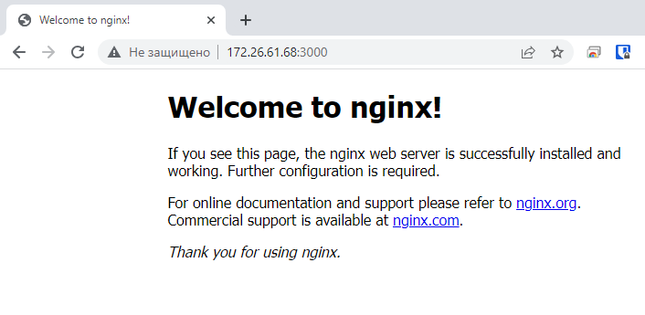
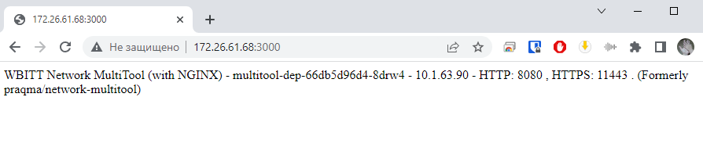

## Домашнее задание 58 [1.3 Запуск приложений в K8S](https://github.com/netology-code/kuber-homeworks/blob/main/1.3/1.3.md)

### Олег Дьяченко DEVOPS-22

### Цель задания

В тестовой среде для работы с Kubernetes, установленной в предыдущем ДЗ, необходимо развернуть Deployment с приложением, состоящим из нескольких контейнеров, и масштабировать его.

------

### Чеклист готовности к домашнему заданию

1. Установленное k8s-решение (например, MicroK8S). +
2. Установленный локальный kubectl. +
3. Редактор YAML-файлов с подключённым git-репозиторием. +

------

### Инструменты и дополнительные материалы, которые пригодятся для выполнения задания

1. [Описание](https://kubernetes.io/docs/concepts/workloads/controllers/deployment/) Deployment и примеры манифестов.
2. [Описание](https://kubernetes.io/docs/concepts/workloads/pods/init-containers/) Init-контейнеров.
3. [Описание](https://github.com/wbitt/Network-MultiTool) Multitool.

------

### Задание 1. Создать Deployment и обеспечить доступ к репликам приложения из другого Pod

1. Создать Deployment приложения, состоящего из двух контейнеров — nginx и multitool. Решить возникшую ошибку.  

    Ошибка порта для multitool

    ```
    PS C:\PycharmProjects\DevOps\HW58\manifest> kubectl.exe get pods            
    NAME                             READY   STATUS   RESTARTS     AGE
    multitool-dep-86f89554df-mmttp   1/2     Error    1 (7s ago)   38s
    
    lega@ubuntu-001:~$ microk8s kubectl logs pods/multitool-dep-86f89554df-mmttp multitool
    The directory /usr/share/nginx/html is not mounted.
    Therefore, over-writing the default index.html file with some useful information:
    WBITT Network MultiTool (with NGINX) - multitool-dep-86f89554df-mmttp - 10.1.63.89 - HTTP: 80 , HTTPS: 443 . (Formerl
    y praqma/network-multitool)
    2023/06/27 06:26:17 [emerg] 1#1: bind() to 0.0.0.0:80 failed (98: Address in use)
    nginx: [emerg] bind() to 0.0.0.0:80 failed (98: Address in use)
    2023/06/27 06:26:17 [emerg] 1#1: bind() to 0.0.0.0:80 failed (98: Address in use)
    nginx: [emerg] bind() to 0.0.0.0:80 failed (98: Address in use)
    2023/06/27 06:26:17 [emerg] 1#1: bind() to 0.0.0.0:80 failed (98: Address in use)
    nginx: [emerg] bind() to 0.0.0.0:80 failed (98: Address in use)
    2023/06/27 06:26:17 [emerg] 1#1: bind() to 0.0.0.0:80 failed (98: Address in use)
    nginx: [emerg] bind() to 0.0.0.0:80 failed (98: Address in use)
    2023/06/27 06:26:17 [emerg] 1#1: bind() to 0.0.0.0:80 failed (98: Address in use)
    nginx: [emerg] bind() to 0.0.0.0:80 failed (98: Address in use)
    2023/06/27 06:26:17 [emerg] 1#1: still could not bind()
    nginx: [emerg] still could not bind()
    ```
   Добавил env переменные
    ```yaml
    apiVersion: apps/v1
    kind: Deployment
    metadata:
      labels:
        app: multitool-dep
      name: multitool-dep
      namespace: default
    spec:
      replicas: 1
      selector:
        matchLabels:
          app: multitool
      template:
        metadata:
          labels:
            app: multitool
        spec:
          containers:
          - name: nginx
            image: nginx:latest
            ports:
            - containerPort: 80
          - name: multitool
            image: wbitt/network-multitool:latest
            ports:
            - containerPort: 8080
            env:
            - name: HTTP_PORT
              value: "8080"
            - name: HTTPS_PORT
              value: "11443"
    ```
    ```
    PS C:\PycharmProjects\DevOps\HW58\manifest> kubectl.exe get pods
    NAME                             READY   STATUS    RESTARTS   AGE
    multitool-dep-66db5d96d4-8drw4   2/2     Running   0          13s
    ```

2. После запуска увеличить количество реплик работающего приложения до 2.
 
    ```
    replicas: 2
    ```
   
3. Продемонстрировать количество подов до и после масштабирования.

    ```
    PS C:\PycharmProjects\DevOps\HW58\manifest> kubectl.exe get pods
    NAME                             READY   STATUS    RESTARTS   AGE
    multitool-dep-66db5d96d4-8drw4   2/2     Running   0          3m46s
    multitool-dep-66db5d96d4-f2swp   2/2     Running   0          6s
    ```
   
4. Создать Service, который обеспечит доступ до реплик приложений из п.1.

   ```yaml
   ---
   apiVersion: v1
   kind: Service
   metadata:
     name: multitool-svc
   spec:
     selector:
       app: multitool
     ports:
     - name: nginx80
       port: 80
       targetPort: 80
     - name: multitool8080
       port: 8080
       targetPort: 8080
   ```

   ```
   PS C:\PycharmProjects\DevOps\HW58\manifest> kubectl.exe get svc -o wide
   NAME            TYPE        CLUSTER-IP      EXTERNAL-IP   PORT(S)           AGE   SELECTOR
   kubernetes      ClusterIP   10.152.183.1    <none>        443/TCP           32m   <none>
   multitool-svc   ClusterIP   10.152.183.19   <none>        80/TCP,8080/TCP   27s   app=multitool
   
   PS C:\PycharmProjects\DevOps\HW58\manifest> kubectl describe service multitool-svc
   Name:              multitool-svc
   Type:              ClusterIP
   IP Family Policy:  SingleStack
   IP Families:       IPv4
   IP:                10.152.183.19
   IPs:               10.152.183.19
   Port:              nginx80  80/TCP
   TargetPort:        80/TCP
   Endpoints:         10.1.63.90:80,10.1.63.91:80
   Port:              multitool8080  8080/TCP
   TargetPort:        8080/TCP
   Endpoints:         10.1.63.90:8080,10.1.63.91:8080
   Session Affinity:  None
   Events:            <none>
   ```

   ```
   lega@ubuntu-001:~$ microk8s kubectl port-forward services/multitool-svc 3000:80 --address="0.0.0.0"
   Forwarding from 0.0.0.0:3000 -> 80
   Handling connection for 3000
   ```
   
   ```
   lega@ubuntu-001:~$ microk8s kubectl port-forward services/multitool-svc 3000:8080 --address="0.0.0.0"
   Forwarding from 0.0.0.0:3000 -> 8080
   Handling connection for 3000
   ```
   


5. Создать отдельный Pod с приложением multitool и убедиться с помощью `curl`, что из пода есть доступ до приложений из п.1.

   ```yaml
   ---
   apiVersion: v1
   kind: Pod
   metadata:
     labels:
       app: multitool
     name: multitool3
   spec:
     containers:
     - name: multitool
       image: wbitt/network-multitool
       ports:
       - containerPort: 8080
       env:
         - name: HTTP_PORT
           value: "8080"
         - name: HTTPS_PORT
           value: "11443"
   ```
   
   ```
   PS C:\PycharmProjects\DevOps\HW58\manifest> kubectl get pods -o wide
   NAME                             READY   STATUS    RESTARTS   AGE   IP           NODE         NOMINATED NODE   READINESS GATES
   multitool-dep-66db5d96d4-8drw4   2/2     Running   0          34m   10.1.63.90   ubuntu-001   <none>           <none>
   multitool-dep-66db5d96d4-f2swp   2/2     Running   0          30m   10.1.63.91   ubuntu-001   <none>           <none>
   multitool3                       1/1     Running   0          7s    10.1.63.92   ubuntu-001   <none>           <none>
   ```
   
   ```
   PS C:\PycharmProjects\DevOps\HW58\manifest> kubectl describe service multitool-svc
   Name:              multitool-svc
   Namespace:         default
   Labels:            <none>
   Annotations:       <none>
   Selector:          app=multitool
   Type:              ClusterIP
   IP Family Policy:  SingleStack
   IP Families:       IPv4
   IP:                10.152.183.19
   IPs:               10.152.183.19
   Port:              nginx80  80/TCP
   TargetPort:        80/TCP
   Endpoints:         10.1.63.90:80,10.1.63.91:80,10.1.63.92:80
   Port:              multitool8080  8080/TCP
   TargetPort:        8080/TCP
   Endpoints:         10.1.63.90:8080,10.1.63.91:8080,10.1.63.92:8080
   Session Affinity:  None
   Events:            <none>
   ```

```
lega@ubuntu-001:~$ microk8s kubectl exec multitool3 -- curl 10.1.63.90:80
<!DOCTYPE html>
<html>
<head>
<title>Welcome to nginx!</title>
<style>
html { color-scheme: light dark; }
body { width: 35em; margin: 0 auto;
font-family: Tahoma, Verdana, Arial, sans-serif; }
</style>
</head>
<body>
<h1>Welcome to nginx!</h1>
<p>If you see this page, the nginx web server is successfully installed and
working. Further configuration is required.</p>

<p>For online documentation and support please refer to
<a href="http://nginx.org/">nginx.org</a>.<br/>
Commercial support is available at
<a href="http://nginx.com/">nginx.com</a>.</p>

<p><em>Thank you for using nginx.</em></p>
</body>
</html>
  % Total    % Received % Xferd  Average Speed   Time    Time     Time  Current
                                 Dload  Upload   Total   Spent    Left  Speed
100   615  100   615    0     0   960k      0 --:--:-- --:--:-- --:--:--  600k

lega@ubuntu-001:~$ microk8s kubectl exec multitool3 -- curl 10.1.63.90:8080]
0WBITT Network MultiTool (with NGINX) - multitool-dep-66db5d96d4-8drw4 - 10.1.63.90 - HTTP: 8080 , HTTPS: 11443 . (Formerly praqma/network-multitool)
  % Total    % Received % Xferd  Average Speed   Time    Time     Time  Current
                                 Dload  Upload   Total   Spent    Left  Speed
  0     0    0     0    0     0      0      0 --:--:-- --:--:-- --:--:--     
100   149  100   149    0     0   371k      0 --:--:-- --:--:-- --:--:--  145k
```
```
lega@ubuntu-001:~$ microk8s kubectl exec multitool3 -- curl 10.1.63.91:80
  % Total    % Received % Xferd  Average Speed   Time    Time     Time  Current
                                 Dload  Upload   Total   Spent    Left  Speed
  0     0    0     0    0     0      0      0 --:--:-- --:--:-- --:--:--     0
  <!DOCTYPE html>
<html>
<head>
<title>Welcome to nginx!</title>
<style>
html { color-scheme: light dark; }
body { width: 35em; margin: 0 auto;
font-family: Tahoma, Verdana, Arial, sans-serif; }
</style>
</head>
<body>
<h1>Welcome to nginx!</h1>
<p>If you see this page, the nginx web server is successfully installed and
working. Further configuration is required.</p>

<p>For online documentation and support please refer to
<a href="http://nginx.org/">nginx.org</a>.<br/>
Commercial support is available at
<a href="http://nginx.com/">nginx.com</a>.</p>

<p><em>Thank you for using nginx.</em></p>
</body>
</html>
100   615  100   615    0     0   554k      0 --:--:-- --:--:-- --:--:--  600k

lega@ubuntu-001:~$ microk8s kubectl exec multitool3 -- curl 10.1.63.91:8080
WBITT Network MultiTool (with NGINX) - multitool-dep-66db5d96d4-f2swp - 10.1.63.91 - HTTP: 8080 , HTTPS: 11443 . (Formerly praqma/network-multitool)
  % Total    % Received % Xferd  Average Speed   Time    Time     Time  Current
                                 Dload  Upload   Total   Spent    Left  Speed
100   149  100   149    0     0  72050      0 --:--:-- --:--:-- --:--:--  145k
```

------

### Задание 2. Создать Deployment и обеспечить старт основного контейнера при выполнении условий

1. Создать Deployment приложения nginx и обеспечить старт контейнера только после того, как будет запущен сервис этого приложения.

   ```yaml
   apiVersion: apps/v1
   kind: Deployment
   metadata:
     labels:
       app: nginx-dep
     name: nginx-dep
     namespace: default
   spec:
     replicas: 1
     selector:
       matchLabels:
         app: nginx
     template:
       metadata:
         labels:
           app: nginx
       spec:
         containers:
         - name: nginx
           image: nginx:latest
           ports:
           - containerPort: 80
         initContainers:
         - name: init-test-nslookup
           image: busybox
           command: ['sh', '-c', 'until nslookup my-svc.default.svc.cluster.local; do echo waiting for my-svc; sleep 5; done;']
   ```

2. Убедиться, что nginx не стартует. В качестве Init-контейнера взять busybox.

   ```
   PS C:\PycharmProjects\DevOps\HW58\manifest> kubectl.exe get pods -o wide                                   
   NAME                        READY   STATUS     RESTARTS   AGE   IP           NODE         NOMINATED NODE   READINESS GATES
   nginx-dep-5bfb65c7c-rshcg   0/1     Init:0/1   0          90s   10.1.63.96   ubuntu-001   <none>           <none>
   ```
   
   ```
   PS C:\PycharmProjects\DevOps\HW58\manifest> kubectl logs pods/nginx-dep-5bfb65c7c-rshcg  init-test-nslookup
   
   Server:         10.152.183.10
   Address:        10.152.183.10:53
   ** server can't find my-svc.default.svc.cluster.local: NXDOMAIN
   ** server can't find my-svc.default.svc.cluster.local: NXDOMAIN
   waiting for my-svc
   ```

3. Создать и запустить Service. Убедиться, что Init запустился.

   ```yaml
   ---
   apiVersion: v1
   kind: Service
   metadata:
     name: my-svc
   spec:
     selector:
       app: nginx
     ports:
     - name: nginx-svc-port
       port: 80
       protocol: TCP
       targetPort: 80
   ```

4. Продемонстрировать состояние пода до и после запуска сервиса.

   ```
   PS C:\PycharmProjects\DevOps\HW58\manifest> kubectl.exe apply -f .\svc2.yaml                               
   service/my-svc created
   
   PS C:\PycharmProjects\DevOps\HW58\manifest> kubectl.exe get pods -o wide                                   
   NAME                        READY   STATUS    RESTARTS   AGE     IP           NODE         NOMINATED NODE   READINESS GATES
   nginx-dep-5bfb65c7c-rshcg   1/1     Running   0          3m53s   10.1.63.96   ubuntu-001   <none>           <none>
   ```
   
   ```
   PS C:\PycharmProjects\DevOps\HW58\manifest> kubectl logs pods/nginx-dep-5bfb65c7c-rshcg  init-test-nslookup 
   Server:         10.152.183.10
   Address:        10.152.183.10:53
   
   Name:   my-svc.default.svc.cluster.local
   Address: 10.152.183.157
   ```

------

