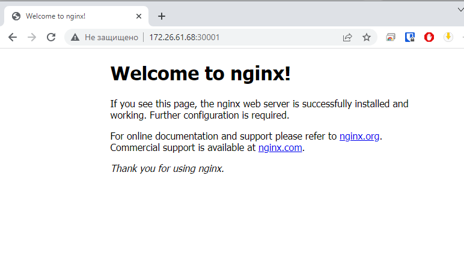
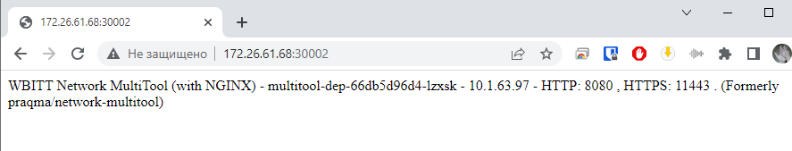

## Домашнее задание 59 [1.4 Сетевое взаимодействие в K8S. Часть 1](https://github.com/netology-code/kuber-homeworks/blob/main/1.4/1.4.md)

### Олег Дьяченко DEVOPS-22

### Цель задания

В тестовой среде Kubernetes необходимо обеспечить доступ к приложению, установленному в предыдущем ДЗ и состоящему из двух контейнеров, по разным портам в разные контейнеры как внутри кластера, так и снаружи.

------

### Чеклист готовности к домашнему заданию

1. Установленное k8s-решение (например, MicroK8S). +
2. Установленный локальный kubectl. +
3. Редактор YAML-файлов с подключённым Git-репозиторием. +

------

### Инструменты и дополнительные материалы, которые пригодятся для выполнения задания

1. [Описание](https://kubernetes.io/docs/concepts/workloads/controllers/deployment/) Deployment и примеры манифестов.
2. [Описание](https://kubernetes.io/docs/concepts/services-networking/service/) Описание Service.
3. [Описание](https://github.com/wbitt/Network-MultiTool) Multitool.

------

### Задание 1. Создать Deployment и обеспечить доступ к контейнерам приложения по разным портам из другого Pod внутри кластера

1. Создать Deployment приложения, состоящего из двух контейнеров (nginx и multitool), с количеством реплик 3 шт.

    ```yaml
    apiVersion: apps/v1
    kind: Deployment
    metadata:
      labels:
        app: multitool-dep
      name: multitool-dep
      namespace: default
    spec:
      replicas: 3
      selector:
        matchLabels:
          app: multitool
      template:
        metadata:
          labels:
            app: multitool
        spec:
          containers:
          - name: nginx
            image: nginx:latest
            ports:
            - containerPort: 80
          - name: multitool
            image: wbitt/network-multitool:latest
            ports:
            - containerPort: 8080
            env:
            - name: HTTP_PORT
              value: "8080"
            - name: HTTPS_PORT
              value: "11443"
    ```

2. Создать Service, который обеспечит доступ внутри кластера до контейнеров приложения из п.1 по порту 9001 — nginx 80, по 9002 — multitool 8080.

    ```yaml
    ---
    apiVersion: v1
    kind: Service
    metadata:
      name: multitool-svc
    spec:
      selector:
        app: multitool
      ports:
      - name: nginx80
        port: 9001
        targetPort: 80
      - name: multitool8080
        port: 9002
        targetPort: 8080
    ```

3. Создать отдельный Pod с приложением multitool и убедиться с помощью `curl`, что из пода есть доступ до приложения из п.1 по разным портам в

    ```yaml
    ---
    apiVersion: v1
    kind: Pod
    metadata:
      name: multitool-pod
    spec:
      containers:
      - name: multitool
        image: wbitt/network-multitool
        ports:
        - containerPort: 8080
        env:
          - name: HTTP_PORT
            value: "8080"
          - name: HTTPS_PORT
            value: "11443"
    
    ```
    
    ```
    PS C:\PycharmProjects\DevOps\hw59\manifest> kubectl.exe get pods -o wide
    NAME                             READY   STATUS    RESTARTS   AGE   IP            NODE         NOMINATED NODE   READINESS GATES
    multitool-dep-66db5d96d4-lzxsk   2/2     Running   0          80s   10.1.63.97    ubuntu-001   <none>           <none>
    multitool-dep-66db5d96d4-44ff8   2/2     Running   0          80s   10.1.63.99    ubuntu-001   <none>           <none>
    multitool-dep-66db5d96d4-q5xvn   2/2     Running   0          80s   10.1.63.98    ubuntu-001   <none>           <none>
    multitool-pod                    1/1     Running   0          68s   10.1.63.100   ubuntu-001   <none>           <none>
    ```
    
    ```
    PS C:\PycharmProjects\DevOps\hw59\manifest> kubectl exec multitool-pod -- curl -s 10.1.63.97:8080
    WBITT Network MultiTool (with NGINX) - multitool-dep-66db5d96d4-lzxsk - 10.1.63.97 - HTTP: 8080 , HTTPS: 11443 . (Formerly praqma/network-multitool)
    PS C:\PycharmProjects\DevOps\hw59\manifest> kubectl exec multitool-pod -- curl -s 10.1.63.99:8080
    WBITT Network MultiTool (with NGINX) - multitool-dep-66db5d96d4-44ff8 - 10.1.63.99 - HTTP: 8080 , HTTPS: 11443 . (Formerly praqma/network-multitool)
    PS C:\PycharmProjects\DevOps\hw59\manifest> kubectl exec multitool-pod -- curl -s 10.1.63.98:8080
    WBITT Network MultiTool (with NGINX) - multitool-dep-66db5d96d4-q5xvn - 10.1.63.98 - HTTP: 8080 , HTTPS: 11443 . (Formerly praqma/network-multitool)
    ```
    
    ```
    PS C:\PycharmProjects\DevOps\hw59\manifest> kubectl exec multitool-pod -- curl -s 10.1.63.97:80  
    <!DOCTYPE html>
    <html>
    <head>
    <title>Welcome to nginx!</title>
    <style>
    html { color-scheme: light dark; }
    body { width: 35em; margin: 0 auto;
    font-family: Tahoma, Verdana, Arial, sans-serif; }
    </style>
    </head>
    <body>
    <h1>Welcome to nginx!</h1>
    <p>If you see this page, the nginx web server is successfully installed and
    working. Further configuration is required.</p>
    
    <p>For online documentation and support please refer to
    <a href="http://nginx.org/">nginx.org</a>.<br/>
    Commercial support is available at
    <a href="http://nginx.com/">nginx.com</a>.</p>
    
    <p><em>Thank you for using nginx.</em></p>
    </body>
    </html>
    ```

4. Продемонстрировать доступ с помощью `curl` по доменному имени сервиса.

    Доменное имя сервиса **multitool-svc.default.svc.cluster.local**

    ```
    PS C:\PycharmProjects\DevOps\hw59\manifest> kubectl exec multitool-pod -- curl -s multitool-svc.default.svc.cluster.local:9001
    <!DOCTYPE html>
    <html>
    <head>
    <title>Welcome to nginx!</title>
    <style>
    html { color-scheme: light dark; }
    body { width: 35em; margin: 0 auto;
    font-family: Tahoma, Verdana, Arial, sans-serif; }
    </style>
    </head>
    <body>
    <h1>Welcome to nginx!</h1>
    <p>If you see this page, the nginx web server is successfully installed and
    working. Further configuration is required.</p>
    
    <p>For online documentation and support please refer to
    <a href="http://nginx.org/">nginx.org</a>.<br/>
    Commercial support is available at
    <a href="http://nginx.com/">nginx.com</a>.</p>
    
    <p><em>Thank you for using nginx.</em></p>
    </body>
    </html>
    ```
    
    ```
    PS C:\PycharmProjects\DevOps\hw59\manifest> kubectl exec multitool-pod -- curl -s multitool-svc.default.svc.cluster.local:9002
    WBITT Network MultiTool (with NGINX) - multitool-dep-66db5d96d4-44ff8 - 10.1.63.99 - HTTP: 8080 , HTTPS: 11443 . (Formerly praqma/network-multitool)
    PS C:\PycharmProjects\DevOps\hw59\manifest> kubectl exec multitool-pod -- curl -s multitool-svc.default.svc.cluster.local:9002
    WBITT Network MultiTool (with NGINX) - multitool-dep-66db5d96d4-44ff8 - 10.1.63.99 - HTTP: 8080 , HTTPS: 11443 . (Formerly praqma/network-multitool)
    PS C:\PycharmProjects\DevOps\hw59\manifest> kubectl exec multitool-pod -- curl -s multitool-svc.default.svc.cluster.local:9002
    WBITT Network MultiTool (with NGINX) - multitool-dep-66db5d96d4-lzxsk - 10.1.63.97 - HTTP: 8080 , HTTPS: 11443 . (Formerly praqma/network-multitool)
    PS C:\PycharmProjects\DevOps\hw59\manifest> kubectl exec multitool-pod -- curl -s multitool-svc.default.svc.cluster.local:9002
    WBITT Network MultiTool (with NGINX) - multitool-dep-66db5d96d4-lzxsk - 10.1.63.97 - HTTP: 8080 , HTTPS: 11443 . (Formerly praqma/network-multitool)
    ```

5. Предоставить манифесты Deployment и Service в решении, а также скриншоты или вывод команды п.4.

------

### Задание 2. Создать Service и обеспечить доступ к приложениям снаружи кластера

1. Создать отдельный Service приложения из Задания 1 с возможностью доступа снаружи кластера к nginx, используя тип NodePort.

   ```yaml
   ---
   apiVersion: v1
   kind: Service
   metadata:
     name: multitool-svc-nodeport
   spec:
     selector:
       app: multitool
     ports:
     - name: nginx80nodeport
       nodePort: 30001
       port: 80
     - name: multitool8080nodeport
       nodePort: 30002
       port: 8080
     type: NodePort
   ```
   
   ```
   PS C:\PycharmProjects\DevOps\hw59\manifest>  kubectl describe service multitool-svc-nodeport
   Name:                     multitool-svc-nodeport
   Namespace:                default
   Labels:                   <none>
   Annotations:              <none>
   Selector:                 app=multitool
   Type:                     NodePort
   IP Family Policy:         SingleStack
   IP Families:              IPv4
   IP:                       10.152.183.162
   IPs:                      10.152.183.162
   Port:                     nginx80nodeport  80/TCP
   TargetPort:               80/TCP
   NodePort:                 nginx80nodeport  30001/TCP
   Endpoints:                10.1.63.97:80,10.1.63.98:80,10.1.63.99:80
   Port:                     multitool8080nodeport  8080/TCP
   TargetPort:               8080/TCP
   NodePort:                 multitool8080nodeport  30002/TCP
   Endpoints:                10.1.63.97:8080,10.1.63.98:8080,10.1.63.99:8080
   Session Affinity:         None
   External Traffic Policy:  Cluster
   Events:                   <none>
   ```

2. Продемонстрировать доступ с помощью браузера или `curl` с локального компьютера.

   
   

3. Предоставить манифест и Service в решении, а также скриншоты или вывод команды п.2.

------