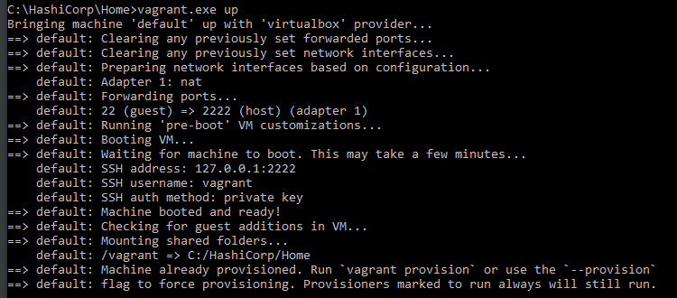
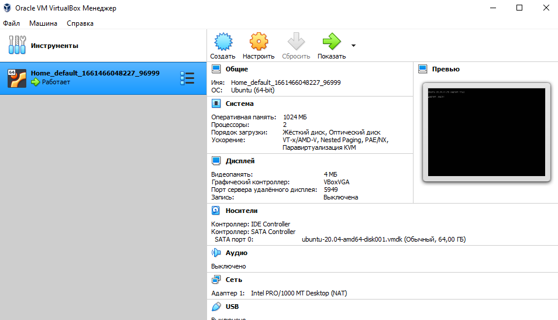
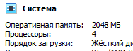
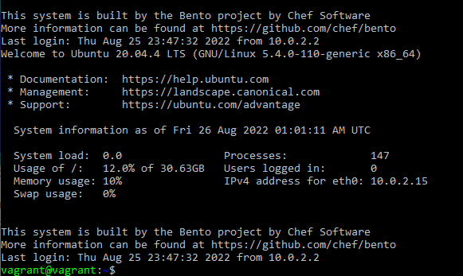
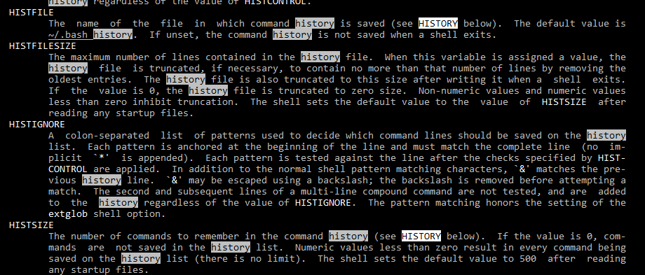
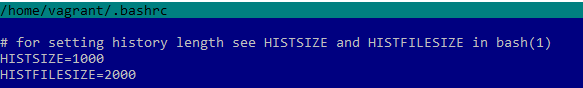
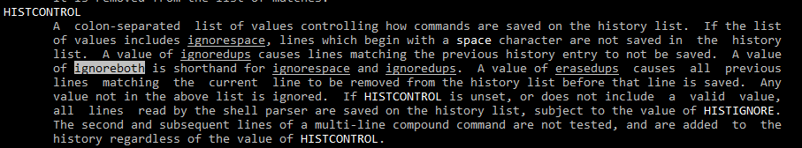
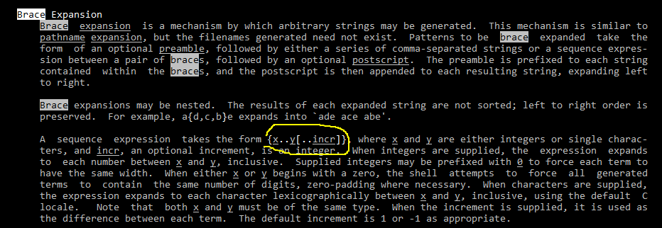
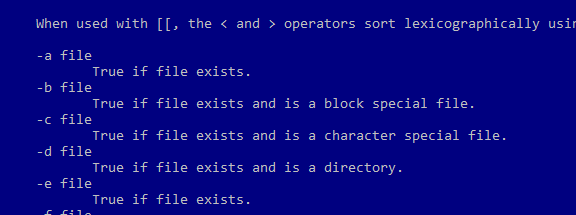

# Дамашнее задание 6, "3.1. Работа в терминале, лекция 1"

## Олег Дьяченко DEVOPS-22

#### Установите средство виртуализации Oracle VirtualBox.

Скачал, установил по Windows.

#### Установите средство автоматизации Hashicorp Vagrant.

Скачал через Tor, установил.

#### В вашем основном окружении подготовьте удобный для дальнейшей работы терминал. Можно предложить:

Windows Terminal, в основном пользуюсь Putty.

#### почитать о кастомизации PS1/применить при желании.

Оно конечно прикольно под себя настроить что-то, но уже давно перестал это делать после того как у меня сгорел комп а я потом ничего не смог сделать, и серверами также все стараюсь делать по минимуму, чтоб можно было все быстро переделать. Стараюсь работать в стоке, как есть.

#### С помощью базового файла конфигурации запустите Ubuntu 20.04 в VirtualBox посредством Vagrant:

Пришлось помучаться с блокировкой нашей страны, но вопросы заданные ранее помогли.

#### Ознакомьтесь с графическим интерфейсом VirtualBox, посмотрите как выглядит виртуальная машина, которую создал для вас Vagrant, какие аппаратные ресурсы ей выделены. Какие ресурсы выделены по-умолчанию?

#### Ознакомьтесь с возможностями конфигурации VirtualBox через Vagrantfile: документация. Как добавить оперативной памяти или ресурсов процессора виртуальной машине?

Увеличил чутка памяти и проца

    config.vm.provider "virtualbox" do |vb|
        vb.memory = "2048"
        vb.cpus = 4
    end

#### Команда vagrant ssh из директории, в которой содержится Vagrantfile, позволит вам оказаться внутри виртуальной машины без каких-либо дополнительных настроек. Попрактикуйтесь в выполнении обсуждаемых команд в терминале Ubuntu.

#### Ознакомиться с разделами man bash, почитать о настройках самого bash:
#### какой переменной можно задать длину журнала history, и на какой строчке manual это описывается?
номер строки меняется от ширины терминала, сделал скрин экрана

#### что делает директива ignoreboth в bash?

    ignorespace - не сохранять команды начинающиеся с пробела, 
    ignoredups - не сохранять команду, если такая уже имеется в истории
    ignoreboth это сокращение для двух директив ignorespace and ignoredups одновременно.

#### В каких сценариях использования применимы скобки {} и на какой строчке man bash это описано?

Входит в список зарезирвированных слов, cоставные команды - команда группировки, ограничивает тело функции, используется в массивах, замена выражений в фигурных скобках, используется в именах параметров,

#### Основываясь на предыдущем вопросе, как создать однократным вызовом touch 100000 файлов? 

    touch {000001..100000}.txt

#### А получилось ли создать 300000? Если нет, то почему?

    vagrant@vagrant:~/1$ touch {000001..300000}.txt
    bash: /usr/bin/touch: Argument list too long
    
    vagrant@vagrant:~$ getconf ARG_MAX
    2097152
Системная переменная ARG_MAX определяет максимальную длину символов аргументов в команде оболочки.

#### В man bash поищите по /\[\[. 

ищет двойную левую квадратную скобку

#### Что делает конструкция [[ -d /tmp ]]

Выражение проверяет условие на истину/ложь на наличие каталога /tmp

#### Основываясь на знаниях о просмотре текущих (например, PATH) и установке новых переменных; командах, которые мы рассматривали, добейтесь в выводе type -a bash в виртуальной машине наличия первым пунктом в списке:

vagrant@vagrant:~$ mkdir /tmp/new_path_dir/
vagrant@vagrant:~$ cp /bin/bash /tmp/new_path_dir/
vagrant@vagrant:~$ PATH=/tmp/new_path_dir/:$PATH
vagrant@vagrant:~$ type -a bash
bash is /tmp/new_path_dir/bash
bash is /usr/bin/bash
bash is /bin/bash

#### Чем отличается планирование команд с помощью batch и at?
Тогда как cron используется для назначения повторяющихся задач, команда at используется для назначения одноразового задания на заданное время, а команда batch — для назначения одноразовых задач, которые должны выполняться, когда загрузка системы становится меньше 1.5.

#### Завершите работу виртуальной машины чтобы не расходовать ресурсы компьютера и/или батарею ноутбука.

vagrant halt

