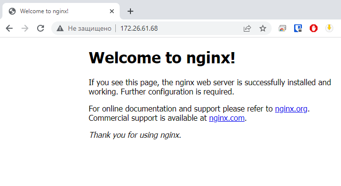
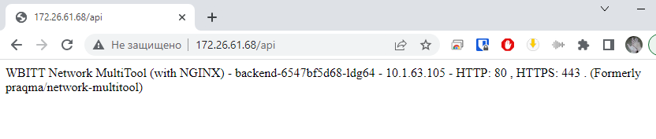

## Домашнее задание 60 [1.5 Сетевое взаимодействие в K8S. Часть 2](https://github.com/netology-code/kuber-homeworks/blob/main/1.5/1.5.md)

### Олег Дьяченко DEVOPS-22

### Цель задания

В тестовой среде Kubernetes необходимо обеспечить доступ к двум приложениям снаружи кластера по разным путям.

------

### Инструменты и дополнительные материалы, которые пригодятся для выполнения задания

1. [Инструкция](https://microk8s.io/docs/getting-started) по установке MicroK8S.
2. [Описание](https://kubernetes.io/docs/concepts/services-networking/service/) Service.
3. [Описание](https://kubernetes.io/docs/concepts/services-networking/ingress/) Ingress.
4. [Описание](https://github.com/wbitt/Network-MultiTool) Multitool.

------

### Задание 1. Создать Deployment приложений backend и frontend

1. Создать Deployment приложения _frontend_ из образа nginx с количеством реплик 3 шт.

    ```yaml
    apiVersion: apps/v1
    kind: Deployment
    metadata:
      labels:
        app: nginx-dep
      name: frontend
      namespace: default
    spec:
      replicas: 3
      selector:
        matchLabels:
          app: nginx
      template:
        metadata:
          labels:
            app: nginx
        spec:
          containers:
          - name: nginx
            image: nginx:latest
            ports:
            - containerPort: 80
    
    ---
    apiVersion: v1
    kind: Service
    metadata:
      name: frontend-svc
    spec:
      selector:
        app: nginx
      ports:
      - name: nginx80
        port: 80
        targetPort: 80
    ```

2. Создать Deployment приложения _backend_ из образа multitool.

    ```yaml
    apiVersion: apps/v1
    kind: Deployment
    metadata:
      labels:
        app: multitool-dep
      name: backend
      namespace: default
    spec:
      replicas: 1
      selector:
        matchLabels:
          app: multitool
      template:
        metadata:
          labels:
            app: multitool
        spec:
          containers:
          - name: multitool
            image: wbitt/network-multitool:latest
            ports:
            - containerPort: 80
            env:
            - name: HTTP_PORT
              value: "80"
    
    ---
    apiVersion: v1
    kind: Service
    metadata:
      name: backend-svc
    spec:
      selector:
        app: multitool
      ports:
      - name: multitool80
        port: 80
        targetPort: 80
    ```

3. Добавить Service, которые обеспечат доступ к обоим приложениям внутри кластера.

    ```
    PS C:\PycharmProjects\DevOps\HW60\manifest> kubectl.exe get all -o wide      
    NAME                            READY   STATUS    RESTARTS   AGE   IP            NODE         NOMINATED NODE   READINESS GATES
    pod/frontend-57d84f57dc-8g2rz   1/1     Running   0          18s   10.1.63.102   ubuntu-001   <none>           <none>
    pod/frontend-57d84f57dc-7h6z6   1/1     Running   0          18s   10.1.63.103   ubuntu-001   <none>           <none>
    pod/frontend-57d84f57dc-9jxg5   1/1     Running   0          18s   10.1.63.104   ubuntu-001   <none>           <none>
    pod/backend-6547bf5d68-ldg64    1/1     Running   0          15s   10.1.63.105   ubuntu-001   <none>           <none>
    
    NAME                   TYPE        CLUSTER-IP      EXTERNAL-IP   PORT(S)   AGE     SELECTOR
    service/kubernetes     ClusterIP   10.152.183.1    <none>        443/TCP   2d20h   <none>
    service/frontend-svc   ClusterIP   10.152.183.40   <none>        80/TCP    18s     app=nginx
    service/backend-svc    ClusterIP   10.152.183.22   <none>        80/TCP    15s     app=multitool
    
    NAME                       READY   UP-TO-DATE   AVAILABLE   AGE   CONTAINERS   IMAGES                           SELECTOR
    deployment.apps/frontend   3/3     3            3           18s   nginx        nginx:latest                     app=nginx
    deployment.apps/backend    1/1     1            1           15s   multitool    wbitt/network-multitool:latest   app=multitool
    
    NAME                                  DESIRED   CURRENT   READY   AGE   CONTAINERS   IMAGES                           SELECTOR
    replicaset.apps/frontend-57d84f57dc   3         3         3       18s   nginx        nginx:latest                     app=nginx,pod-template-hash=57d84f57dc
    replicaset.apps/backend-6547bf5d68    1         1         1       15s   multitool    wbitt/network-multitool:latest   app=multitool,pod-template-hash=6547bf5d68
    ```

4. Продемонстрировать, что приложения видят друг друга с помощью Service.

    ```
    PS C:\PycharmProjects\DevOps\HW60\manifest> kubectl exec services/frontend-svc -- curl -s backend-svc
    WBITT Network MultiTool (with NGINX) - backend-6547bf5d68-ldg64 - 10.1.63.105 - HTTP: 80 , HTTPS: 443 . (Formerly praqma/network-multitool)
    ```
    ```
    PS C:\PycharmProjects\DevOps\HW60\manifest> kubectl exec services/backend-svc -- curl -s frontend-svc
    <!DOCTYPE html>
    <html>
    <head>
    <title>Welcome to nginx!</title>
    <style>
    html { color-scheme: light dark; }
    body { width: 35em; margin: 0 auto;
    font-family: Tahoma, Verdana, Arial, sans-serif; }
    </style>
    </head>
    <body>
    <h1>Welcome to nginx!</h1>
    <p>If you see this page, the nginx web server is successfully installed and
    working. Further configuration is required.</p>
    
    <p>For online documentation and support please refer to
    <a href="http://nginx.org/">nginx.org</a>.<br/>
    Commercial support is available at
    <a href="http://nginx.com/">nginx.com</a>.</p>
    
    <p><em>Thank you for using nginx.</em></p>
    </body>
    </html>
    PS C:\PycharmProjects\DevOps\HW60\manifest> 
    ```

5. Предоставить манифесты Deployment и Service в решении, а также скриншоты или вывод команды п.4.

------

### Задание 2. Создать Ingress и обеспечить доступ к приложениям снаружи кластера

1. Включить Ingress-controller в MicroK8S.

    ```
    lega@ubuntu-001:~$ microk8s enable ingress
    Infer repository core for addon ingress
    Enabling Ingress
    ingressclass.networking.k8s.io/public created
    ingressclass.networking.k8s.io/nginx created
    namespace/ingress created
    serviceaccount/nginx-ingress-microk8s-serviceaccount created
    clusterrole.rbac.authorization.k8s.io/nginx-ingress-microk8s-clusterrole created
    role.rbac.authorization.k8s.io/nginx-ingress-microk8s-role created
    clusterrolebinding.rbac.authorization.k8s.io/nginx-ingress-microk8s created
    rolebinding.rbac.authorization.k8s.io/nginx-ingress-microk8s created
    configmap/nginx-load-balancer-microk8s-conf created
    configmap/nginx-ingress-tcp-microk8s-conf created
    configmap/nginx-ingress-udp-microk8s-conf created
    daemonset.apps/nginx-ingress-microk8s-controller created
    Ingress is enabled
    ```

2. Создать Ingress, обеспечивающий доступ снаружи по IP-адресу кластера MicroK8S так, чтобы при запросе только по адресу открывался _frontend_ а при добавлении /api - _backend_.

```yaml
---
apiVersion: networking.k8s.io/v1
kind: Ingress
metadata:
  name: ingress
spec:
  rules:
  - http:
      paths:
      - path: /
        pathType: Prefix
        backend:
          service:
            name: frontend-svc
            port:
              number: 80
      - path: /api
        pathType: Prefix
        backend:
          service:
            name: backend-svc
            port:
              number: 80
```

3. Продемонстрировать доступ с помощью браузера или `curl` с локального компьютера.

   
   пока не добавил код, на `/api` была ошибка 404, но оно и правильно этого пути в multitool нет.
   ```
   annotations:
       nginx.ingress.kubernetes.io/rewrite-target: /
   ```

4. Предоставить манифесты и скриншоты или вывод команды п.2.
 
   
   
------
