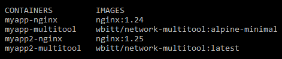
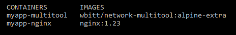
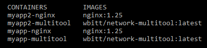

## Домашнее задание 65 [2.5 Helm](https://github.com/netology-code/kuber-homeworks/blob/main/2.5/2.5.md)

### Олег Дьяченко DEVOPS-22

### Цель задания

В тестовой среде Kubernetes необходимо установить и обновить приложения с помощью Helm.

------

### Инструменты и дополнительные материалы, которые пригодятся для выполнения задания

1. [Инструкция](https://helm.sh/docs/intro/install/) по установке Helm. [Helm completion](https://helm.sh/docs/helm/helm_completion/).

    ```
    lega@ubuntu-001:~$ helm version
    version.BuildInfo{Version:"v3.12.2", GitCommit:"1e210a2c8cc5117d1055bfaa5d40f51bbc2e345e", GitTreeState:"clean", GoVersion:"go1.20.5"}
    ```

------

### Задание 1. Подготовить Helm-чарт для приложения

1. Необходимо упаковать приложение в чарт для деплоя в разные окружения. 

    [Папка с MyApp шаблоном](myapp)

    ```yaml
    # depl-multitool.yaml
    apiVersion: apps/v1
    kind: Deployment
    metadata:
      name: {{ .Release.Name }}-multitool-deployment
      namespace: {{ .Release.Namespace }}
      labels:
        app: myapp-multitool
    spec:
      replicas: 1
      selector:
        matchLabels:
          app: myapp-multitool
      template:
        metadata:
          labels:
            app: myapp-multitool
        spec:
          containers:
          - name: {{ .Release.Name }}-multitool
            image: "wbitt/network-multitool:{{ .Values.multitool_version.tag }}"
            ports:
            - containerPort: 80
            env:
            - name: HTTP_PORT
              value: "80"
    ```

    ```yaml
    # depl-nginx.yaml
    apiVersion: apps/v1
    kind: Deployment
    metadata:
      name: {{ .Release.Name }}-nginx-deployment
      namespace: {{ .Release.Namespace }}
      labels:
        app: myapp-nginx
    spec:
      replicas: 1
      selector:
        matchLabels:
          app: myapp-nginx
      template:
        metadata:
          labels:
            app: myapp-nginx
        spec:
          containers:
          - name: {{ .Release.Name }}-nginx
            image: "nginx:{{ .Values.nginx_version.tag }}"
            ports:
            - containerPort: 80
    ```

2. Каждый компонент приложения деплоится отдельным deployment’ом или statefulset’ом.

    Ответ шаблона с переменными по умолчанию.
    
    ```
    lega@ubuntu-001:~/HW65$ helm template myapp
    ---
    # Source: myapp/templates/service.yaml
    apiVersion: v1
    kind: Service
    metadata:
      name: release-name-nginx-svc
      namespace: default
    spec:
      selector:
        app: myapp-nginx
      ports:
      - port: 80
        targetPort: 80
    ---
    # Source: myapp/templates/service.yaml
    apiVersion: v1
    kind: Service
    metadata:
      name: release-name-multitool-svc
      namespace: default
    spec:
      selector:
        app: myapp-multitool
      ports:
      - port: 80
        targetPort: 80
    ---
    # Source: myapp/templates/depl-multitool.yaml
    apiVersion: apps/v1
    kind: Deployment
    metadata:
      name: release-name-multitool-deployment
      namespace: default
      labels:
        app: myapp-multitool
    spec:
      replicas: 1
      selector:
        matchLabels:
          app: myapp-multitool
      template:
        metadata:
          labels:
            app: myapp-multitool
        spec:
          containers:
          - name: release-name-multitool
            image: "wbitt/network-multitool:alpine-minimal"
            ports:
            - containerPort: 80
            env:
            - name: HTTP_PORT
              value: "80"
    ---
    # Source: myapp/templates/depl-nginx.yaml
    apiVersion: apps/v1
    kind: Deployment
    metadata:
      name: release-name-nginx-deployment
      namespace: default
      labels:
        app: myapp-nginx
    spec:
      replicas: 1
      selector:
        matchLabels:
          app: myapp-nginx
      template:
        metadata:
          labels:
            app: myapp-nginx
        spec:
          containers:
          - name: release-name-nginx
            image: "nginx:1.24"
            ports:
            - containerPort: 80
    ```
   
3. В переменных чарта измените образ приложения для изменения версии.

    Ответ шаблона с переменными из второго файла.
    
    ```
    lega@ubuntu-001:~/HW65$ helm template -f myapp/values2.yaml myapp
    ---
    # Source: myapp/templates/service.yaml
    apiVersion: v1
    kind: Service
    metadata:
      name: release-name-nginx-svc
      namespace: default
    spec:
      selector:
        app: myapp-nginx
      ports:
      - port: 80
        targetPort: 80
    ---
    # Source: myapp/templates/service.yaml
    apiVersion: v1
    kind: Service
    metadata:
      name: release-name-multitool-svc
      namespace: default
    spec:
      selector:
        app: myapp-multitool
      ports:
      - port: 80
        targetPort: 80
    ---
    # Source: myapp/templates/depl-multitool.yaml
    apiVersion: apps/v1
    kind: Deployment
    metadata:
      name: release-name-multitool-deployment
      namespace: default
      labels:
        app: myapp-multitool
    spec:
      replicas: 1
      selector:
        matchLabels:
          app: myapp-multitool
      template:
        metadata:
          labels:
            app: myapp-multitool
        spec:
          containers:
          - name: release-name-multitool
            image: "wbitt/network-multitool:latest"
            ports:
            - containerPort: 80
            env:
            - name: HTTP_PORT
              value: "80"
    ---
    # Source: myapp/templates/depl-nginx.yaml
    apiVersion: apps/v1
    kind: Deployment
    metadata:
      name: release-name-nginx-deployment
      namespace: default
      labels:
        app: myapp-nginx
    spec:
      replicas: 1
      selector:
        matchLabels:
          app: myapp-nginx
      template:
        metadata:
          labels:
            app: myapp-nginx
        spec:
          containers:
          - name: release-name-nginx
            image: "nginx:1.25"
            ports:
            - containerPort: 80
    ```

------
### Задание 2. Запустить две версии в разных неймспейсах

1. Подготовив чарт, необходимо его проверить. Запуститe несколько копий приложения.  

   ```
   lega@ubuntu-001:~/HW65$ helm install myapp myapp
   NAME: myapp
   LAST DEPLOYED: Sat Jul 29 08:48:45 2023
   NAMESPACE: default
   STATUS: deployed
   REVISION: 1
   TEST SUITE: None
   lega@ubuntu-001:~/HW65$ microk8s kubectl get all
   NAME                                             READY   STATUS    RESTARTS   AGE
   pod/myapp-nginx-deployment-59647f496c-zk9qv      1/1     Running   0          40s
   pod/myapp-multitool-deployment-6ffd9b476-jbqz9   1/1     Running   0          40s
   
   NAME                          TYPE        CLUSTER-IP       EXTERNAL-IP   PORT(S)   AGE
   service/kubernetes            ClusterIP   10.152.183.1     <none>        443/TCP   32d
   service/myapp-multitool-svc   ClusterIP   10.152.183.228   <none>        80/TCP    40s
   service/myapp-nginx-svc       ClusterIP   10.152.183.208   <none>        80/TCP    40s
   
   NAME                                         READY   UP-TO-DATE   AVAILABLE   AGE
   deployment.apps/myapp-nginx-deployment       1/1     1            1           40s
   deployment.apps/myapp-multitool-deployment   1/1     1            1           40s
   
   NAME                                                   DESIRED   CURRENT   READY   AGE
   replicaset.apps/myapp-nginx-deployment-59647f496c      1         1         1       40s
   replicaset.apps/myapp-multitool-deployment-6ffd9b476   1         1         1       40s
   ```
   

2. Одну версию в namespace=app1, вторую версию в том же неймспейсе, третью версию в namespace=app2.

   ```
   lega@ubuntu-001:~/HW65$ microk8s kubectl create namespace app1
   namespace/app1 created
   lega@ubuntu-001:~/HW65$ microk8s kubectl create namespace app2
   namespace/app2 created
   ```

3. Продемонстрируйте результат.

   ```
   lega@ubuntu-001:~/HW65$ helm install myapp myapp --namespace=app1
   NAME: myapp
   LAST DEPLOYED: Sat Jul 29 09:00:29 2023
   NAMESPACE: app1
   STATUS: deployed
   REVISION: 1
   TEST SUITE: None
   
   lega@ubuntu-001:~/HW65$ helm install myapp2 myapp --namespace=app1 -f myapp/values2.yaml
   NAME: myapp2
   LAST DEPLOYED: Sat Jul 29 09:01:40 2023
   NAMESPACE: app1
   STATUS: deployed
   REVISION: 1
   TEST SUITE: None
   ```

   ```
   lega@ubuntu-001:~/HW65$ microk8s kubectl get all -o wide -n app1
   NAME                                               READY   STATUS    RESTARTS   AGE     IP           NODE         NOMINATED NODE   READINESS GATES
   pod/myapp-nginx-deployment-59647f496c-ll86x        1/1     Running   0          5m29s   10.1.63.69   ubuntu-001   <none>           <none>
   pod/myapp-multitool-deployment-6ffd9b476-swg9h     1/1     Running   0          5m29s   10.1.63.70   ubuntu-001   <none>           <none>
   pod/myapp2-nginx-deployment-78bf58d564-v7swd       1/1     Running   0          4m17s   10.1.63.67   ubuntu-001   <none>           <none>
   pod/myapp2-multitool-deployment-666c9cbdb8-mfghk   1/1     Running   0          4m17s   10.1.63.66   ubuntu-001   <none>           <none>
   
   NAME                           TYPE        CLUSTER-IP       EXTERNAL-IP   PORT(S)   AGE     SELECTOR
   service/myapp-nginx-svc        ClusterIP   10.152.183.112   <none>        80/TCP    5m29s   app=myapp-nginx
   service/myapp-multitool-svc    ClusterIP   10.152.183.82    <none>        80/TCP    5m29s   app=myapp-multitool
   service/myapp2-multitool-svc   ClusterIP   10.152.183.43    <none>        80/TCP    4m17s   app=myapp-multitool
   service/myapp2-nginx-svc       ClusterIP   10.152.183.200   <none>        80/TCP    4m17s   app=myapp-nginx
   
   NAME                                          READY   UP-TO-DATE   AVAILABLE   AGE     CONTAINERS         IMAGES                                   SELECTOR
   deployment.apps/myapp-nginx-deployment        1/1     1            1           5m29s   myapp-nginx        nginx:1.24                               app=myapp-nginx
   deployment.apps/myapp-multitool-deployment    1/1     1            1           5m29s   myapp-multitool    wbitt/network-multitool:alpine-minimal   app=myapp-multitool
   deployment.apps/myapp2-nginx-deployment       1/1     1            1           4m17s   myapp2-nginx       nginx:1.25                               app=myapp-nginx
   deployment.apps/myapp2-multitool-deployment   1/1     1            1           4m17s   myapp2-multitool   wbitt/network-multitool:latest           app=myapp-multitool
   
   NAME                                                     DESIRED   CURRENT   READY   AGE     CONTAINERS         IMAGES                                   SELECTOR
   replicaset.apps/myapp-nginx-deployment-59647f496c        1         1         1       5m29s   myapp-nginx        nginx:1.24                               app=myapp-nginx,pod-template-hash=59647f496c
   replicaset.apps/myapp-multitool-deployment-6ffd9b476     1         1         1       5m29s   myapp-multitool    wbitt/network-multitool:alpine-minimal   app=myapp-multitool,pod-template-hash=6ffd9b476
   replicaset.apps/myapp2-nginx-deployment-78bf58d564       1         1         1       4m17s   myapp2-nginx       nginx:1.25                               app=myapp-nginx,pod-template-hash=78bf58d564
   replicaset.apps/myapp2-multitool-deployment-666c9cbdb8   1         1         1       4m17s   myapp2-multitool   wbitt/network-multitool:latest           app=myapp-multitool,pod-template-hash=666c9cbdb8
   ```
   
   Образы приложений разные
   

   ```
   lega@ubuntu-001:~/HW65$ helm install myapp myapp --namespace=app2 --set nginx_version.tag="1.23",multitool_version.tag="alpine-extra"
   NAME: myapp
   LAST DEPLOYED: Sat Jul 29 09:15:37 2023
   NAMESPACE: app2
   STATUS: deployed
   REVISION: 1
   TEST SUITE: None
   lega@ubuntu-001:~/HW65$ microk8s kubectl get all -o wide -n app2
   NAME                                              READY   STATUS              RESTARTS   AGE   IP       NODE         NOMINATED NODE   READINESS GATES
   pod/myapp-nginx-deployment-d9bffc44-wq6sc         0/1     ContainerCreating   0          6s    <none>   ubuntu-001   <none>           <none>
   pod/myapp-multitool-deployment-6ff575d787-n7hgl   0/1     ContainerCreating   0          6s    <none>   ubuntu-001   <none>           <none>
   
   NAME                          TYPE        CLUSTER-IP       EXTERNAL-IP   PORT(S)   AGE   SELECTOR
   service/myapp-multitool-svc   ClusterIP   10.152.183.144   <none>        80/TCP    7s    app=myapp-multitool
   service/myapp-nginx-svc       ClusterIP   10.152.183.203   <none>        80/TCP    7s    app=myapp-nginx
   
   NAME                                         READY   UP-TO-DATE   AVAILABLE   AGE   CONTAINERS        IMAGES                                 SELECTOR
   deployment.apps/myapp-multitool-deployment   0/1     1            0           6s    myapp-multitool   wbitt/network-multitool:alpine-extra   app=myapp-multitool
   deployment.apps/myapp-nginx-deployment       0/1     1            0           6s    myapp-nginx       nginx:1.23                             app=myapp-nginx
   
   NAME                                                    DESIRED   CURRENT   READY   AGE   CONTAINERS        IMAGES                                 SELECTOR
   replicaset.apps/myapp-multitool-deployment-6ff575d787   1         1         0       6s    myapp-multitool   wbitt/network-multitool:alpine-extra   app=myapp-multitool,pod-template-hash=6ff575d787
   replicaset.apps/myapp-nginx-deployment-d9bffc44         1         1         0       6s    myapp-nginx       nginx:1.23                             app=myapp-nginx,pod-template-hash=d9bffc44
   ```
   
   Образы приложений измененные в командной строке
   

   ```
   lega@ubuntu-001:~/HW65$ helm upgrade myapp myapp --namespace=app1 -f myapp/values2.yaml
   Release "myapp" has been upgraded. Happy Helming!
   NAME: myapp
   LAST DEPLOYED: Sat Jul 29 09:18:00 2023
   NAMESPACE: app1
   STATUS: deployed
   REVISION: 2
   TEST SUITE: None
   ```

   Проапгрейдил приложение myapp из namespace app1
   