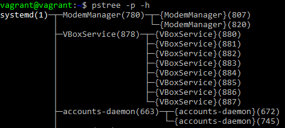
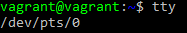
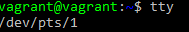
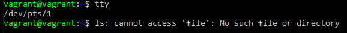
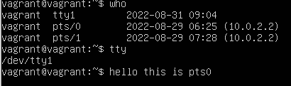
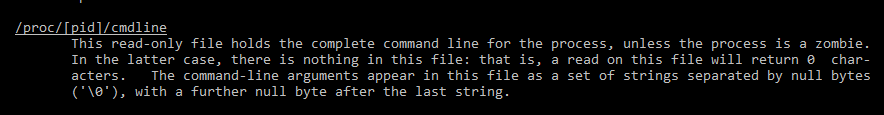
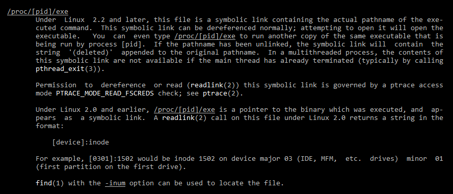

# Дамашнее задание 7, "3.2. Работа в терминале, лекция 2"

## Олег Дьяченко DEVOPS-22

#### Какого типа команда cd? Попробуйте объяснить, почему она именно такого типа; опишите ход своих мыслей, если считаете что она могла бы быть другого типа.

Внутрення команда bash. Могла быть внешней командой, но аналогов не нашел, значит нельзя изменить папку текущего терминала внешней программой. 

    vagrant@vagrant:~$ type cd
    cd is a shell builtin

#### Какая альтернатива без pipe команде grep <some_string> <some_file> | wc -l? man grep поможет в ответе на этот вопрос. Ознакомьтесь с документом о других подобных некорректных вариантах использования pipe.

    grep string file -c

    -c, --count
       Suppress normal output; instead print a count of matching lines for each input file.  With the -v, --invert-match option (see below), count non-matching lines.
  
#### Какой процесс с PID 1 является родителем для всех процессов в вашей виртуальной машине Ubuntu 20.04?

#### Как будет выглядеть команда, которая перенаправит вывод stderr ls на другую сессию терминала?
Сделаем два терминала

вводим команду на первом терминале

    vagrant@vagrant:~$ ls -l file 2>/dev/pts/1

#### Получится ли одновременно передать команде файл на stdin и вывести ее stdout в другой файл? Приведите работающий пример.

    vagrant@vagrant:~$ cat test.txt
    Строка 1
    Строка 2
    vagrant@vagrant:~$ cat test2.txt
    cat: test2.txt: No such file or directory
    vagrant@vagrant:~$
    vagrant@vagrant:~$ cat < test.txt > test2.txt
    vagrant@vagrant:~$ cat test2.txt
    Строка 1
    Строка 2
    vagrant@vagrant:~$

Получилось одновременно передать команде файл на stdin и вывести ее stdout в другой файл

#### Получится ли вывести находясь в графическом режиме данные из PTY в какой-либо из эмуляторов TTY? Сможете ли вы наблюдать выводимые данные?

Открыл еще одну терминальную сессию но уже через приложение VirtualBox.
В терминале ввел команду 

    vagrant@vagrant:~$ who
    vagrant  tty1         2022-08-31 09:04
    vagrant  pts/0        2022-08-29 06:25 (10.0.2.2)
    vagrant  pts/1        2022-08-29 07:28 (10.0.2.2)
    vagrant@vagrant:~$ echo hello this is pts0 > /dev/tty1

#### Выполните команду bash 5>&1. К чему она приведет? Что будет, если вы выполните echo netology > /proc/$$/fd/5? Почему так происходит?

bash 5>&1 - Запускает в текущем терминале новый подпроцесс баша, создает новый дескриптор, и вывод его переправляет в окно текущего терминала.

           │            └─{snapd}(1218)
           ├─sshd(732)─┬─sshd(1662)───sshd(1703)───bash(1704)
           │           └─sshd(3097)───sshd(3140)───bash(3141)───bash(3158)───pstree(3165)
    vagrant@vagrant:~$ echo $$
    3158
    vagrant@vagrant:~$ echo $PPID
    3141
    vagrant@vagrant:/proc/3158/fd$ ll
    total 0
    dr-x------ 2 vagrant vagrant  0 Aug 31 09:39 ./
    dr-xr-xr-x 9 vagrant vagrant  0 Aug 31 09:36 ../
    lrwx------ 1 vagrant vagrant 64 Aug 31 09:39 0 -> /dev/pts/0
    lrwx------ 1 vagrant vagrant 64 Aug 31 09:39 1 -> /dev/pts/0
    lrwx------ 1 vagrant vagrant 64 Aug 31 09:39 2 -> /dev/pts/0
    lrwx------ 1 vagrant vagrant 64 Aug 31 09:39 255 -> /dev/pts/0
    lrwx------ 1 vagrant vagrant 64 Aug 31 09:39 5 -> /dev/pts/0

echo netology > /proc/$$/fd/5 - выводит в файл слово netology, а файл привязан к дескриптору который перенаправлен на текущий терминал.

    vagrant@vagrant:~$ bash 5>&1
    vagrant@vagrant:~$ echo netology > /proc/$$/fd/5
    netology
    vagrant@vagrant:~$ exit
    exit

#### Получится ли в качестве входного потока для pipe использовать только stderr команды, не потеряв при этом отображение stdout на pty? Напоминаем: по умолчанию через pipe передается только stdout команды слева от | на stdin команды справа. Это можно сделать, поменяв стандартные потоки местами через промежуточный новый дескриптор, который вы научились создавать в предыдущем вопросе.

    vagrant@vagrant:~$ cat file
    cat: file: No such file or directory
    vagrant@vagrant:~$ cat file | grep file
    cat: file: No such file or directory
    vagrant@vagrant:~$ cat file | grep file -c
    cat: file: No such file or directory
    0
    vagrant@vagrant:~$ cat file 5>&2 2>&1 1>&5 | grep file -c
    1

#### Что выведет команда cat /proc/$$/environ? Как еще можно получить аналогичный по содержанию вывод?

Будут выведены переменные окружения

    vagrant@vagrant:~$ cat /proc/$$/environ
    USER=vagrantLOGNAME=vagrantHOME=/home/vagrantPATH=/usr/local/sbin:/usr/local/bin:/usr/sbin:/usr/bin:/sbin:/bin:/usr/games:/usr/local/games:/snap/binSHELL=/bin/bashTERM=xterm-256colorXDG_SESSION_ID=62XDG_RUNTIME_DIR=/run/user/1000DBUS_SESSION_BUS_ADDRESS=unix:path=/run/user/1000/busXDG_SESSION_TYPE=ttyXDG_SESSION_CLASS=userMOTD_SHOWN=pamLANG=en_US.UTF-8SSH_CLIENT=10.0.2.2 55532 22SSH_CONNECTION=10.0.2.2 55532 10.0.2.15 22SSH_TTY=/dev/pts/0

Так же команды env и printenv, в некоторой степени export

#### Используя man, опишите что доступно по адресам /proc/<PID>/cmdline, /proc/<PID>/exe.

    cat /proc/$$/cmdline
    -bash
    Этот файл содержит полную командную строку запуска процесса

    exe является символьной ссылкой, содержащей фактическое полное имя выполняемого файла.

#### Узнайте, какую наиболее старшую версию набора инструкций SSE поддерживает ваш процессор с помощью /proc/cpuinfo.

    vagrant@vagrant:~$ grep sse /proc/cpuinfo
    flags  : fpu vme de pse tsc msr pae mce cx8 apic sep mtrr pge mca cmov pat pse36 clflush mmx fxsr sse sse2 ht syscall nx rdtscp lm constant_tsc rep_good nopl xtopology nonstop_tsc cpuid tsc_known_freq pni pclmulqdq ssse3 cx16 pcid sse4_1 sse4_2 x2apic movbe popcnt aes xsave avx rdrand hypervisor lahf_lm abm 3dnowprefetch invpcid_single fsgsbase avx2 invpcid rdseed clflushopt md_clear flush_l1d arch_capabilities

Самая старшая sse4_2

#### При открытии нового окна терминала и vagrant ssh создается новая сессия и выделяется pty. Это можно подтвердить командой tty, которая упоминалась в лекции 3.2. Однако:
    vagrant@netology1:~$ ssh localhost 'tty'
    not a tty
    Почитайте, почему так происходит, и как изменить поведение.

    -T      Disable pseudo-tty allocation.

    -t      Force pseudo-tty allocation.  This can be used to execute arbitrary 
            screen-based programs on a remote machine, which can be very useful,
            e.g. when implementing menu services.  Multiple -t options force tty
            allocation, even if ssh has no local tty.

    vagrant@vagrant:~$ ssh -t localhost 'tty'
    vagrant@localhost's password:
    /dev/pts/2
    Connection to localhost closed.
    vagrant@vagrant:~$ ssh -tt localhost 'tty'
    vagrant@localhost's password:
    /dev/pts/2
    Connection to localhost closed.
    vagrant@vagrant:~$ ssh -T localhost 'tty'
    vagrant@localhost's password:
    not a tty

Нужно применять параментр -t или еще -tt

#### Бывает, что есть необходимость переместить запущенный процесс из одной сессии в другую. Попробуйте сделать это, воспользовавшись reptyr. Например, так можно перенести в screen процесс, который вы запустили по ошибке в обычной SSH-сессии.

Сделал маленький скриптик

    while.sh
    while true
    do
        date
        sleep 1
    done

Запускаем

    vagrant@vagrant:~$ sh while.sh
    Thu 01 Sep 2022 05:35:57 AM UTC
    Thu 01 Sep 2022 05:35:58 AM UTC
    Thu 01 Sep 2022 05:35:59 AM UTC
    Thu 01 Sep 2022 05:36:00 AM UTC

Переходим в другой терминал    

     ├─sshd(732)─┬─sshd(1662)───sshd(1703)───bash(1704)───sudo(5021)───reptyr(5022)
     │           └─sshd(5108)───sshd(5151)───bash(5152)───sh(5216)───sleep(5344)

    vagrant@vagrant:~$ sudo reptyr -T 5216
    Unable to attach to pid 5216: Operation not permitted
    The kernel denied permission while attaching. If your uid matches
    the target's, check the value of /proc/sys/kernel/yama/ptrace_scope.
    For more information, see /etc/sysctl.d/10-ptrace.conf

перелогинился под root и исправил 
echo 0 > /proc/sys/kernel/yama/ptrace_scope
и файл /etc/sysctl.d/10-ptrace.conf тоже подправил

    vagrant@vagrant:~$ sudo reptyr -T 5216
    Thu 01 Sep 2022 05:42:07 AM UTC
    Thu 01 Sep 2022 05:42:09 AM UTC
    Thu 01 Sep 2022 05:42:10 AM UTC
    Thu 01 Sep 2022 05:42:11 AM UTC
    Thu 01 Sep 2022 05:42:12 AM UTC

Получилось. Первый терминал завис и перестал работать. Можно его закрывать.

#### sudo echo string > /root/new_file не даст выполнить перенаправление под обычным пользователем, так как перенаправлением занимается процесс shell'а, который запущен без sudo под вашим пользователем. Для решения данной проблемы можно использовать конструкцию echo string | sudo tee /root/new_file. Узнайте что делает команда tee и почему в отличие от sudo echo команда с sudo tee будет работать.

    NAME
           tee - read from standard input and write to standard output and files
    SYNOPSIS
           tee [OPTION]... [FILE]...
    DESCRIPTION
           Copy standard input to each FILE, and also to standard output.
    Выводит и в файл и на экран

echo string выдает строку string через пайп на вход команды tee, которая выдает на экран и сразу записывает в файл. Но т.к. она запущена под sudo о она имеет права в папку пользователя root