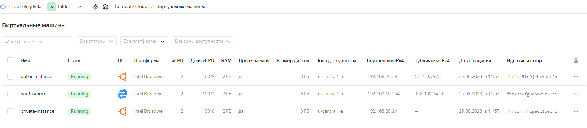

## Домашнее задание 71 [15.1 Организация сети](https://github.com/netology-code/clopro-homeworks/blob/main/15.1.md)

### Олег Дьяченко DEVOPS-22

### Подготовка к выполнению задания

1. Домашнее задание состоит из обязательной части, которую нужно выполнить на провайдере Yandex Cloud, и дополнительной части в AWS (выполняется по желанию). 
2. Все домашние задания в блоке 15 связаны друг с другом и в конце представляют пример законченной инфраструктуры.  
3. Все задания нужно выполнить с помощью Terraform. Результатом выполненного домашнего задания будет код в репозитории. 
4. Перед началом работы настройте доступ к облачным ресурсам из Terraform, используя материалы прошлых лекций и домашнее задание по теме «Облачные провайдеры и синтаксис Terraform». Заранее выберите регион (в случае AWS) и зону.

---
### Задание 1. Yandex Cloud 

**Что нужно сделать**

1. Создать пустую VPC. Выбрать зону.
2. Публичная подсеть.

 - Создать в VPC subnet с названием public, сетью 192.168.10.0/24.
 - Создать в этой подсети NAT-инстанс, присвоив ему адрес 192.168.10.254. В качестве image_id использовать fd80mrhj8fl2oe87o4e1.
 - Создать в этой публичной подсети виртуалку с публичным IP, подключиться к ней и убедиться, что есть доступ к интернету.
3. Приватная подсеть.
 - Создать в VPC subnet с названием private, сетью 192.168.20.0/24.
 - Создать route table. Добавить статический маршрут, направляющий весь исходящий трафик private сети в NAT-инстанс.
 - Создать в этой приватной подсети виртуалку с внутренним IP, подключиться к ней через виртуалку, созданную ранее, и убедиться, что есть доступ к интернету.

Resource Terraform для Yandex Cloud:

- [VPC subnet](https://registry.terraform.io/providers/yandex-cloud/yandex/latest/docs/resources/vpc_subnet).
- [Route table](https://registry.terraform.io/providers/yandex-cloud/yandex/latest/docs/resources/vpc_route_table).
- [Compute Instance](https://registry.terraform.io/providers/yandex-cloud/yandex/latest/docs/resources/compute_instance).

### Ответ:

Исходники кода terraform [тут](./terraform)

Основной main.tf
```terraform
provider "yandex" {
  cloud_id  = var.yc_cloud_id
  folder_id = var.yc_folder_id
  zone      = var.yc_region
}

resource "yandex_vpc_network" "network-netology" {
  name = "network-netology"
}

# Публичная подсеть и ее ресурсы
resource "yandex_vpc_subnet" "public" {
  name           = "public"
  v4_cidr_blocks = ["192.168.10.0/24"]
  zone           = var.yc_region
  network_id     = yandex_vpc_network.network-netology.id
}

# публичная машина
resource "yandex_compute_instance" "public-instance" {
  name     = "public-instance"
  hostname = "public-instance"
  zone     = var.yc_region

  resources {
    cores  = 2
    memory = 2
  }

  boot_disk {
    initialize_params {
      image_id = "fd8fco5lpqbhanbfg2du" # ubuntu 22.4
    }
  }

  network_interface {
    subnet_id = "${yandex_vpc_subnet.public.id}"
    nat       = true
  }

  metadata = {
    ssh-keys = "ubuntu:${file("~/.ssh/id_rsa.pub")}"
  }

  scheduling_policy {
    preemptible = true
  }
}

# nat машина
resource "yandex_compute_instance" "nat-instance" {
  name     = "nat-instance"
  hostname = "nat-instance"
  zone     = var.yc_region

  resources {
    cores  = 2
    memory = 2
  }

  boot_disk {
    initialize_params {
      image_id = "fd8vf5hgv1o31j0hp4gn"
    }
  }

  network_interface {
    subnet_id  = "${yandex_vpc_subnet.public.id}"
    ip_address = "192.168.10.254"
    nat        = true
  }

  metadata = {
    ssh-keys = "ubuntu:${file("~/.ssh/id_rsa.pub")}"
  }

  scheduling_policy {
    preemptible = true
  }
}

# Приватная подсеть и ее ресурсы
resource "yandex_vpc_route_table" "netology-rt" {
  name       = "netology-rt"
  network_id = yandex_vpc_network.network-netology.id
  static_route {
    destination_prefix = "0.0.0.0/0"
    next_hop_address   = "192.168.10.254"
  }
}

resource "yandex_vpc_subnet" "private" {
  name           = "private_subnet"
  v4_cidr_blocks = ["192.168.20.0/24"]
  zone           = var.yc_region
  network_id     = yandex_vpc_network.network-netology.id
  route_table_id = yandex_vpc_route_table.netology-rt.id
}

# машина за натом
resource "yandex_compute_instance" "private-instance" {
  name     = "private-instance"
  hostname = "private-instance"
  zone     = var.yc_region

  resources {
    cores  = 2
    memory = 2
  }

  boot_disk {
    initialize_params {
      image_id = "fd8fco5lpqbhanbfg2du" # ubuntu 22.04
    }
  }

  network_interface {
    subnet_id = "${yandex_vpc_subnet.private.id}"
  }

  metadata = {
    ssh-keys = "ubuntu:${file("~/.ssh/id_rsa.pub")}"
  }

  scheduling_policy {
    preemptible = true
  }
}

# Выходные айпишники
output "internal_ip_address_private" {
  value = yandex_compute_instance.private-instance.network_interface.0.ip_address
}

output "external_ip_address_public" {
  value = yandex_compute_instance.public-instance.network_interface.0.nat_ip_address
}

output "external_ip_address_nat" {
  value = yandex_compute_instance.nat-instance.network_interface.0.nat_ip_address
}
```

```
root@server1:/vagrant/HW71# terraform validate
Success! The configuration is valid.

root@server1:/vagrant/HW71# terraform apply

Terraform used the selected providers to generate the following execution plan. Resource actions are indicated with the following symbols:
  + create

Terraform will perform the following actions:

  # yandex_compute_instance.nat-instance will be created
  + resource "yandex_compute_instance" "nat-instance" {
      + created_at                = (known after apply)
      + folder_id                 = (known after apply)
      + fqdn                      = (known after apply)
      + gpu_cluster_id            = (known after apply)
      + hostname                  = "nat-instance"
      + id                        = (known after apply)

...

yandex_compute_instance.nat-instance: Still creating... [3m50s elapsed]
yandex_compute_instance.nat-instance: Still creating... [4m0s elapsed]
yandex_compute_instance.nat-instance: Creation complete after 4m7s [id=fhmkravfguqnd0ve27he]

Apply complete! Resources: 7 added, 0 changed, 0 destroyed.

Outputs:

external_ip_address_nat = "158.160.34.50"
external_ip_address_public = "51.250.79.52"
internal_ip_address_private = "192.168.20.24"
```




Подключаюсь к ВМ со своего компа, пинг есть:

```
root@server1:/vagrant/HW71# ssh ubuntu@51.250.79.52
Welcome to Ubuntu 22.04.3 LTS (GNU/Linux 5.15.0-79-generic x86_64)

 * Documentation:  https://help.ubuntu.com
 * Management:     https://landscape.canonical.com
 * Support:        https://ubuntu.com/advantage

  System information as of Fri Aug 25 04:04:27 AM UTC 2023

  System load:  0.0               Processes:             127
  Usage of /:   54.4% of 7.79GB   Users logged in:       0
  Memory usage: 10%               IPv4 address for eth0: 192.168.10.29
  Swap usage:   0%
  
ubuntu@public-instance:~$ ping github.com
PING github.com (140.82.121.4) 56(84) bytes of data.
64 bytes from lb-140-82-121-4-fra.github.com (140.82.121.4): icmp_seq=1 ttl=51 time=43.5 ms
64 bytes from lb-140-82-121-4-fra.github.com (140.82.121.4): icmp_seq=2 ttl=51 time=43.1 ms
^C
--- github.com ping statistics ---
2 packets transmitted, 2 received, 0% packet loss, time 1002ms
rtt min/avg/max/mdev = 43.087/43.270/43.454/0.183 ms  
  
```

Записываю свой ключ и подключаюсь, проверяю пинг есть. 
```
ubuntu@public-instance:~$ ssh ubuntu@192.168.20.24
Welcome to Ubuntu 22.04.3 LTS (GNU/Linux 5.15.0-79-generic x86_64)

 * Documentation:  https://help.ubuntu.com
 * Management:     https://landscape.canonical.com
 * Support:        https://ubuntu.com/advantage

  System information as of Fri Aug 25 04:31:02 AM UTC 2023

  System load:  0.0               Processes:             127
  Usage of /:   54.1% of 7.79GB   Users logged in:       0
  Memory usage: 10%               IPv4 address for eth0: 192.168.20.24
  Swap usage:   0%
  
ubuntu@private-instance:~$ ping github.com
PING github.com (140.82.121.4) 56(84) bytes of data.
64 bytes from lb-140-82-121-4-fra.github.com (140.82.121.4): icmp_seq=1 ttl=47 time=45.0 ms
64 bytes from lb-140-82-121-4-fra.github.com (140.82.121.4): icmp_seq=2 ttl=47 time=43.8 ms
64 bytes from lb-140-82-121-4-fra.github.com (140.82.121.4): icmp_seq=3 ttl=47 time=43.8 ms
^C
--- github.com ping statistics ---
3 packets transmitted, 3 received, 0% packet loss, time 2003ms
rtt min/avg/max/mdev = 43.791/44.198/44.971/0.546 ms
```


Удаляю
```
root@server1:/vagrant/HW71# terraform destroy
yandex_vpc_network.network-netology: Refreshing state... [id=enpmb5uiucvhuva4fh0g]
yandex_vpc_subnet.public: Refreshing state... [id=e9bu6fl9uvhjrm6su7jk]
yandex_vpc_route_table.netology-rt: Refreshing state... [id=enpgrertj2nl90pbdgl9]
yandex_compute_instance.nat-instance: Refreshing state... [id=fhmkravfguqnd0ve27he]
yandex_vpc_subnet.private: Refreshing state... [id=e9bl84592rha9fr3su4g]
yandex_compute_instance.public-instance: Refreshing state... [id=fhm4an5fc0j4hekuuc2n]
yandex_compute_instance.private-instance: Refreshing state... [id=fhmtinf7m2ge6i1qech1]

...

yandex_compute_instance.nat-instance: Destroying... [id=fhmkravfguqnd0ve27he]
yandex_compute_instance.public-instance: Destroying... [id=fhm4an5fc0j4hekuuc2n]
yandex_compute_instance.private-instance: Destroying... [id=fhmtinf7m2ge6i1qech1]
yandex_compute_instance.private-instance: Still destroying... [id=fhmtinf7m2ge6i1qech1, 10s elapsed]
yandex_compute_instance.nat-instance: Still destroying... [id=fhmkravfguqnd0ve27he, 10s elapsed]
yandex_compute_instance.public-instance: Still destroying... [id=fhm4an5fc0j4hekuuc2n, 10s elapsed]
yandex_compute_instance.public-instance: Still destroying... [id=fhm4an5fc0j4hekuuc2n, 20s elapsed]
yandex_compute_instance.private-instance: Still destroying... [id=fhmtinf7m2ge6i1qech1, 20s elapsed]
yandex_compute_instance.nat-instance: Still destroying... [id=fhmkravfguqnd0ve27he, 20s elapsed]
yandex_compute_instance.nat-instance: Destruction complete after 21s
yandex_compute_instance.public-instance: Destruction complete after 21s
yandex_vpc_subnet.public: Destroying... [id=e9bu6fl9uvhjrm6su7jk]
yandex_vpc_subnet.public: Destruction complete after 3s
yandex_compute_instance.private-instance: Destruction complete after 26s
yandex_vpc_subnet.private: Destroying... [id=e9bl84592rha9fr3su4g]
yandex_vpc_subnet.private: Destruction complete after 3s
yandex_vpc_route_table.netology-rt: Destroying... [id=enpgrertj2nl90pbdgl9]
yandex_vpc_route_table.netology-rt: Destruction complete after 1s
yandex_vpc_network.network-netology: Destroying... [id=enpmb5uiucvhuva4fh0g]
yandex_vpc_network.network-netology: Destruction complete after 0s

Destroy complete! Resources: 7 destroyed.
```