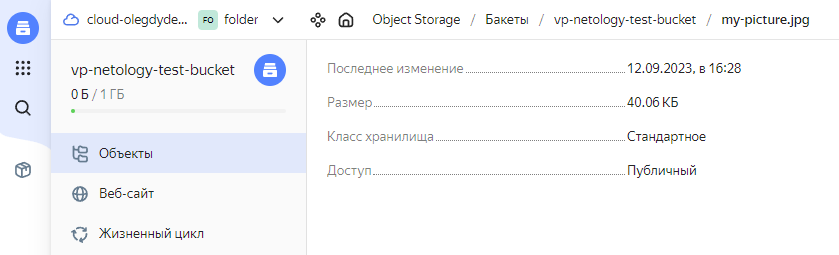
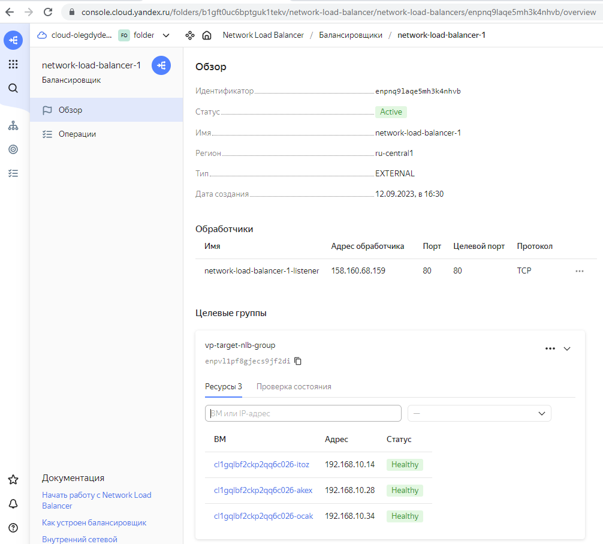
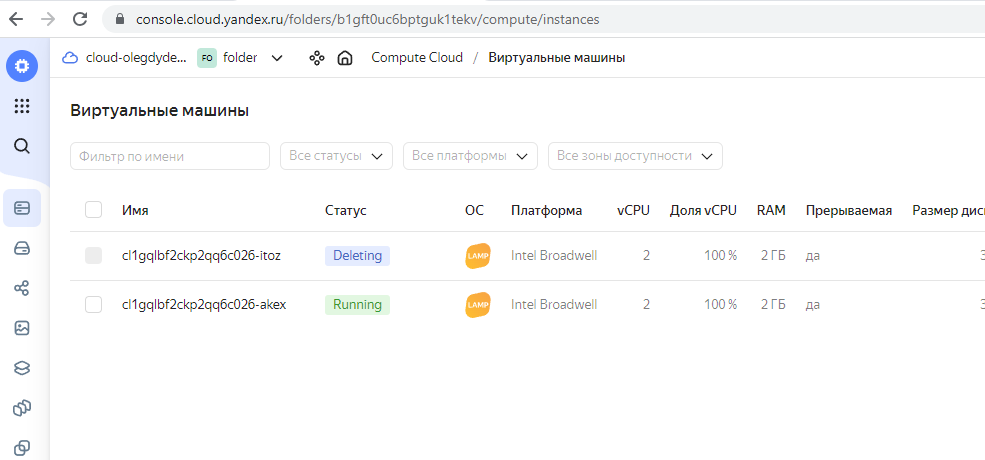
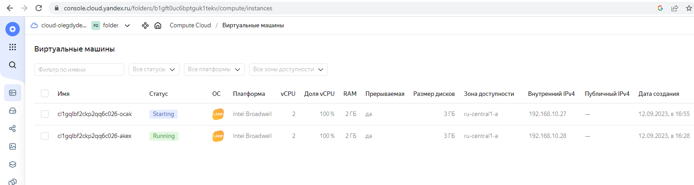
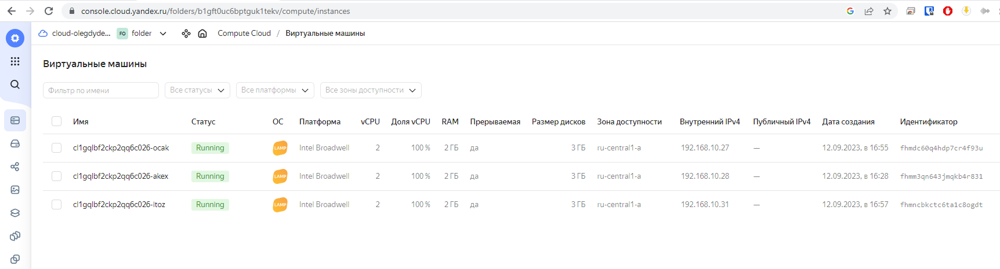

## Домашнее задание 72 [15.2 Вычислительные мощности. Балансировщики нагрузки](https://github.com/netology-code/clopro-homeworks/blob/main/15.2.md)

### Олег Дьяченко DEVOPS-22

---
## Задание 1. Yandex Cloud 

**Что нужно сделать**

1. Создать бакет Object Storage и разместить в нём файл с картинкой:

 - Создать бакет в Object Storage с произвольным именем (например, _имя_студента_дата_).
 - Положить в бакет файл с картинкой.
 - Сделать файл доступным из интернета.
 

```terraform
# Сервисный аккаунт для управления бакетом
resource "yandex_iam_service_account" "bucket-sa" {
  name        = "bucket-sa"
  description = "сервисный аккаунт s3"
}

# Выдаем роль сервисному аккаунту
resource "yandex_resourcemanager_folder_iam_member" "sa-editor" {
  folder_id = var.yc_folder_id
  role      = "storage.editor"
  member    = "serviceAccount:${yandex_iam_service_account.bucket-sa.id}"
}

# Создаем ключи доступа для сервисного аккаунта
resource "yandex_iam_service_account_static_access_key" "sa-static-key" {
  service_account_id = yandex_iam_service_account.bucket-sa.id
  description        = "static access key for object storage"
}

## Создаем бакет с указанными ключами доступа
resource "yandex_storage_bucket" "vp-bucket" {
  access_key = yandex_iam_service_account_static_access_key.sa-static-key.access_key
  secret_key = yandex_iam_service_account_static_access_key.sa-static-key.secret_key
  bucket     = "vp-netology-test-bucket"

  max_size = 1073741824 # 1 Gb

  anonymous_access_flags {
    read = true
    list = false
  }
}

# Загрузка картинки в бакет
resource "yandex_storage_object" "my-picture" {
  access_key = yandex_iam_service_account_static_access_key.sa-static-key.access_key
  secret_key = yandex_iam_service_account_static_access_key.sa-static-key.secret_key
  bucket     = yandex_storage_bucket.vp-bucket.id
  key        = "my-picture.jpg"
  source     = var.my_picture
}

```



2. Создать группу ВМ в public подсети фиксированного размера с шаблоном LAMP и веб-страницей, содержащей ссылку на картинку из бакета:

 - Создать Instance Group с тремя ВМ и шаблоном LAMP. Для LAMP рекомендуется использовать `image_id = fd827b91d99psvq5fjit`.
 - Для создания стартовой веб-страницы рекомендуется использовать раздел `user_data` в [meta_data](https://cloud.yandex.ru/docs/compute/concepts/vm-metadata).
 - Разместить в стартовой веб-странице шаблонной ВМ ссылку на картинку из бакета.
 - Настроить проверку состояния ВМ.
 

```terraform
# Группа ВМ

# Сеть для ВМ
resource "yandex_vpc_network" "network-netology" {
  name = "network-netology"
}

# Публичная подсеть
resource "yandex_vpc_subnet" "public" {
  name           = "public"
  v4_cidr_blocks = ["192.168.10.0/24"]
  zone           = var.yc_region
  network_id     = yandex_vpc_network.network-netology.id
}

# Сервисный аккаунт для группы ВМ
resource "yandex_iam_service_account" "ig-sa" {
  name        = "ig-sa"
  description = "сервисный аккаунт для управления группой ВМ"
}

# Назначаем роль editor сервисному аккаунту
resource "yandex_resourcemanager_folder_iam_member" "editor" {
  folder_id = var.yc_folder_id
  role      = "editor"
  member    = "serviceAccount:${yandex_iam_service_account.ig-sa.id}"
}

# Группа ВМ
resource "yandex_compute_instance_group" "vp-nlb-ig" {
  name               = "vp-nlb-ig"
  folder_id          = var.yc_folder_id
  service_account_id = "${yandex_iam_service_account.ig-sa.id}"
  instance_template {
    platform_id = "standard-v1"
    resources {
      memory = 2
      cores  = 2
    }

    boot_disk {
      initialize_params {
        image_id = "fd827b91d99psvq5fjit" # LAMP image
      }
    }

    network_interface {
      network_id = "${yandex_vpc_network.network-netology.id}"
      subnet_ids = ["${yandex_vpc_subnet.public.id}"]
    }

    metadata = {
      ssh-keys  = "ubuntu:${file("~/.ssh/id_rsa.pub")}"
      user-data = "#!/bin/bash\n cd /var/www/html\n echo \"<html><h1>Network load balanced web-server</h1></html>\" > index.html"
    }

    labels = {
      group = "network-load-balanced"
    }

    scheduling_policy {
      preemptible = true
    }
  }

  scale_policy {
    fixed_scale {
      size = 3
    }
  }

  allocation_policy {
    zones = [var.yc_region]
  }

  deploy_policy {
    max_unavailable = 2
    max_expansion   = 1
  }

  health_check {
    interval = 2
    timeout = 1
    healthy_threshold = 5
    unhealthy_threshold = 2
    http_options {
      path = "/"
      port = 80
    }
  }

  load_balancer {
    target_group_name        = "vp-target-nlb-group"
    target_group_description = "Целевая группа для сетевого балансировщика"
  }
}
```

3. Подключить группу к сетевому балансировщику:

 - Создать сетевой балансировщик.
 - Проверить работоспособность, удалив одну или несколько ВМ.

```terraform
# Сетевой балансировщик
resource "yandex_lb_network_load_balancer" "vp-nlb-1" {
  name = "network-load-balancer-1"

  listener {
    name = "network-load-balancer-1-listener"
    port = 80
    external_address_spec {
      ip_version = "ipv4"
    }
  }

  attached_target_group {
    target_group_id = yandex_compute_instance_group.vp-nlb-ig.load_balancer.0.target_group_id

    healthcheck {
      name = "http"
      interval = 2
      timeout = 1
      unhealthy_threshold = 2
      healthy_threshold = 5
      http_options {
        port = 80
        path = "/"
      }
    }
  }
}
```


Итоговый план [main.tf](terraform/main.tf)

Запуск плана
```
root@server1:/vagrant/HW72# terraform validate
Success! The configuration is valid.

root@server1:/vagrant/HW72# terraform apply

Terraform used the selected providers to generate the following execution plan. Resource actions are indicated with the following symbols:
  + create

Terraform will perform the following actions:

  # yandex_compute_instance_group.vp-nlb-ig will be created
  + resource "yandex_compute_instance_group" "vp-nlb-ig" {
      + created_at          = (known after apply)
      + deletion_protection = false
      + folder_id           = "b1gft0uc6bptguk1tekv"
      + id                  = (known after apply)
      + instances           = (known after apply)
      + name                = "vp-nlb-ig"
      + service_account_id  = (known after apply)
      + status              = (known after apply)

      + allocation_policy {

...

yandex_resourcemanager_folder_iam_member.editor: Creation complete after 4s [id=b1gft0uc6bptguk1tekv/editor/serviceAcc
yandex_storage_bucket.vp-bucket: Still creating... [10s elapsed]
yandex_storage_bucket.vp-bucket: Still creating... [20s elapsed]
yandex_storage_bucket.vp-bucket: Still creating... [30s elapsed]
yandex_storage_bucket.vp-bucket: Still creating... [40s elapsed]
yandex_storage_bucket.vp-bucket: Still creating... [50s elapsed]
yandex_storage_bucket.vp-bucket: Still creating... [1m0s elapsed]
yandex_storage_bucket.vp-bucket: Still creating... [1m10s elapsed]
yandex_storage_bucket.vp-bucket: Still creating... [1m20s elapsed]
yandex_storage_bucket.vp-bucket: Still creating... [1m30s elapsed]
yandex_storage_bucket.vp-bucket: Still creating... [1m40s elapsed]
yandex_storage_bucket.vp-bucket: Still creating... [1m50s elapsed]
yandex_storage_bucket.vp-bucket: Still creating... [2m0s elapsed]
yandex_storage_bucket.vp-bucket: Creation complete after 2m9s [id=vp-netology-test-bucket]
yandex_storage_object.my-picture: Creating...
yandex_storage_object.my-picture: Creation complete after 0s [id=my-picture.jpg]
yandex_compute_instance_group.vp-nlb-ig: Creating...
yandex_compute_instance_group.vp-nlb-ig: Still creating... [10s elapsed]
yandex_compute_instance_group.vp-nlb-ig: Still creating... [20s elapsed]
yandex_compute_instance_group.vp-nlb-ig: Still creating... [30s elapsed]
yandex_compute_instance_group.vp-nlb-ig: Still creating... [40s elapsed]
yandex_compute_instance_group.vp-nlb-ig: Still creating... [50s elapsed]
yandex_compute_instance_group.vp-nlb-ig: Still creating... [1m0s elapsed]
yandex_compute_instance_group.vp-nlb-ig: Still creating... [1m10s elapsed]
yandex_compute_instance_group.vp-nlb-ig: Still creating... [1m20s elapsed]
yandex_compute_instance_group.vp-nlb-ig: Still creating... [1m30s elapsed]
yandex_compute_instance_group.vp-nlb-ig: Still creating... [1m40s elapsed]
yandex_compute_instance_group.vp-nlb-ig: Still creating... [1m50s elapsed]
yandex_compute_instance_group.vp-nlb-ig: Still creating... [2m0s elapsed]
yandex_compute_instance_group.vp-nlb-ig: Still creating... [2m10s elapsed]
yandex_compute_instance_group.vp-nlb-ig: Creation complete after 2m13s [id=cl1gqlbf2ckp2qq6c026]
yandex_lb_network_load_balancer.vp-nlb-1: Creating...
yandex_lb_network_load_balancer.vp-nlb-1: Creation complete after 4s [id=enpnq9laqe5mh3k4nhvb]

Apply complete! Resources: 11 added, 0 changed, 0 destroyed.

Outputs:

nlb-address = tolist([
  "158.160.68.159",
])
pic-url = "https://vp-netology-test-bucket.storage.yandexcloud.net/my-picture.jpg"

```




Пробуем удалить две виртуальные машины.



Сайт все еще работает, что и нужно.


Через некоторое время создаются новые виртуальные машины автоматически.



