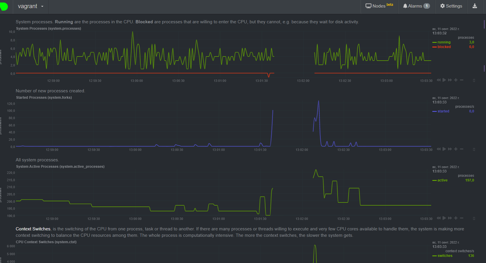

# Дамашнее задание 9, "3.4. Операционные системы, лекция 2"

## Олег Дьяченко DEVOPS-22

#### На лекции мы познакомились с node_exporter. В демонстрации его исполняемый файл запускался в background. Этого достаточно для демо, но не для настоящей production-системы, где процессы должны находиться под внешним управлением. Используя знания из лекции по systemd, создайте самостоятельно простой unit-файл для node_exporter:

Нашел инструкцию по установке в интернете и по ней установил node_exporter

#### поместите его в автозагрузку,

    root@vagrant:/etc/systemd/system# systemctl status node_exporter.service
    ● node_exporter.service - Node Exporter
         Loaded: loaded (/etc/systemd/system/node_exporter.service; disabled; vendor preset: enabled)
         Active: inactive (dead)
    
    root@vagrant:/etc/systemd/system# systemctl enable node_exporter.service
    Created symlink /etc/systemd/system/multi-user.target.wants/node_exporter.service → /etc/systemd/system/node_exporter.service.

перезагрузил виртуалку и проверил статус

    vagrant@vagrant:~$ sudo systemctl status node_exporter
    ● node_exporter.service - Node Exporter
         Loaded: loaded (/etc/systemd/system/node_exporter.service; enabled; vendor preset: enabled)
         Active: active (running) since Sun 2022-09-11 01:35:31 UTC; 10min ago
       Main PID: 674 (node_exporter)
          Tasks: 6 (limit: 2273)
         Memory: 17.3M
         CGroup: /system.slice/node_exporter.service
                 └─674 /usr/local/bin/node_exporter
    
    Sep 11 01:35:32 vagrant node_exporter[674]: ts=2022-09-11T01:35:31.952Z caller=node_exporter.go:115 level=info collector=thermal_zone
    Sep 11 01:35:32 vagrant node_exporter[674]: ts=2022-09-11T01:35:31.952Z caller=node_exporter.go:115 level=info collector=time
    Sep 11 01:35:32 vagrant node_exporter[674]: ts=2022-09-11T01:35:31.952Z caller=node_exporter.go:115 level=info collector=timex
    Sep 11 01:35:32 vagrant node_exporter[674]: ts=2022-09-11T01:35:31.952Z caller=node_exporter.go:115 level=info collector=udp_queues
    Sep 11 01:35:32 vagrant node_exporter[674]: ts=2022-09-11T01:35:31.952Z caller=node_exporter.go:115 level=info collector=uname
    Sep 11 01:35:32 vagrant node_exporter[674]: ts=2022-09-11T01:35:31.952Z caller=node_exporter.go:115 level=info collector=vmstat
    Sep 11 01:35:32 vagrant node_exporter[674]: ts=2022-09-11T01:35:31.952Z caller=node_exporter.go:115 level=info collector=xfs
    Sep 11 01:35:32 vagrant node_exporter[674]: ts=2022-09-11T01:35:31.952Z caller=node_exporter.go:115 level=info collector=zfs
    Sep 11 01:35:32 vagrant node_exporter[674]: ts=2022-09-11T01:35:31.952Z caller=node_exporter.go:199 level=info msg="Listening on" address=:9100
    Sep 11 01:35:32 vagrant node_exporter[674]: ts=2022-09-11T01:35:31.954Z caller=tls_config.go:195 level=info msg="TLS is disabled." http2=false

#### предусмотрите возможность добавления опций к запускаемому процессу через внешний файл (посмотрите, например, на systemctl cat cron),
    
    vagrant@vagrant:~$ systemctl cat node_exporter
    # /etc/systemd/system/node_exporter.service
    [Unit]
    Description=Node Exporter
    Wants=network-online.target
    After=network-online.target
    
    [Service]
    User=node_exporter
    Group=node_exporter
    Type=simple
    ExecStart=/usr/local/bin/node_exporter
    EnvironmentFile=/etc/default/node_explorer
    
    [Install]
    WantedBy=multi-user.target

создал пустой файл /etc/default/node_explorer

#### удостоверьтесь, что с помощью systemctl процесс корректно стартует, завершается, а после перезагрузки автоматически поднимается.

    vagrant@vagrant:/var/log$ journalctl  -u node_exporter
    Sep 11 00:09:12 vagrant node_exporter[1777]: ts=2022-09-11T00:09:12.692Z caller=node_exporter.go:199 level=info msg="Listening on" address=:9100
    Sep 11 00:09:12 vagrant node_exporter[1777]: ts=2022-09-11T00:09:12.693Z caller=tls_config.go:195 level=info msg="TLS is disabled." http2=false
    Sep 11 01:21:13 vagrant systemd[1]: Stopping Node Exporter...
    Sep 11 01:21:13 vagrant systemd[1]: node_exporter.service: Succeeded.
    Sep 11 01:21:13 vagrant systemd[1]: Stopped Node Exporter.
    -- Reboot --
    Sep 11 01:35:31 vagrant systemd[1]: Started Node Exporter.
    Sep 11 01:35:31 vagrant node_exporter[674]: ts=2022-09-11T01:35:31.951Z caller=node_exporter.go:182 level=info msg="Starting node_exporter" version="(version=1.3.1, branch=HEAD, revision=a2321e7b940ddcff26873612bccdf7cd4c42b6b6)"
    Sep 11 01:35:31 vagrant node_exporter[674]: ts=2022-09-11T01:35:31.951Z caller=node_exporter.go:183 level=info msg="Build context" build_context="(go=go1.17.3, user=root@243aafa5525c, date=20211205-11:09:49)"

#### Ознакомьтесь с опциями node_exporter и выводом /metrics по-умолчанию. Приведите несколько опций, которые вы бы выбрали для базового мониторинга хоста по CPU, памяти, диску и сети.

Метрик очень много, выбрал что-то, на опыте думаю может выбрал бы подругому. Можно вставить все, а затем постепенно удалять метрики которые не нужны. 
[metrics](metrics.txt)

#### Установите в свою виртуальную машину Netdata. Воспользуйтесь готовыми пакетами для установки (sudo apt install -y netdata). После успешной установки: Ознакомьтесь с метриками, которые по умолчанию собираются Netdata и с комментариями, которые даны к этим метрикам.

Очень большая портяночка.

#### Можно ли по выводу dmesg понять, осознает ли ОС, что загружена не на настоящем оборудовании, а на системе виртуализации?

    vagrant@vagrant:~$ dmesg | grep virt
    [    0.001980] CPU MTRRs all blank - virtualized system.
    [    0.067357] Booting paravirtualized kernel on KVM
    [    5.698086] systemd[1]: Detected virtualization oracle.

#### Как настроен sysctl fs.nr_open на системе по-умолчанию? Узнайте, что означает этот параметр. Какой другой существующий лимит не позволит достичь такого числа (ulimit --help)?

    максимальное количество открытых файлов в одном процессе
    vagrant@vagrant:~$ sysctl fs.nr_open
    fs.nr_open = 1048576

ulimit - это настройка ограничений ресурсов оболочки. -S использовать мягкий лимит ресурсов, -H использовать жесткий лимит ресурсов
    
    vagrant@vagrant:~$ ulimit -Sn
    1024
    vagrant@vagrant:~$ ulimit -Hn
    1048576

#### Запустите любой долгоживущий процесс (не ls, который отработает мгновенно, а, например, sleep 1h) в отдельном неймспейсе процессов; покажите, что ваш процесс работает под PID 1 через nsenter. Для простоты работайте в данном задании под root (sudo -i). Под обычным пользователем требуются дополнительные опции (--map-root-user) и т.д.

    root        2413  0.0  0.1   6820  3004 pts/0    S+   05:03   0:00 screen
    root        2414  0.0  0.1   7248  2664 ?        Ss   05:03   0:00 SCREEN
    root        2415  0.0  0.1   7236  3880 pts/3    Ss   05:03   0:00 /bin/bash
    root        2426  0.0  0.0   5480   584 pts/3    S+   05:04   0:00 unshare -f --pid --mount-proc sleep 1h
    root        2427  0.0  0.0   5476   580 pts/3    S+   05:04   0:00 sleep 1h
    root        2428  0.0  0.1   8888  3244 pts/2    R+   05:04   0:00 ps aux
    
    root@vagrant:/etc/default# nsenter --target 2427 --pid --mount
    root@vagrant:/# ps aux
    USER         PID %CPU %MEM    VSZ   RSS TTY      STAT START   TIME COMMAND
    root           1  0.0  0.0   5476   580 pts/3    S+   05:04   0:00 sleep 1h
    root           2  0.0  0.2   7236  4084 pts/2    S    05:06   0:00 -bash
    root          13  0.0  0.1   8888  3236 pts/2    R+   05:07   0:00 ps aux

#### Найдите информацию о том, что такое :(){ :|:& };:. Запустите эту команду в своей виртуальной машине Vagrant с Ubuntu 20.04 (это важно, поведение в других ОС не проверялось). Некоторое время все будет "плохо", после чего (минуты) – ОС должна стабилизироваться. Вызов dmesg расскажет, какой механизм помог автоматической стабилизации. Как настроен этот механизм по-умолчанию, и как изменить число процессов, которое можно создать в сессии?

fork-бомба

Выглядит она как странный набор символов, хотя на деле это реальное определение функции bash.

В bash допускается использовать в качестве имени функции :. И в случае выполнения команды :(){ :|:& };: именно такую функцию мы и создаем. Внутренне она рекурсивно вызывает сама себя, то есть выполняется бесконечно, а с помощью & мы инструктируем процесс выполняться фоново.

Через минуту выдает:

    -bash: fork: Resource temporarily unavailable
    -bash: fork: retry: Resource temporarily unavailable

dmesg
    
    [ 7662.134442] cgroup: fork rejected by pids controller in /user.slice/user-1000.slice/session-3.scope

Можно чутка ограничить
    
    ulimit -S -u 500

и после запуска команды ошибки ограничения посыпались почти сразу.